# Scene 001 — Shot Reports
**EXT. CHINATOWN (SOLEDAD STREET), SALINAS, CA — DAWN** · present_day · source: 00_inputs/scene_001.fountain (Dances With Fetty.fountain, Drive, 2026-09-18)
Review order per shot: department reports → Shot Report → prompt pair. Prompts marked **BLOCKED** are drafts and should not be generated until the listed blockers clear.

---

## Shot 1-01 · 6s

**Beat:** Black screen. Voice-overs from the block.

> With the black black screen comes the first of the voice-overs.

**Upstream reports:** CRR-001-EDT (locked)

**Audio-only (editorial).** Pre-dawn street room tone: distant freeway hiss, a shopping-cart wheel rattling, low overlapping voices. No music.

- V.O. #1 MALE: "I got fifteen, who got fedi?"
- V.O. #2 FEMALE: "Somebody lemme hit their foil a couple times for three dollars."

**Editing:** Hold black 6s. Voices panned slightly off-center so the block feels like it surrounds the audience before we see it. Fade up into 1-02 on the final word of V.O. #2.

---

## Shot 1-02 · 8s

**Beat:** Fade in. Track Paul heading south past the Suey Sing Building, head on a swivel. He answers V.O. #2.

> The opening shot fades in, tracking PAUL 23WM as he heads south, past The Suey Sing Building with his head on a swivel…

**Upstream reports:** CRR-001-CAS (flagged_for_human_review), CRR-001-WAR (provisional_pending_upstream), CRR-001-PRO (provisional_pending_upstream), CRR-001-LOC (flagged_for_human_review), CRR-001-BLK (locked), CRR-001-SET (locked), CRR-001-CIN (provisional_pending_upstream), CRR-001-LGT (flagged_for_human_review), CRR-001-IMG (provisional_pending_upstream), CRR-001-VAG (provisional_pending_upstream), CRR-001-EDT (locked)

### Shot Report
- **Blocking / Set:** focal point is *Paul's head turning, scanning the block* at left golden section x=0.382, head at y=0.66 — Paul's head held at (0.38, 0.66) for the full move; lead room open to screen-right. Spiral: none — tracking shot holds subject fixed; background encampment slides along the outer arc. Paul walks in the street along the curb, not on the sidewalk (producer note, Location Bible).
- **Set design:** Suey Sing façade runs as a baroque diagonal from upper-left to lower-right behind him; corner tents and the tarp two-unit structure pass in the background at y≈0.40; crumpled foil in the gutter along y=0.10.
- **Camera:** Wide-to-medium lateral tracking shot, 35mm. Smooth lateral gimbal track at Paul's fast walking pace, camera on the street side moving screen-right with him, slightly below his eye level.
- **Lighting:** L1 Blue hour: cobalt pre-sunrise ambient, sodium streetlamps still burning amber as isolated pools; Paul passes through one amber pool mid-track.
- **Cast / wardrobe:** PAUL (present_day)
- **Props:** FOIL_CRUMPLED, SHOPPING_CARTS
- **Expression anchors:** PAUL_scanning_restless → PAUL_scanning_restless
- **Editing:** Fade from black over the first 1.5s. Hold the full track — this is the audience's guided entry into the block.
- **How it works together:** the camera (35mm) arrives at the blocking's focal point — Paul's head turning, scanning the block — under L1 Blue hour, so the beat "Fade in" lands where the eye already is.
- **Open flags:** F-03, F-10

### Prompt pair — **BLOCKED**
Blockers:
- PAUL: no chosen reference image (F-18)
- SOLEDAD_SUEY_SING: no chosen location reference (F-18)

**LTX-2.3**

```text
[PAUL] Same character as reference image: white man in his late 20s to early 30s, gaunt thin build, dirty blonde wavy shoulder-length hair, disheveled, light patchy stubble, blue eyes, pained distressed expression, wearing a gray hooded sweatshirt. Maintain exact facial structure and build from reference. Scene: The Suey Sing Building on Soledad Street, Chinatown, Salinas: tan/cream single-story stucco building, weathered signage, boarded and graffiti-covered sections along the lower wall, no fence in front. The seven-story Moongate Apartments rise on its left. On its right, a dirt, weed and rock-filled field holds twenty weathered tents. Against the building's wall: a tent in each corner and a huge tarp-built two-unit structure between them, with shopping carts, bikes and belongings. A young man walks fast and hunched-forward down the street along the curb, heading screen-right past a single-story stucco building lined with weathered tents and a large tarp-built shelter. His head swivels, scanning the sidewalk and across the street, listening. Without breaking stride he calls back over his shoulder. Composition follows dynamic symmetry principles — subject(s) positioned along a diagonal sightline rather than center-frame, with deliberate negative space. Focal point — Paul's head turning, scanning the block: Paul's head held at (0.38, 0.66) for the full move; lead room open to screen-right. Camera: Wide-to-medium lateral tracking shot, 35mm lens. Smooth lateral gimbal track at Paul's fast walking pace, camera on the street side moving screen-right with him, slightly below his eye level. Lighting: L1 Blue hour: cobalt pre-sunrise ambient, sodium streetlamps still burning amber as isolated pools; Paul passes through one amber pool mid-track. Props in frame: dozens of tiny crumpled balls of smoked aluminum foil scattered across the sidewalk and gutter, glinting; metal shopping carts stacked with bundled blankets, tarps, and plastic bags, treated with visual dignity. Cinematic tearjerker tone, emotionally intimate framing, soft natural light favoring dawn or dusk. Foil visible somewhere in frame — crumpled, glinting, or scattered nearby. Environment shows worn signs of habitation — blankets, bags, makeshift bedding — treated with visual dignity, not disorder. Camera lingers rather than cuts quickly, allowing emotional weight to build. Paul says: "I'm 'bout to grab a ball. Gimme sec, I got you." Audio: Footsteps on asphalt, distant laughter from the sidewalk group, a bottle clinking. Duration 8 seconds. Compose inside a centered 2.39:1 safe area of a 16:9 frame.
```

**Wan 2.2** (first frame `expr/PAUL_scanning_restless.png`, last frame `expr/PAUL_scanning_restless.png`) — 8s > 5s: generate 2 segments, each segment's last frame seeds the next.

```text
[PAUL] Same character as reference image: white man in his late 20s to early 30s, gaunt thin build, dirty blonde wavy shoulder-length hair, disheveled, light patchy stubble, blue eyes, pained distressed expression, wearing a gray hooded sweatshirt. Maintain exact facial structure and build from reference. Scene: A young man walks fast and hunched-forward down the street along the curb, heading screen-right past a single-story stucco building lined with weathered tents and a large tarp-built shelter. His head swivels, scanning the sidewalk and across the street, listening. Without breaking stride he calls back over his shoulder. Wide-to-medium lateral tracking shot, 35mm. Smooth lateral gimbal track at Paul's fast walking pace, camera on the street side moving screen-right with him, slightly below his eye level. Placement: Paul's head held at (0.38, 0.66) for the full move; lead room open to screen-right. L1 Blue hour: cobalt pre-sunrise ambient, sodium streetlamps still burning amber as isolated pools; Paul passes through one amber pool mid-track.
```

Negative:

```text
no dead-center framing unless flagged as intentional, no clean or brand-new camping gear; tents show wear and dust, no high-contrast plastic or neon garbage bins, no harsh flat midday daylight, no garbled on-screen text, no neat/well-groomed hair, no clean-shaven face, no composed/calm default expression, no healthy/full build, no eye color other than blue, no formal or bright-colored wardrobe, Moongate Apartments on the left of Suey Sing, never the right, no fence in front of the Suey Sing Building, do not fill in, build over, or remove the open field, do not merge the building-side encampment with the field encampment
```

**MiniMax Omni** (4/9 references)

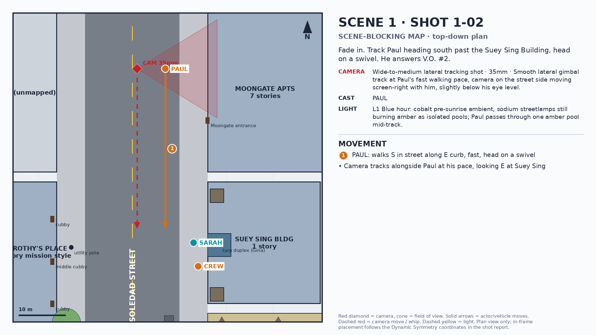

| Slot | Reference | File | Status |
|---|---|---|---|
| 1 | blocking_map | `03_department_outputs/scene_001/blocking_maps/1-02_blocking_map.png` | ready |
| 2 | character · PAUL | `02_bibles/refs/paul_reference.png` | missing |
| 3 | location · SOLEDAD_SUEY_SING | `02_bibles/refs/soledad_suey_sing_plate.png` | missing |
| 4 | expression_start · PAUL_scanning_restless | `expr/PAUL_scanning_restless.png` | missing |

```text
Image 1: Top-down scene-blocking map. Follow its positions and movement arrows; do not render the map itself.
Image 2 is PAUL (character).
Image 3 is SOLEDAD_SUEY_SING (location).
Image 4 is PAUL_scanning_restless (expression start).

A young man walks fast and hunched-forward down the street along the curb, heading screen-right past a single-story stucco building lined with weathered tents and a large tarp-built shelter. His head swivels, scanning the sidewalk and across the street, listening. Without breaking stride he calls back over his shoulder. Stage the action exactly as the blocking map in Image 1 shows: where each person stands, the numbered movement arrows, and the camera position and viewing direction. In frame, the focal point (Paul's head turning, scanning the block) sits at Paul's head held at (0.38, 0.66) for the full move; lead room open to screen-right. Wide-to-medium lateral tracking shot, 35mm lens. Smooth lateral gimbal track at Paul's fast walking pace, camera on the street side moving screen-right with him, slightly below his eye level. Lighting: L1 Blue hour: cobalt pre-sunrise ambient, sodium streetlamps still burning amber as isolated pools; Paul passes through one amber pool mid-track. Cinematic tearjerker tone, emotionally intimate framing, soft natural light favoring dawn or dusk. Foil visible somewhere in frame — crumpled, glinting, or scattered nearby. Environment shows worn signs of habitation — blankets, bags, makeshift bedding — treated with visual dignity, not disorder. Camera lingers rather than cuts quickly, allowing emotional weight to build. Paul says: "I'm 'bout to grab a ball. Gimme sec, I got you."

Duration 8s. Cinematic 2.39:1 composition, photoreal, no on-screen text, no map graphics in the output.
```

---

## Shot 1-03 · 6s

**Beat:** The sidewalk crew — Poochie, Moody, Gina, Belle, Izzy — seated with beers, happily listening to Sarah's drunk ramblings.

> POOCHIE 35BM, MOODY 35BM, GINA 25HF, and BELLE 30BF and IZZY 30HF are seated with beers, happily listening to SARAH'S 30WF drunk ramblings.

**Upstream reports:** CRR-001-CAS (flagged_for_human_review), CRR-001-WAR (provisional_pending_upstream), CRR-001-PRO (provisional_pending_upstream), CRR-001-LOC (flagged_for_human_review), CRR-001-BLK (locked), CRR-001-SET (locked), CRR-001-CIN (provisional_pending_upstream), CRR-001-LGT (flagged_for_human_review), CRR-001-IMG (provisional_pending_upstream), CRR-001-VAG (provisional_pending_upstream), CRR-001-EDT (locked)

### Shot Report
- **Blocking / Set:** focal point is *Sarah mid-story, hands animated* at upper-left eye UL (0.30, 0.66) — Sarah standing at (0.30, 0.62); the seated group arcs along the lower-right toward (0.80, 0.35) so their eyelines run up the sinister diagonal to her. Spiral: Outer arc, bottom-right orientation — the seated crew sits along the arc, spiral coils into Sarah. Diagonal sightlines, not a flat row. Moody beer in hand per bible.
- **Set design:** Tent in the building corner frames left edge; tarp structure fills right background, not competing with Sarah's hotspot.
- **Camera:** Medium-wide group shot, 35mm. Static, camera at seated eye level, very slow push-in (5% over the shot).
- **Lighting:** L1 Blue hour; warm practical glow from inside the tarp structure as the only warm accent.
- **Cast / wardrobe:** SARAH (present_day), POOCHIE (present_day), MOODY (present_day), GINA (present_day), BELLE (present_day), IZZY (present_day)
- **Props:** BEERS, FOIL_CRUMPLED
- **Expression anchors:** SARAH_tipsy_storytelling → SARAH_tipsy_storytelling
- **Editing:** Cutaway can overlap Paul's track audio. Group laughter continues under 1-07 to 1-13 as background (producer note).
- **How it works together:** the camera (35mm) arrives at the blocking's focal point — Sarah mid-story, hands animated — under L1 Blue hour; warm practical glow from inside the tarp structure as the only warm accent., so the beat "The sidewalk crew — Poochie, Moody, Gina, Belle, Izzy — seated with beers, happily listening to Sarah's drunk ramblings" lands where the eye already is.
- **Open flags:** F-04, F-08, F-09

### Prompt pair — **BLOCKED**
Blockers:
- SARAH: no chosen reference image (F-18)
- POOCHIE: no chosen reference image (F-18)
- POOCHIE: Character Bible is provisional (F-09)
- MOODY: real-person consent not confirmed (F-04)
- MOODY: sheet supplied but file not committed (F-18)
- GINA: no chosen reference image (F-18)
- GINA: Character Bible is provisional (F-09)
- BELLE: no chosen reference image (F-18)
- BELLE: Character Bible is provisional (F-09)
- IZZY: sheet supplied but file not committed (F-18)
- IZZY: Character Bible is provisional (F-09)
- SOLEDAD_SUEY_SING: no chosen location reference (F-18)

**LTX-2.3**

```text
[SARAH] Same character as reference image: 25-year-old pretty woman with strawberry blonde hair styled in a 1940s-style updo, emerald green eyes, strong jawline, dimpled chin, curvaceous figure. Wearing a blouse, cream sweater, and black stylish boots. Maintain exact facial structure and build from reference. [POOCHIE] 35-year-old mixed-race Black man with a half-straight afro, dark striking good looks, relaxed ladies'-man confidence. [MOODY] Same character as reference image: Black male, 30s-40s, stocky heavyset build, long uniform dreadlocks with center part, full connected beard, dark rectangular glasses, medium-brown skin, warm jovial expression, holding a beer bottle or can. Maintain exact facial structure and build from reference. [GINA] 35-year-old Hispanic woman, a fighter's posture and a loud, instigating energy. [BELLE] 30-year-old Black woman, small of stature and ladylike, wearing a dress and heels, hair, make-up and nails done to perfection. [IZZY] Same character as reference image: 30-year-old Hispanic woman, short, petite tomboy build, bow-legged stance, dark-rimmed glasses, chin-length dark hair, green plaid flannel shirt over a gray t-shirt, blue jeans, sneakers. Maintain exact facial structure and build from reference. Scene: The Suey Sing Building on Soledad Street, Chinatown, Salinas: tan/cream single-story stucco building, weathered signage, boarded and graffiti-covered sections along the lower wall, no fence in front. The seven-story Moongate Apartments rise on its left. On its right, a dirt, weed and rock-filled field holds twenty weathered tents. Against the building's wall: a tent in each corner and a huge tarp-built two-unit structure between them, with shopping carts, bikes and belongings. A group sits on crates and folding chairs on the sidewalk against the stucco wall, beers in hand, laughing easily as a tipsy woman standing among them tells an animated story with sweeping hand gestures. They lean toward her, grinning; one tips his head back mid-laugh. Composition follows dynamic symmetry principles — subject(s) positioned along a diagonal sightline rather than center-frame, with deliberate negative space. Focal point — Sarah mid-story, hands animated: Sarah standing at (0.30, 0.62); the seated group arcs along the lower-right toward (0.80, 0.35) so their eyelines run up the sinister diagonal to her. Camera: Medium-wide group shot, 35mm lens. Static, camera at seated eye level, very slow push-in (5% over the shot). Lighting: L1 Blue hour; warm practical glow from inside the tarp structure as the only warm accent. Props in frame: beer cans and bottles in hand; dozens of tiny crumpled balls of smoked aluminum foil scattered across the sidewalk and gutter, glinting. Cinematic tearjerker tone, emotionally intimate framing, soft natural light favoring dawn or dusk. Foil visible somewhere in frame — crumpled, glinting, or scattered nearby. Environment shows worn signs of habitation — blankets, bags, makeshift bedding — treated with visual dignity, not disorder. Camera lingers rather than cuts quickly, allowing emotional weight to build. Audio: Sarah's rambling as walla (unintelligible, sassy rhythm), group laughter. Duration 6 seconds. Compose inside a centered 2.39:1 safe area of a 16:9 frame.
```

**Wan 2.2** (first frame `expr/SARAH_tipsy_storytelling.png`, last frame `expr/SARAH_tipsy_storytelling.png`) — 6s > 5s: generate 2 segments, each segment's last frame seeds the next.

```text
[SARAH] Same character as reference image: 25-year-old pretty woman with strawberry blonde hair styled in a 1940s-style updo, emerald green eyes, strong jawline, dimpled chin, curvaceous figure. Wearing a blouse, cream sweater, and black stylish boots. Maintain exact facial structure and build from reference. [POOCHIE] 35-year-old mixed-race Black man with a half-straight afro, dark striking good looks, relaxed ladies'-man confidence. [MOODY] Same character as reference image: Black male, 30s-40s, stocky heavyset build, long uniform dreadlocks with center part, full connected beard, dark rectangular glasses, medium-brown skin, warm jovial expression, holding a beer bottle or can. Maintain exact facial structure and build from reference. [GINA] 35-year-old Hispanic woman, a fighter's posture and a loud, instigating energy. [BELLE] 30-year-old Black woman, small of stature and ladylike, wearing a dress and heels, hair, make-up and nails done to perfection. [IZZY] Same character as reference image: 30-year-old Hispanic woman, short, petite tomboy build, bow-legged stance, dark-rimmed glasses, chin-length dark hair, green plaid flannel shirt over a gray t-shirt, blue jeans, sneakers. Maintain exact facial structure and build from reference. Scene: A group sits on crates and folding chairs on the sidewalk against the stucco wall, beers in hand, laughing easily as a tipsy woman standing among them tells an animated story with sweeping hand gestures. They lean toward her, grinning; one tips his head back mid-laugh. Medium-wide group shot, 35mm. Static, camera at seated eye level, very slow push-in (5% over the shot). Placement: Sarah standing at (0.30, 0.62); the seated group arcs along the lower-right toward (0.80, 0.35) so their eyelines run up the sinister diagonal to her. L1 Blue hour; warm practical glow from inside the tarp structure as the only warm accent.
```

Negative:

```text
no dead-center framing unless flagged as intentional, no clean or brand-new camping gear; tents show wear and dust, no high-contrast plastic or neon garbage bins, no harsh flat midday daylight, no garbled on-screen text, no hair color other than strawberry blonde, no modern/loose hairstyle, no eye color other than emerald green, no weak/narrow jawline, no missing chin dimple, no flashback jail sweatsuit, no clean-shaven or partial beard, no short/cropped hair, no different glasses style, no somber expression, no empty hands without beer, Moongate Apartments on the left of Suey Sing, never the right, no fence in front of the Suey Sing Building, do not fill in, build over, or remove the open field, do not merge the building-side encampment with the field encampment
```

**MiniMax Omni** (9/9 references)

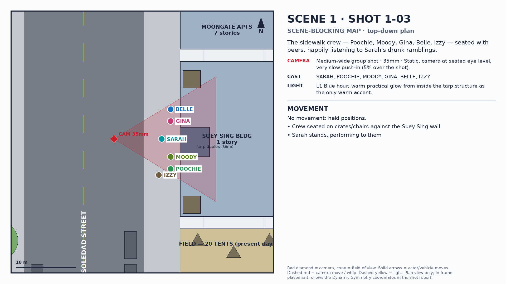

| Slot | Reference | File | Status |
|---|---|---|---|
| 1 | blocking_map | `03_department_outputs/scene_001/blocking_maps/1-03_blocking_map.png` | ready |
| 2 | character · SARAH | `02_bibles/refs/sarah_reference.png` | missing |
| 3 | character · POOCHIE | `02_bibles/refs/poochie_reference.png` | missing |
| 4 | character · MOODY | `02_bibles/refs/moody_reference_sheet.png` | missing |
| 5 | character · GINA | `02_bibles/refs/gina_reference.png` | missing |
| 6 | character · BELLE | `02_bibles/refs/belle_reference.png` | missing |
| 7 | character · IZZY | `02_bibles/refs/izzy_reference_sheet.png` | missing |
| 8 | location · SOLEDAD_SUEY_SING | `02_bibles/refs/soledad_suey_sing_plate.png` | missing |
| 9 | expression_start · SARAH_tipsy_storytelling | `expr/SARAH_tipsy_storytelling.png` | missing |

```text
Image 1: Top-down scene-blocking map. Follow its positions and movement arrows; do not render the map itself.
Image 2 is SARAH (character).
Image 3 is POOCHIE (character).
Image 4 is MOODY (character).
Image 5 is GINA (character).
Image 6 is BELLE (character).
Image 7 is IZZY (character).
Image 8 is SOLEDAD_SUEY_SING (location).
Image 9 is SARAH_tipsy_storytelling (expression start).

A group sits on crates and folding chairs on the sidewalk against the stucco wall, beers in hand, laughing easily as a tipsy woman standing among them tells an animated story with sweeping hand gestures. They lean toward her, grinning; one tips his head back mid-laugh. Stage the action exactly as the blocking map in Image 1 shows: where each person stands, the numbered movement arrows, and the camera position and viewing direction. In frame, the focal point (Sarah mid-story, hands animated) sits at Sarah standing at (0.30, 0.62); the seated group arcs along the lower-right toward (0.80, 0.35) so their eyelines run up the sinister diagonal to her. Medium-wide group shot, 35mm lens. Static, camera at seated eye level, very slow push-in (5% over the shot). Lighting: L1 Blue hour; warm practical glow from inside the tarp structure as the only warm accent. Cinematic tearjerker tone, emotionally intimate framing, soft natural light favoring dawn or dusk. Foil visible somewhere in frame — crumpled, glinting, or scattered nearby. Environment shows worn signs of habitation — blankets, bags, makeshift bedding — treated with visual dignity, not disorder. Camera lingers rather than cuts quickly, allowing emotional weight to build.

Duration 6s. Cinematic 2.39:1 composition, photoreal, no on-screen text, no map graphics in the output.
```

---

## Shot 1-04 · 5s

**Beat:** Life at home: Gina going into and coming out of the tarp-built structure, putting things in and taking things out.

> Producer note (Location Bible): 'we want footage of them all going in and coming out of their home putting things into and grabbing things out of them.'

**Upstream reports:** CRR-001-CAS (flagged_for_human_review), CRR-001-WAR (provisional_pending_upstream), CRR-001-PRO (provisional_pending_upstream), CRR-001-LOC (flagged_for_human_review), CRR-001-BLK (locked), CRR-001-SET (locked), CRR-001-CIN (provisional_pending_upstream), CRR-001-LGT (flagged_for_human_review), CRR-001-IMG (provisional_pending_upstream), CRR-001-VAG (provisional_pending_upstream), CRR-001-EDT (locked)

### Shot Report
- **Blocking / Set:** focal point is *Gina's hands placing a folded blanket inside the shelter* at lower-right eye LR (0.70, 0.33) — Shelter entrance at (0.70, 0.45); Gina enters from frame-left along the inner arc and stops at the entrance. Spiral: Inner arc, top-left orientation. Domestic, ordinary gestures — this is a home, framed with dignity.
- **Set design:** Tarp structure's doorway flap is the frame's anchor; shopping cart parked beside it like a car in a driveway.
- **Camera:** Medium shot, observational, 50mm. Locked-off, eye level. Nobody looks at camera.
- **Lighting:** L1 Blue hour.
- **Cast / wardrobe:** GINA (present_day)
- **Props:** SHOPPING_CARTS
- **Expression anchors:** GINA_neutral_busy → GINA_neutral_busy
- **Editing:** B-roll pool. Use as cutaway anywhere in 1-02 to 1-06.
- **How it works together:** the camera (50mm) arrives at the blocking's focal point — Gina's hands placing a folded blanket inside the shelter — under L1 Blue hour., so the beat "Life at home: Gina going into and coming out of the tarp-built structure, putting things in and taking things out" lands where the eye already is.
- **Open flags:** F-09

### Prompt pair — **BLOCKED**
Blockers:
- GINA: no chosen reference image (F-18)
- GINA: Character Bible is provisional (F-09)
- SOLEDAD_SUEY_SING: no chosen location reference (F-18)

**LTX-2.3**

```text
[GINA] 35-year-old Hispanic woman, a fighter's posture and a loud, instigating energy. Scene: The Suey Sing Building on Soledad Street, Chinatown, Salinas: tan/cream single-story stucco building, weathered signage, boarded and graffiti-covered sections along the lower wall, no fence in front. The seven-story Moongate Apartments rise on its left. On its right, a dirt, weed and rock-filled field holds twenty weathered tents. Against the building's wall: a tent in each corner and a huge tarp-built two-unit structure between them, with shopping carts, bikes and belongings. A woman lifts the flap of a large tarp-built shelter, sets a folded blanket inside with care, then steps back out carrying a jacket and pulls the flap closed behind her, like closing a front door. Composition follows dynamic symmetry principles — subject(s) positioned along a diagonal sightline rather than center-frame, with deliberate negative space. Focal point — Gina's hands placing a folded blanket inside the shelter: Shelter entrance at (0.70, 0.45); Gina enters from frame-left along the inner arc and stops at the entrance. Camera: Medium shot, observational, 50mm lens. Locked-off, eye level. Nobody looks at camera. Lighting: L1 Blue hour. Props in frame: metal shopping carts stacked with bundled blankets, tarps, and plastic bags, treated with visual dignity. Cinematic tearjerker tone, emotionally intimate framing, soft natural light favoring dawn or dusk. Foil visible somewhere in frame — crumpled, glinting, or scattered nearby. Environment shows worn signs of habitation — blankets, bags, makeshift bedding — treated with visual dignity, not disorder. Camera lingers rather than cuts quickly, allowing emotional weight to build. Audio: Tarp rustle, zipper, distant laughter. Duration 5 seconds. Compose inside a centered 2.39:1 safe area of a 16:9 frame.
```

**Wan 2.2** (first frame `expr/GINA_neutral_busy.png`, last frame `expr/GINA_neutral_busy.png`)

```text
[GINA] 35-year-old Hispanic woman, a fighter's posture and a loud, instigating energy. Scene: A woman lifts the flap of a large tarp-built shelter, sets a folded blanket inside with care, then steps back out carrying a jacket and pulls the flap closed behind her, like closing a front door. Medium shot, observational, 50mm. Locked-off, eye level. Nobody looks at camera. Placement: Shelter entrance at (0.70, 0.45); Gina enters from frame-left along the inner arc and stops at the entrance. L1 Blue hour.
```

Negative:

```text
no dead-center framing unless flagged as intentional, no clean or brand-new camping gear; tents show wear and dust, no high-contrast plastic or neon garbage bins, no harsh flat midday daylight, no garbled on-screen text, Moongate Apartments on the left of Suey Sing, never the right, no fence in front of the Suey Sing Building, do not fill in, build over, or remove the open field, do not merge the building-side encampment with the field encampment
```

**MiniMax Omni** (4/9 references)

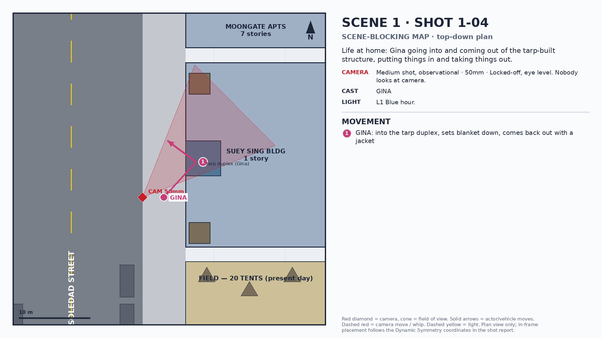

| Slot | Reference | File | Status |
|---|---|---|---|
| 1 | blocking_map | `03_department_outputs/scene_001/blocking_maps/1-04_blocking_map.png` | ready |
| 2 | character · GINA | `02_bibles/refs/gina_reference.png` | missing |
| 3 | location · SOLEDAD_SUEY_SING | `02_bibles/refs/soledad_suey_sing_plate.png` | missing |
| 4 | expression_start · GINA_neutral_busy | `expr/GINA_neutral_busy.png` | missing |

```text
Image 1: Top-down scene-blocking map. Follow its positions and movement arrows; do not render the map itself.
Image 2 is GINA (character).
Image 3 is SOLEDAD_SUEY_SING (location).
Image 4 is GINA_neutral_busy (expression start).

A woman lifts the flap of a large tarp-built shelter, sets a folded blanket inside with care, then steps back out carrying a jacket and pulls the flap closed behind her, like closing a front door. Stage the action exactly as the blocking map in Image 1 shows: where each person stands, the numbered movement arrows, and the camera position and viewing direction. In frame, the focal point (Gina's hands placing a folded blanket inside the shelter) sits at Shelter entrance at (0.70, 0.45); Gina enters from frame-left along the inner arc and stops at the entrance. Medium shot, observational, 50mm lens. Locked-off, eye level. Nobody looks at camera. Lighting: L1 Blue hour. Cinematic tearjerker tone, emotionally intimate framing, soft natural light favoring dawn or dusk. Foil visible somewhere in frame — crumpled, glinting, or scattered nearby. Environment shows worn signs of habitation — blankets, bags, makeshift bedding — treated with visual dignity, not disorder. Camera lingers rather than cuts quickly, allowing emotional weight to build.

Duration 5s. Cinematic 2.39:1 composition, photoreal, no on-screen text, no map graphics in the output.
```

---

## Shot 1-05 · 6s

**Beat:** Perspective shot 1: the upper half of Soledad Street from Dorothy's up.

> We see a couple of perspective shots of the the upper-half (From Dorothy's Kitchen up) of Soledad Street.

**Upstream reports:** CRR-001-CAS (flagged_for_human_review), CRR-001-WAR (provisional_pending_upstream), CRR-001-PRO (provisional_pending_upstream), CRR-001-LOC (flagged_for_human_review), CRR-001-BLK (locked), CRR-001-SET (locked), CRR-001-CIN (provisional_pending_upstream), CRR-001-LGT (flagged_for_human_review), CRR-001-IMG (provisional_pending_upstream), CRR-001-VAG (provisional_pending_upstream), CRR-001-EDT (locked)

### Shot Report
- **Blocking / Set:** focal point is *The field of twenty tents* at right golden section x=0.618 — Field occupies the right of frame from x=0.55 to 0.95; Moongate tower on the left edge reaching y=0.95. Spiral: none. Preserve the open field as intentional negative space — do not fill in, build over, or alter the gap (Scene Blocking drift log).
- **Set design:** Cars parked bumper to bumper on both sides of the street along the field. Foil glints in the gutter. Chairs, crates, bikes in disrepair, trash heaps and carts along the curb.
- **Camera:** Extreme wide establishing shot, 24mm. Static, slightly elevated (head height on a crate), a slow 3-second tilt up from the gutter to the rooftops.
- **Lighting:** L1 Blue hour; horizon behind the buildings beginning to lift to pale steel-blue.
- **Cast / wardrobe:** none
- **Props:** FOIL_CRUMPLED, SHOPPING_CARTS
- **Editing:** Pair with 1-06 as the 'couple of perspective shots'.
- **How it works together:** the camera (24mm) arrives at the blocking's focal point — The field of twenty tents — under L1 Blue hour; horizon behind the buildings beginning to lift to pale steel-blue., so the beat "Perspective shot 1: the upper half of Soledad Street from Dorothy's up" lands where the eye already is.
- **Open flags:** F-02, F-10

### Prompt pair — **BLOCKED**
Blockers:
- SOLEDAD_SUEY_SING: no chosen location reference (F-18)

**LTX-2.3**

```text
Scene: The Suey Sing Building on Soledad Street, Chinatown, Salinas: tan/cream single-story stucco building, weathered signage, boarded and graffiti-covered sections along the lower wall, no fence in front. The seven-story Moongate Apartments rise on its left. On its right, a dirt, weed and rock-filled field holds twenty weathered tents. Against the building's wall: a tent in each corner and a huge tarp-built two-unit structure between them, with shopping carts, bikes and belongings. Establishing view down a Chinatown street at dawn: a seven-story apartment tower on the left, a single-story stucco building, then an open dirt field crowded with twenty weathered tents. Cars line both curbs bumper to bumper. People sit, stand and drift between tents. Composition follows dynamic symmetry principles — subject(s) positioned along a diagonal sightline rather than center-frame, with deliberate negative space. Focal point — The field of twenty tents: Field occupies the right of frame from x=0.55 to 0.95; Moongate tower on the left edge reaching y=0.95. Camera: Extreme wide establishing shot, 24mm lens. Static, slightly elevated (head height on a crate), a slow 3-second tilt up from the gutter to the rooftops. Lighting: L1 Blue hour; horizon behind the buildings beginning to lift to pale steel-blue. Props in frame: dozens of tiny crumpled balls of smoked aluminum foil scattered across the sidewalk and gutter, glinting; metal shopping carts stacked with bundled blankets, tarps, and plastic bags, treated with visual dignity. Cinematic tearjerker tone, emotionally intimate framing, soft natural light favoring dawn or dusk. Foil visible somewhere in frame — crumpled, glinting, or scattered nearby. Environment shows worn signs of habitation — blankets, bags, makeshift bedding — treated with visual dignity, not disorder. Camera lingers rather than cuts quickly, allowing emotional weight to build. Audio: Room tone, a far-off dog, the sidewalk crew's laughter faint. Duration 6 seconds. Compose inside a centered 2.39:1 safe area of a 16:9 frame.
```

**Wan 2.2** (first frame `None`, last frame `None`) — 6s > 5s: generate 2 segments, each segment's last frame seeds the next.

```text
Scene: Establishing view down a Chinatown street at dawn: a seven-story apartment tower on the left, a single-story stucco building, then an open dirt field crowded with twenty weathered tents. Cars line both curbs bumper to bumper. People sit, stand and drift between tents. Extreme wide establishing shot, 24mm. Static, slightly elevated (head height on a crate), a slow 3-second tilt up from the gutter to the rooftops. Placement: Field occupies the right of frame from x=0.55 to 0.95; Moongate tower on the left edge reaching y=0.95. L1 Blue hour; horizon behind the buildings beginning to lift to pale steel-blue.
```

Negative:

```text
no dead-center framing unless flagged as intentional, no clean or brand-new camping gear; tents show wear and dust, no high-contrast plastic or neon garbage bins, no harsh flat midday daylight, no garbled on-screen text, Moongate Apartments on the left of Suey Sing, never the right, no fence in front of the Suey Sing Building, do not fill in, build over, or remove the open field, do not merge the building-side encampment with the field encampment
```

**MiniMax Omni** (2/9 references)

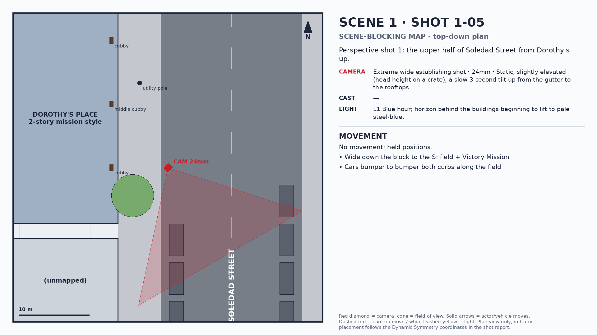

| Slot | Reference | File | Status |
|---|---|---|---|
| 1 | blocking_map | `03_department_outputs/scene_001/blocking_maps/1-05_blocking_map.png` | ready |
| 2 | location · SOLEDAD_SUEY_SING | `02_bibles/refs/soledad_suey_sing_plate.png` | missing |

```text
Image 1: Top-down scene-blocking map. Follow its positions and movement arrows; do not render the map itself.
Image 2 is SOLEDAD_SUEY_SING (location).

Establishing view down a Chinatown street at dawn: a seven-story apartment tower on the left, a single-story stucco building, then an open dirt field crowded with twenty weathered tents. Cars line both curbs bumper to bumper. People sit, stand and drift between tents. Stage the action exactly as the blocking map in Image 1 shows: where each person stands, the numbered movement arrows, and the camera position and viewing direction. In frame, the focal point (The field of twenty tents) sits at Field occupies the right of frame from x=0.55 to 0.95; Moongate tower on the left edge reaching y=0.95. Extreme wide establishing shot, 24mm lens. Static, slightly elevated (head height on a crate), a slow 3-second tilt up from the gutter to the rooftops. Lighting: L1 Blue hour; horizon behind the buildings beginning to lift to pale steel-blue. Cinematic tearjerker tone, emotionally intimate framing, soft natural light favoring dawn or dusk. Foil visible somewhere in frame — crumpled, glinting, or scattered nearby. Environment shows worn signs of habitation — blankets, bags, makeshift bedding — treated with visual dignity, not disorder. Camera lingers rather than cuts quickly, allowing emotional weight to build.

Duration 6s. Cinematic 2.39:1 composition, photoreal, no on-screen text, no map graphics in the output.
```

---

## Shot 1-06 · 5s

**Beat:** Perspective shot 2: street-level detail — chairs, crates, bikes, carts, people hanging, selling, using. Foil everywhere.

> People selling and using drugs, and people hanging out. There's foil everywhere.

**Upstream reports:** CRR-001-CAS (flagged_for_human_review), CRR-001-WAR (provisional_pending_upstream), CRR-001-PRO (provisional_pending_upstream), CRR-001-LOC (flagged_for_human_review), CRR-001-BLK (locked), CRR-001-SET (locked), CRR-001-CIN (provisional_pending_upstream), CRR-001-LGT (flagged_for_human_review), CRR-001-IMG (provisional_pending_upstream), CRR-001-VAG (provisional_pending_upstream), CRR-001-EDT (locked)

### Shot Report
- **Blocking / Set:** focal point is *A single crumpled foil ball in the foreground catching light* at lower-left eye LL (0.30, 0.33) — Foreground foil at (0.30, 0.15); background figures soft along y=0.40–0.60. Spiral: none. Figures are background, soft-focus, non-identifiable — atmosphere, not spectacle.
- **Set design:** Foil along the lower-third line y=0.10 (Props addendum). A bike with no front wheel leans on a cart.
- **Camera:** Low wide shot from curb height, 28mm. Camera at gutter level, very slow push forward along the curb.
- **Lighting:** L1 Blue hour; foil picks up the amber of the streetlamps.
- **Cast / wardrobe:** none
- **Props:** FOIL_CRUMPLED, SHOPPING_CARTS
- **Editing:** Short. Cut on the lighter flick into 1-07.
- **How it works together:** the camera (28mm) arrives at the blocking's focal point — A single crumpled foil ball in the foreground catching light — under L1 Blue hour; foil picks up the amber of the streetlamps., so the beat "Perspective shot 2: street-level detail — chairs, crates, bikes, carts, people hanging, selling, using" lands where the eye already is.
- **Open flags:** F-02

### Prompt pair — **BLOCKED**
Blockers:
- SOLEDAD_SUEY_SING: no chosen location reference (F-18)

**LTX-2.3**

```text
Scene: The Suey Sing Building on Soledad Street, Chinatown, Salinas: tan/cream single-story stucco building, weathered signage, boarded and graffiti-covered sections along the lower wall, no fence in front. The seven-story Moongate Apartments rise on its left. On its right, a dirt, weed and rock-filled field holds twenty weathered tents. Against the building's wall: a tent in each corner and a huge tarp-built two-unit structure between them, with shopping carts, bikes and belongings. Low view along a gutter littered with small crumpled balls of foil glinting in the light. Behind, out of focus, people linger on the sidewalk among carts, crates and a broken bicycle; a figure sits bent forward, gently swaying. Composition follows dynamic symmetry principles — subject(s) positioned along a diagonal sightline rather than center-frame, with deliberate negative space. Focal point — A single crumpled foil ball in the foreground catching light: Foreground foil at (0.30, 0.15); background figures soft along y=0.40–0.60. Camera: Low wide shot from curb height, 28mm lens. Camera at gutter level, very slow push forward along the curb. Lighting: L1 Blue hour; foil picks up the amber of the streetlamps. Props in frame: dozens of tiny crumpled balls of smoked aluminum foil scattered across the sidewalk and gutter, glinting; metal shopping carts stacked with bundled blankets, tarps, and plastic bags, treated with visual dignity. Cinematic tearjerker tone, emotionally intimate framing, soft natural light favoring dawn or dusk. Foil visible somewhere in frame — crumpled, glinting, or scattered nearby. Environment shows worn signs of habitation — blankets, bags, makeshift bedding — treated with visual dignity, not disorder. Camera lingers rather than cuts quickly, allowing emotional weight to build. Audio: Lighter flick off-screen, murmured voices. Duration 5 seconds. Compose inside a centered 2.39:1 safe area of a 16:9 frame.
```

**Wan 2.2** (first frame `None`, last frame `None`)

```text
Scene: Low view along a gutter littered with small crumpled balls of foil glinting in the light. Behind, out of focus, people linger on the sidewalk among carts, crates and a broken bicycle; a figure sits bent forward, gently swaying. Low wide shot from curb height, 28mm. Camera at gutter level, very slow push forward along the curb. Placement: Foreground foil at (0.30, 0.15); background figures soft along y=0.40–0.60. L1 Blue hour; foil picks up the amber of the streetlamps.
```

Negative:

```text
no dead-center framing unless flagged as intentional, no clean or brand-new camping gear; tents show wear and dust, no high-contrast plastic or neon garbage bins, no harsh flat midday daylight, no garbled on-screen text, Moongate Apartments on the left of Suey Sing, never the right, no fence in front of the Suey Sing Building, do not fill in, build over, or remove the open field, do not merge the building-side encampment with the field encampment
```

**MiniMax Omni** (2/9 references)

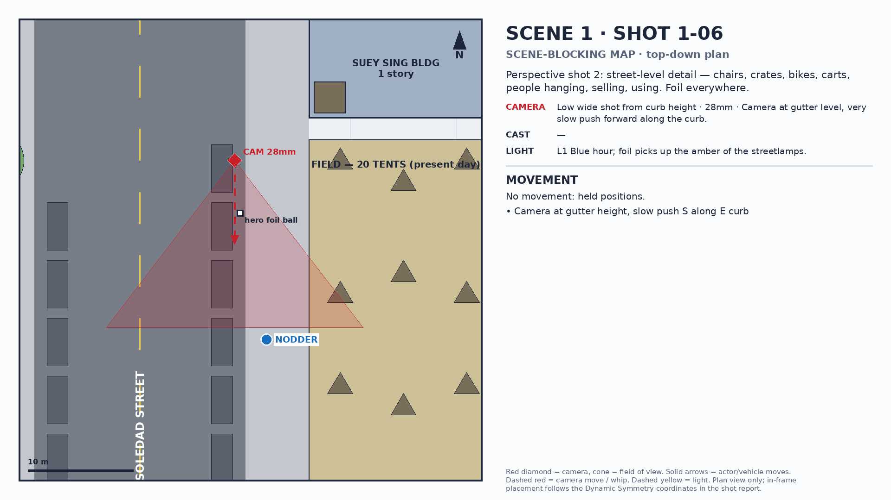

| Slot | Reference | File | Status |
|---|---|---|---|
| 1 | blocking_map | `03_department_outputs/scene_001/blocking_maps/1-06_blocking_map.png` | ready |
| 2 | location · SOLEDAD_SUEY_SING | `02_bibles/refs/soledad_suey_sing_plate.png` | missing |

```text
Image 1: Top-down scene-blocking map. Follow its positions and movement arrows; do not render the map itself.
Image 2 is SOLEDAD_SUEY_SING (location).

Low view along a gutter littered with small crumpled balls of foil glinting in the light. Behind, out of focus, people linger on the sidewalk among carts, crates and a broken bicycle; a figure sits bent forward, gently swaying. Stage the action exactly as the blocking map in Image 1 shows: where each person stands, the numbered movement arrows, and the camera position and viewing direction. In frame, the focal point (A single crumpled foil ball in the foreground catching light) sits at Foreground foil at (0.30, 0.15); background figures soft along y=0.40–0.60. Low wide shot from curb height, 28mm lens. Camera at gutter level, very slow push forward along the curb. Lighting: L1 Blue hour; foil picks up the amber of the streetlamps. Cinematic tearjerker tone, emotionally intimate framing, soft natural light favoring dawn or dusk. Foil visible somewhere in frame — crumpled, glinting, or scattered nearby. Environment shows worn signs of habitation — blankets, bags, makeshift bedding — treated with visual dignity, not disorder. Camera lingers rather than cuts quickly, allowing emotional weight to build.

Duration 5s. Cinematic 2.39:1 composition, photoreal, no on-screen text, no map graphics in the output.
```

---

## Shot 1-07 · 4s

**Beat:** Paul asks the block where it's at. Ends on a whip pan across the street.

> Paul asks the block. PAUL: I'm tryna spend a hundo, where it at?

**Upstream reports:** CRR-001-CAS (flagged_for_human_review), CRR-001-WAR (provisional_pending_upstream), CRR-001-PRO (provisional_pending_upstream), CRR-001-LOC (flagged_for_human_review), CRR-001-BLK (locked), CRR-001-SET (locked), CRR-001-CIN (provisional_pending_upstream), CRR-001-LGT (flagged_for_human_review), CRR-001-IMG (provisional_pending_upstream), CRR-001-VAG (provisional_pending_upstream), CRR-001-EDT (locked)

### Shot Report
- **Blocking / Set:** focal point is *Paul's face calling out* at UL (0.30, 0.66) — Paul's face at (0.30, 0.66), body angled toward screen-left (toward Dorothy's). Spiral: none. He's turned outward to the whole block — open body, open need.
- **Set design:** Suey Sing wall soft behind him.
- **Camera:** Medium shot, 50mm. Static for 3s, then a fast whip pan screen-left across the street (motion blur) for the final second.
- **Lighting:** L1 Blue hour, amber streetlamp as a rim on his hair.
- **Cast / wardrobe:** PAUL (present_day)
- **Props:** FOIL_CRUMPLED
- **Expression anchors:** PAUL_pleading_outward → PAUL_pleading_outward
- **Editing:** Whip-pan match cut into 1-08: cut mid-blur.
- **How it works together:** the camera (50mm) arrives at the blocking's focal point — Paul's face calling out — under L1 Blue hour, amber streetlamp as a rim on his hair., so the beat "Paul asks the block where it's at" lands where the eye already is.
- **Open flags:** F-03

### Prompt pair — **BLOCKED**
Blockers:
- PAUL: no chosen reference image (F-18)
- SOLEDAD_SUEY_SING: no chosen location reference (F-18)

**LTX-2.3**

```text
[PAUL] Same character as reference image: white man in his late 20s to early 30s, gaunt thin build, dirty blonde wavy shoulder-length hair, disheveled, light patchy stubble, blue eyes, pained distressed expression, wearing a gray hooded sweatshirt. Maintain exact facial structure and build from reference. Scene: The Suey Sing Building on Soledad Street, Chinatown, Salinas: tan/cream single-story stucco building, weathered signage, boarded and graffiti-covered sections along the lower wall, no fence in front. The seven-story Moongate Apartments rise on its left. On its right, a dirt, weed and rock-filled field holds twenty weathered tents. Against the building's wall: a tent in each corner and a huge tarp-built two-unit structure between them, with shopping carts, bikes and belongings. The young man stops at the curb, turns outward toward the whole street and calls out, arms half-raised. The camera then whips fast to the left across the street in a streak of motion blur. Composition follows dynamic symmetry principles — subject(s) positioned along a diagonal sightline rather than center-frame, with deliberate negative space. Focal point — Paul's face calling out: Paul's face at (0.30, 0.66), body angled toward screen-left (toward Dorothy's). Camera: Medium shot, 50mm lens. Static for 3s, then a fast whip pan screen-left across the street (motion blur) for the final second. Lighting: L1 Blue hour, amber streetlamp as a rim on his hair. Props in frame: dozens of tiny crumpled balls of smoked aluminum foil scattered across the sidewalk and gutter, glinting. Cinematic tearjerker tone, emotionally intimate framing, soft natural light favoring dawn or dusk. Foil visible somewhere in frame — crumpled, glinting, or scattered nearby. Environment shows worn signs of habitation — blankets, bags, makeshift bedding — treated with visual dignity, not disorder. Camera lingers rather than cuts quickly, allowing emotional weight to build. Paul says: "I'm tryna spend a hundo, where it at?" Audio: His voice carries and echoes slightly off the buildings. Duration 4 seconds. Compose inside a centered 2.39:1 safe area of a 16:9 frame.
```

**Wan 2.2** (first frame `expr/PAUL_pleading_outward.png`, last frame `expr/PAUL_pleading_outward.png`)

```text
[PAUL] Same character as reference image: white man in his late 20s to early 30s, gaunt thin build, dirty blonde wavy shoulder-length hair, disheveled, light patchy stubble, blue eyes, pained distressed expression, wearing a gray hooded sweatshirt. Maintain exact facial structure and build from reference. Scene: The young man stops at the curb, turns outward toward the whole street and calls out, arms half-raised. The camera then whips fast to the left across the street in a streak of motion blur. Medium shot, 50mm. Static for 3s, then a fast whip pan screen-left across the street (motion blur) for the final second. Placement: Paul's face at (0.30, 0.66), body angled toward screen-left (toward Dorothy's). L1 Blue hour, amber streetlamp as a rim on his hair.
```

Negative:

```text
no dead-center framing unless flagged as intentional, no clean or brand-new camping gear; tents show wear and dust, no high-contrast plastic or neon garbage bins, no harsh flat midday daylight, no garbled on-screen text, no neat/well-groomed hair, no clean-shaven face, no composed/calm default expression, no healthy/full build, no eye color other than blue, no formal or bright-colored wardrobe, Moongate Apartments on the left of Suey Sing, never the right, no fence in front of the Suey Sing Building, do not fill in, build over, or remove the open field, do not merge the building-side encampment with the field encampment
```

**MiniMax Omni** (4/9 references)

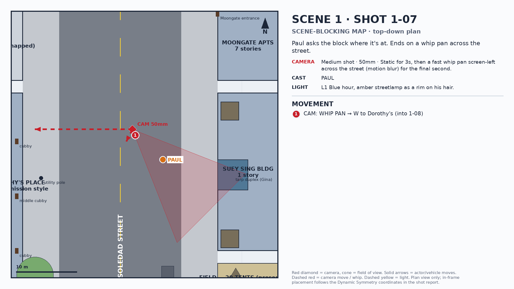

| Slot | Reference | File | Status |
|---|---|---|---|
| 1 | blocking_map | `03_department_outputs/scene_001/blocking_maps/1-07_blocking_map.png` | ready |
| 2 | character · PAUL | `02_bibles/refs/paul_reference.png` | missing |
| 3 | location · SOLEDAD_SUEY_SING | `02_bibles/refs/soledad_suey_sing_plate.png` | missing |
| 4 | expression_start · PAUL_pleading_outward | `expr/PAUL_pleading_outward.png` | missing |

```text
Image 1: Top-down scene-blocking map. Follow its positions and movement arrows; do not render the map itself.
Image 2 is PAUL (character).
Image 3 is SOLEDAD_SUEY_SING (location).
Image 4 is PAUL_pleading_outward (expression start).

The young man stops at the curb, turns outward toward the whole street and calls out, arms half-raised. The camera then whips fast to the left across the street in a streak of motion blur. Stage the action exactly as the blocking map in Image 1 shows: where each person stands, the numbered movement arrows, and the camera position and viewing direction. In frame, the focal point (Paul's face calling out) sits at Paul's face at (0.30, 0.66), body angled toward screen-left (toward Dorothy's). Medium shot, 50mm lens. Static for 3s, then a fast whip pan screen-left across the street (motion blur) for the final second. Lighting: L1 Blue hour, amber streetlamp as a rim on his hair. Cinematic tearjerker tone, emotionally intimate framing, soft natural light favoring dawn or dusk. Foil visible somewhere in frame — crumpled, glinting, or scattered nearby. Environment shows worn signs of habitation — blankets, bags, makeshift bedding — treated with visual dignity, not disorder. Camera lingers rather than cuts quickly, allowing emotional weight to build. Paul says: "I'm tryna spend a hundo, where it at?"

Duration 4s. Cinematic 2.39:1 composition, photoreal, no on-screen text, no map graphics in the output.
```

---

## Shot 1-08 · 4s

**Beat:** Whip pan lands on Killa seated on a crate in the middle cubbyhole of Dorothy's.

> The shot whip pans across the street to where KILLA is seated on a crate, in the middle middle of cubbyhole. KILLA: You tried Feddietown?

**Upstream reports:** CRR-001-CAS (flagged_for_human_review), CRR-001-WAR (provisional_pending_upstream), CRR-001-PRO (provisional_pending_upstream), CRR-001-LOC (flagged_for_human_review), CRR-001-BLK (locked), CRR-001-SET (locked), CRR-001-CIN (provisional_pending_upstream), CRR-001-LGT (flagged_for_human_review), CRR-001-IMG (provisional_pending_upstream), CRR-001-VAG (provisional_pending_upstream), CRR-001-EDT (locked)

### Shot Report
- **Blocking / Set:** focal point is *Killa's unhurried face* at UR (0.70, 0.66) — Killa seated at (0.70, 0.55), face at (0.70, 0.66), framed by the dark recessed cubbyhole. Spiral: none. Killa is still, the camera is the thing that moves — power sits still.
- **Set design:** Middle of three recessed cubbyhole entrances of the yellow stucco building frames him like a throne alcove; utility pole on frame-left edge.
- **Camera:** Medium-wide landing to medium, 50mm. Enters on the tail of a fast whip pan (motion blur), settles hard on Killa within 0.5s, then holds still.
- **Lighting:** L1 Blue hour; the cubbyhole is in shade, a sliver of amber streetlamp catches his gold rings.
- **Cast / wardrobe:** KILLA (present_day)
- **Props:** MILK_CRATE, FOIL_CRUMPLED
- **Expression anchors:** KILLA_cool_unbothered → KILLA_cool_unbothered
- **Editing:** Receives the whip-pan match cut from 1-07.
- **How it works together:** the camera (50mm) arrives at the blocking's focal point — Killa's unhurried face — under L1 Blue hour; the cubbyhole is in shade, a sliver of amber streetlamp catches his gold rings., so the beat "Whip pan lands on Killa seated on a crate in the middle cubbyhole of Dorothy's" lands where the eye already is.
- **Open flags:** F-11

### Prompt pair — **BLOCKED**
Blockers:
- KILLA: no chosen reference image (F-18)
- DOROTHYS_PLACE: no chosen location reference (F-18)

**LTX-2.3**

```text
[KILLA] Same character as reference image: 40-year-old African American man, tall, slim build, long shoulder-length dreadlocks, missing front left tooth, clean-shaven, black eyes, sagging jawline, longish hands, smooth confident charming demeanor, several gold rings, gold nugget bracelet. Wearing a bomber jacket with a fake fur-lined hood, jeans, boots, and a dark brown beanie. Maintain exact facial structure and build from reference. Scene: Dorothy's Place, directly across Soledad Street from the Suey Sing Building: two-story Spanish/mission-style building, yellow stucco walls, dark-red trim and support beams, upper wooden balcony with railing, green-trimmed windows, three recessed cubbyhole entrances at ground level, yellow brick wall topped with black steel spikes running left and right, a large shade tree, a utility pole standing directly in front near the entrance. The camera lands out of a fast whip pan on a tall slim man lounging on an upside-down milk crate in a recessed doorway, perfectly at ease. He speaks across the street without raising his voice. Composition follows dynamic symmetry principles — subject(s) positioned along a diagonal sightline rather than center-frame, with deliberate negative space. Focal point — Killa's unhurried face: Killa seated at (0.70, 0.55), face at (0.70, 0.66), framed by the dark recessed cubbyhole. Camera: Medium-wide landing to medium, 50mm lens. Enters on the tail of a fast whip pan (motion blur), settles hard on Killa within 0.5s, then holds still. Lighting: L1 Blue hour; the cubbyhole is in shade, a sliver of amber streetlamp catches his gold rings. Props in frame: a heavy-duty plastic milk crate, weathered black, flipped upside down as a street seat; dozens of tiny crumpled balls of smoked aluminum foil scattered across the sidewalk and gutter, glinting. Cinematic tearjerker tone, emotionally intimate framing, soft natural light favoring dawn or dusk. Foil visible somewhere in frame — crumpled, glinting, or scattered nearby. Environment shows worn signs of habitation — blankets, bags, makeshift bedding — treated with visual dignity, not disorder. Camera lingers rather than cuts quickly, allowing emotional weight to build. Killa says: "You tried Feddietown?" Audio: Motion whoosh resolving into quiet. Duration 4 seconds. Compose inside a centered 2.39:1 safe area of a 16:9 frame.
```

**Wan 2.2** (first frame `expr/KILLA_cool_unbothered.png`, last frame `expr/KILLA_cool_unbothered.png`)

```text
[KILLA] Same character as reference image: 40-year-old African American man, tall, slim build, long shoulder-length dreadlocks, missing front left tooth, clean-shaven, black eyes, sagging jawline, longish hands, smooth confident charming demeanor, several gold rings, gold nugget bracelet. Wearing a bomber jacket with a fake fur-lined hood, jeans, boots, and a dark brown beanie. Maintain exact facial structure and build from reference. Scene: The camera lands out of a fast whip pan on a tall slim man lounging on an upside-down milk crate in a recessed doorway, perfectly at ease. He speaks across the street without raising his voice. Medium-wide landing to medium, 50mm. Enters on the tail of a fast whip pan (motion blur), settles hard on Killa within 0.5s, then holds still. Placement: Killa seated at (0.70, 0.55), face at (0.70, 0.66), framed by the dark recessed cubbyhole. L1 Blue hour; the cubbyhole is in shade, a sliver of amber streetlamp catches his gold rings.
```

Negative:

```text
no dead-center framing unless flagged as intentional, no clean or brand-new camping gear; tents show wear and dust, no high-contrast plastic or neon garbage bins, no harsh flat midday daylight, no garbled on-screen text, no short hair, no heavyset/stocky build, no full smile without the missing front left tooth showing, no facial hair, no eye color other than black, no firm/tight jawline, no reserved/timid demeanor, no flashback wardrobe elements, no missing gold jewelry, never remove the utility pole in front of Dorothy's Place, no swapping architectural styles with the Suey Sing Building
```

**MiniMax Omni** (5/9 references)

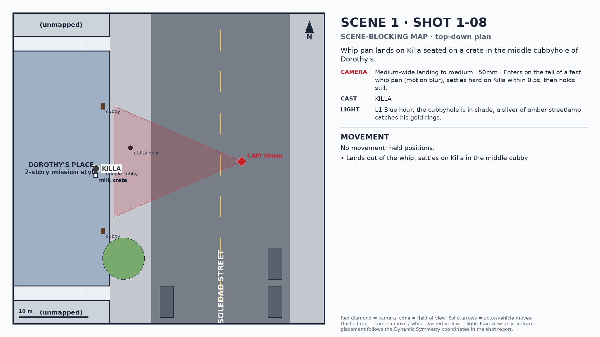

| Slot | Reference | File | Status |
|---|---|---|---|
| 1 | blocking_map | `03_department_outputs/scene_001/blocking_maps/1-08_blocking_map.png` | ready |
| 2 | character · KILLA | `02_bibles/refs/killa_reference.png` | missing |
| 3 | location · DOROTHYS_PLACE | `02_bibles/refs/dorothys_place_plate.png` | missing |
| 4 | expression_start · KILLA_cool_unbothered | `expr/KILLA_cool_unbothered.png` | missing |
| 5 | prop · MILK_CRATE | `02_bibles/refs/milk_crate.png` | missing |

```text
Image 1: Top-down scene-blocking map. Follow its positions and movement arrows; do not render the map itself.
Image 2 is KILLA (character).
Image 3 is DOROTHYS_PLACE (location).
Image 4 is KILLA_cool_unbothered (expression start).
Image 5 is MILK_CRATE (prop).

The camera lands out of a fast whip pan on a tall slim man lounging on an upside-down milk crate in a recessed doorway, perfectly at ease. He speaks across the street without raising his voice. Stage the action exactly as the blocking map in Image 1 shows: where each person stands, the numbered movement arrows, and the camera position and viewing direction. In frame, the focal point (Killa's unhurried face) sits at Killa seated at (0.70, 0.55), face at (0.70, 0.66), framed by the dark recessed cubbyhole. Medium-wide landing to medium, 50mm lens. Enters on the tail of a fast whip pan (motion blur), settles hard on Killa within 0.5s, then holds still. Lighting: L1 Blue hour; the cubbyhole is in shade, a sliver of amber streetlamp catches his gold rings. Cinematic tearjerker tone, emotionally intimate framing, soft natural light favoring dawn or dusk. Foil visible somewhere in frame — crumpled, glinting, or scattered nearby. Environment shows worn signs of habitation — blankets, bags, makeshift bedding — treated with visual dignity, not disorder. Camera lingers rather than cuts quickly, allowing emotional weight to build. Killa says: "You tried Feddietown?"

Duration 4s. Cinematic 2.39:1 composition, photoreal, no on-screen text, no map graphics in the output.
```

---

## Shot 1-09 · 5s

**Beat:** Paul stops in his tracks and spins to Killa, face full of hope and desperation.

> The shot switches to one that catches PAUL stopping in tracks and spinning to KILLA with a face full of hope and desperation.

**Upstream reports:** CRR-001-CAS (flagged_for_human_review), CRR-001-WAR (provisional_pending_upstream), CRR-001-PRO (provisional_pending_upstream), CRR-001-LOC (flagged_for_human_review), CRR-001-BLK (locked), CRR-001-SET (locked), CRR-001-CIN (provisional_pending_upstream), CRR-001-LGT (flagged_for_human_review), CRR-001-IMG (provisional_pending_upstream), CRR-001-VAG (provisional_pending_upstream), CRR-001-EDT (locked)

### Shot Report
- **Blocking / Set:** focal point is *Paul's eyes lighting with hope* at UR (0.70, 0.66) — Paul spins into frame, face lands at (0.70, 0.66) looking screen-left toward Killa. Spiral: none. Eyeline screen-left matches Killa's screen-right placement in 1-08.
- **Set design:** Background falls off to soft blue.
- **Camera:** Medium close-up, 85mm. Static, at Paul's eye level.
- **Lighting:** L1 Blue hour.
- **Cast / wardrobe:** PAUL (present_day)
- **Expression anchors:** PAUL_scanning_restless → PAUL_hope_desperation
- **Editing:** Cut on the spin.
- **How it works together:** the camera (85mm) arrives at the blocking's focal point — Paul's eyes lighting with hope — under L1 Blue hour., so the beat "Paul stops in his tracks and spins to Killa, face full of hope and desperation" lands where the eye already is.
- **Open flags:** F-03

### Prompt pair — **BLOCKED**
Blockers:
- PAUL: no chosen reference image (F-18)
- SOLEDAD_SUEY_SING: no chosen location reference (F-18)

**LTX-2.3**

```text
[PAUL] Same character as reference image: white man in his late 20s to early 30s, gaunt thin build, dirty blonde wavy shoulder-length hair, disheveled, light patchy stubble, blue eyes, pained distressed expression, wearing a gray hooded sweatshirt. Maintain exact facial structure and build from reference. Scene: The Suey Sing Building on Soledad Street, Chinatown, Salinas: tan/cream single-story stucco building, weathered signage, boarded and graffiti-covered sections along the lower wall, no fence in front. The seven-story Moongate Apartments rise on its left. On its right, a dirt, weed and rock-filled field holds twenty weathered tents. Against the building's wall: a tent in each corner and a huge tarp-built two-unit structure between them, with shopping carts, bikes and belongings. The young man stops mid-stride and spins around, his face opening with sudden hope and need, eyes locked across the street. Composition follows dynamic symmetry principles — subject(s) positioned along a diagonal sightline rather than center-frame, with deliberate negative space. Focal point — Paul's eyes lighting with hope: Paul spins into frame, face lands at (0.70, 0.66) looking screen-left toward Killa. Camera: Medium close-up, 85mm lens. Static, at Paul's eye level. Lighting: L1 Blue hour. Cinematic tearjerker tone, emotionally intimate framing, soft natural light favoring dawn or dusk. Foil visible somewhere in frame — crumpled, glinting, or scattered nearby. Environment shows worn signs of habitation — blankets, bags, makeshift bedding — treated with visual dignity, not disorder. Camera lingers rather than cuts quickly, allowing emotional weight to build. Paul says: "Not yet, why? Somebody over there gots some?" Audio: Sneaker scuff on the turn. Duration 5 seconds. Compose inside a centered 2.39:1 safe area of a 16:9 frame.
```

**Wan 2.2** (first frame `expr/PAUL_scanning_restless.png`, last frame `expr/PAUL_hope_desperation.png`)

```text
[PAUL] Same character as reference image: white man in his late 20s to early 30s, gaunt thin build, dirty blonde wavy shoulder-length hair, disheveled, light patchy stubble, blue eyes, pained distressed expression, wearing a gray hooded sweatshirt. Maintain exact facial structure and build from reference. Scene: The young man stops mid-stride and spins around, his face opening with sudden hope and need, eyes locked across the street. Medium close-up, 85mm. Static, at Paul's eye level. Placement: Paul spins into frame, face lands at (0.70, 0.66) looking screen-left toward Killa. L1 Blue hour.
```

Negative:

```text
no dead-center framing unless flagged as intentional, no clean or brand-new camping gear; tents show wear and dust, no high-contrast plastic or neon garbage bins, no harsh flat midday daylight, no garbled on-screen text, no neat/well-groomed hair, no clean-shaven face, no composed/calm default expression, no healthy/full build, no eye color other than blue, no formal or bright-colored wardrobe, Moongate Apartments on the left of Suey Sing, never the right, no fence in front of the Suey Sing Building, do not fill in, build over, or remove the open field, do not merge the building-side encampment with the field encampment
```

**MiniMax Omni** (5/9 references)

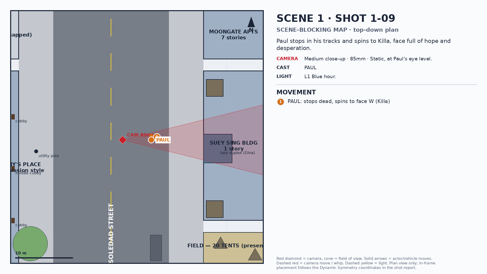

| Slot | Reference | File | Status |
|---|---|---|---|
| 1 | blocking_map | `03_department_outputs/scene_001/blocking_maps/1-09_blocking_map.png` | ready |
| 2 | character · PAUL | `02_bibles/refs/paul_reference.png` | missing |
| 3 | location · SOLEDAD_SUEY_SING | `02_bibles/refs/soledad_suey_sing_plate.png` | missing |
| 4 | expression_start · PAUL_scanning_restless | `expr/PAUL_scanning_restless.png` | missing |
| 5 | expression_end · PAUL_hope_desperation | `expr/PAUL_hope_desperation.png` | missing |

```text
Image 1: Top-down scene-blocking map. Follow its positions and movement arrows; do not render the map itself.
Image 2 is PAUL (character).
Image 3 is SOLEDAD_SUEY_SING (location).
Image 4 is PAUL_scanning_restless (expression start).
Image 5 is PAUL_hope_desperation (expression end).

The young man stops mid-stride and spins around, his face opening with sudden hope and need, eyes locked across the street. Stage the action exactly as the blocking map in Image 1 shows: where each person stands, the numbered movement arrows, and the camera position and viewing direction. In frame, the focal point (Paul's eyes lighting with hope) sits at Paul spins into frame, face lands at (0.70, 0.66) looking screen-left toward Killa. Medium close-up, 85mm lens. Static, at Paul's eye level. Lighting: L1 Blue hour. Cinematic tearjerker tone, emotionally intimate framing, soft natural light favoring dawn or dusk. Foil visible somewhere in frame — crumpled, glinting, or scattered nearby. Environment shows worn signs of habitation — blankets, bags, makeshift bedding — treated with visual dignity, not disorder. Camera lingers rather than cuts quickly, allowing emotional weight to build. Paul says: "Not yet, why? Somebody over there gots some?"

Duration 5s. Cinematic 2.39:1 composition, photoreal, no on-screen text, no map graphics in the output.
```

---

## Shot 1-10 · 6s

**Beat:** Paul's POV of Dorothy's: a dozen people hanging, nodding, getting high around the other two cubbyholes. Killa sits alone.

> We see Dorothy's from PAUL'S perspective and there's a dozen or so people hanging, nodding, getting high in and around the other two cubbyholes. Killla sits alone.

**Upstream reports:** CRR-001-CAS (flagged_for_human_review), CRR-001-WAR (provisional_pending_upstream), CRR-001-PRO (provisional_pending_upstream), CRR-001-LOC (flagged_for_human_review), CRR-001-BLK (locked), CRR-001-SET (locked), CRR-001-CIN (provisional_pending_upstream), CRR-001-LGT (flagged_for_human_review), CRR-001-IMG (provisional_pending_upstream), CRR-001-VAG (provisional_pending_upstream), CRR-001-EDT (locked)

### Shot Report
- **Blocking / Set:** focal point is *Killa alone in the middle cubbyhole* at center-right golden section (0.618, 0.50) — Killa at (0.62, 0.45); crowded cubbyholes at (0.25, 0.45) and (0.90, 0.45). Spiral: none. Isolation by contrast: two crowded doorways bracket one empty-but-for-Killa doorway.
- **Set design:** Utility pole divides the frame at x=0.15; spiked yellow brick wall runs off both edges.
- **Camera:** Wide POV, 35mm. POV, subtle handheld sway matching Paul's unsteady stance, looking across the street.
- **Lighting:** L1 Blue hour.
- **Cast / wardrobe:** KILLA (present_day)
- **Props:** FOIL_CRUMPLED, MILK_CRATE
- **Editing:** Paul's POV — keep short enough that the audience reads the geography of power: Killa alone.
- **How it works together:** the camera (35mm) arrives at the blocking's focal point — Killa alone in the middle cubbyhole — under L1 Blue hour., so the beat "Paul's POV of Dorothy's: a dozen people hanging, nodding, getting high around the other two cubbyholes" lands where the eye already is.
- **Open flags:** F-11

### Prompt pair — **BLOCKED**
Blockers:
- KILLA: no chosen reference image (F-18)
- DOROTHYS_PLACE: no chosen location reference (F-18)

**LTX-2.3**

```text
[KILLA] Same character as reference image: 40-year-old African American man, tall, slim build, long shoulder-length dreadlocks, missing front left tooth, clean-shaven, black eyes, sagging jawline, longish hands, smooth confident charming demeanor, several gold rings, gold nugget bracelet. Wearing a bomber jacket with a fake fur-lined hood, jeans, boots, and a dark brown beanie. Maintain exact facial structure and build from reference. Scene: Dorothy's Place, directly across Soledad Street from the Suey Sing Building: two-story Spanish/mission-style building, yellow stucco walls, dark-red trim and support beams, upper wooden balcony with railing, green-trimmed windows, three recessed cubbyhole entrances at ground level, yellow brick wall topped with black steel spikes running left and right, a large shade tree, a utility pole standing directly in front near the entrance. View across the street at a two-story Spanish-style building with three recessed doorways. The two outer doorways are crowded with a dozen people leaning, sitting, bodies folded forward and gently swaying. In the middle doorway one man sits alone on a crate. Composition follows dynamic symmetry principles — subject(s) positioned along a diagonal sightline rather than center-frame, with deliberate negative space. Focal point — Killa alone in the middle cubbyhole: Killa at (0.62, 0.45); crowded cubbyholes at (0.25, 0.45) and (0.90, 0.45). Camera: Wide POV, 35mm lens. POV, subtle handheld sway matching Paul's unsteady stance, looking across the street. Lighting: L1 Blue hour. Props in frame: dozens of tiny crumpled balls of smoked aluminum foil scattered across the sidewalk and gutter, glinting; a heavy-duty plastic milk crate, weathered black, flipped upside down as a street seat. Cinematic tearjerker tone, emotionally intimate framing, soft natural light favoring dawn or dusk. Foil visible somewhere in frame — crumpled, glinting, or scattered nearby. Environment shows worn signs of habitation — blankets, bags, makeshift bedding — treated with visual dignity, not disorder. Camera lingers rather than cuts quickly, allowing emotional weight to build. Audio: Soft murmur from across the street. Duration 6 seconds. Compose inside a centered 2.39:1 safe area of a 16:9 frame.
```

**Wan 2.2** (first frame `None`, last frame `None`) — 6s > 5s: generate 2 segments, each segment's last frame seeds the next.

```text
[KILLA] Same character as reference image: 40-year-old African American man, tall, slim build, long shoulder-length dreadlocks, missing front left tooth, clean-shaven, black eyes, sagging jawline, longish hands, smooth confident charming demeanor, several gold rings, gold nugget bracelet. Wearing a bomber jacket with a fake fur-lined hood, jeans, boots, and a dark brown beanie. Maintain exact facial structure and build from reference. Scene: View across the street at a two-story Spanish-style building with three recessed doorways. The two outer doorways are crowded with a dozen people leaning, sitting, bodies folded forward and gently swaying. In the middle doorway one man sits alone on a crate. Wide POV, 35mm. POV, subtle handheld sway matching Paul's unsteady stance, looking across the street. Placement: Killa at (0.62, 0.45); crowded cubbyholes at (0.25, 0.45) and (0.90, 0.45). L1 Blue hour.
```

Negative:

```text
no dead-center framing unless flagged as intentional, no clean or brand-new camping gear; tents show wear and dust, no high-contrast plastic or neon garbage bins, no harsh flat midday daylight, no garbled on-screen text, no short hair, no heavyset/stocky build, no full smile without the missing front left tooth showing, no facial hair, no eye color other than black, no firm/tight jawline, no reserved/timid demeanor, no flashback wardrobe elements, no missing gold jewelry, never remove the utility pole in front of Dorothy's Place, no swapping architectural styles with the Suey Sing Building
```

**MiniMax Omni** (4/9 references)

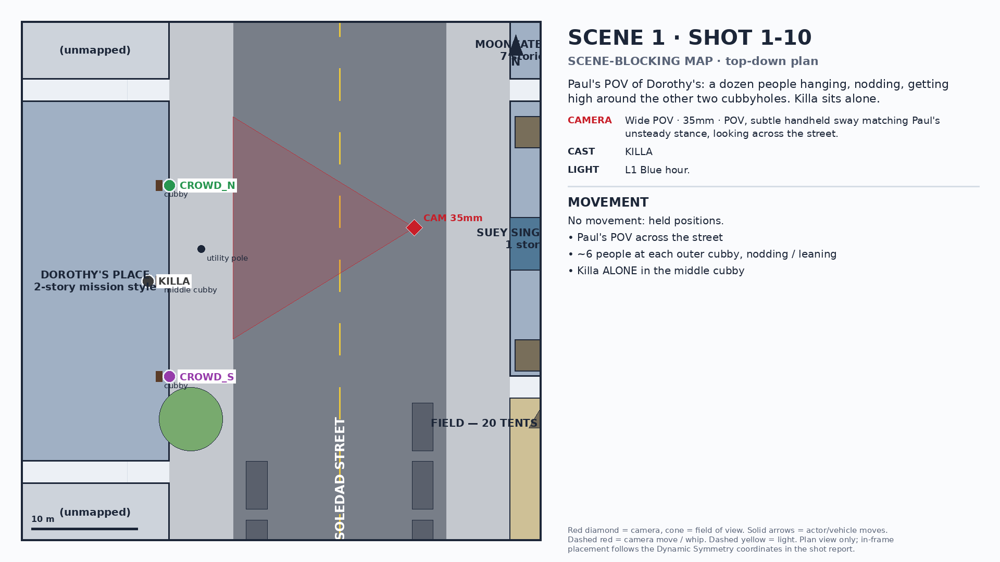

| Slot | Reference | File | Status |
|---|---|---|---|
| 1 | blocking_map | `03_department_outputs/scene_001/blocking_maps/1-10_blocking_map.png` | ready |
| 2 | character · KILLA | `02_bibles/refs/killa_reference.png` | missing |
| 3 | location · DOROTHYS_PLACE | `02_bibles/refs/dorothys_place_plate.png` | missing |
| 4 | prop · MILK_CRATE | `02_bibles/refs/milk_crate.png` | missing |

```text
Image 1: Top-down scene-blocking map. Follow its positions and movement arrows; do not render the map itself.
Image 2 is KILLA (character).
Image 3 is DOROTHYS_PLACE (location).
Image 4 is MILK_CRATE (prop).

View across the street at a two-story Spanish-style building with three recessed doorways. The two outer doorways are crowded with a dozen people leaning, sitting, bodies folded forward and gently swaying. In the middle doorway one man sits alone on a crate. Stage the action exactly as the blocking map in Image 1 shows: where each person stands, the numbered movement arrows, and the camera position and viewing direction. In frame, the focal point (Killa alone in the middle cubbyhole) sits at Killa at (0.62, 0.45); crowded cubbyholes at (0.25, 0.45) and (0.90, 0.45). Wide POV, 35mm lens. POV, subtle handheld sway matching Paul's unsteady stance, looking across the street. Lighting: L1 Blue hour. Cinematic tearjerker tone, emotionally intimate framing, soft natural light favoring dawn or dusk. Foil visible somewhere in frame — crumpled, glinting, or scattered nearby. Environment shows worn signs of habitation — blankets, bags, makeshift bedding — treated with visual dignity, not disorder. Camera lingers rather than cuts quickly, allowing emotional weight to build.

Duration 6s. Cinematic 2.39:1 composition, photoreal, no on-screen text, no map graphics in the output.
```

---

## Shot 1-11 · 4s

**Beat:** Killa shakes his head no.

> KILLA (shaking his head): Naw. There ain't been none out here all night.

**Upstream reports:** CRR-001-CAS (flagged_for_human_review), CRR-001-WAR (provisional_pending_upstream), CRR-001-PRO (provisional_pending_upstream), CRR-001-LOC (flagged_for_human_review), CRR-001-BLK (locked), CRR-001-SET (locked), CRR-001-CIN (provisional_pending_upstream), CRR-001-LGT (flagged_for_human_review), CRR-001-IMG (provisional_pending_upstream), CRR-001-VAG (provisional_pending_upstream), CRR-001-EDT (locked)

### Shot Report
- **Blocking / Set:** focal point is *Killa's slow head shake* at UR (0.70, 0.66) — Killa's face at (0.70, 0.66), eyeline screen-right toward Paul. Spiral: none. 
- **Set design:** Dark cubbyhole behind him.
- **Camera:** Medium close-up, 85mm. Static, slightly below Killa's eye level.
- **Lighting:** L1 Blue hour.
- **Cast / wardrobe:** KILLA (present_day)
- **Props:** MILK_CRATE
- **Expression anchors:** KILLA_cool_unbothered → KILLA_cool_unbothered
- **Editing:** —
- **How it works together:** the camera (85mm) arrives at the blocking's focal point — Killa's slow head shake — under L1 Blue hour., so the beat "Killa shakes his head no" lands where the eye already is.

### Prompt pair — **BLOCKED**
Blockers:
- KILLA: no chosen reference image (F-18)
- DOROTHYS_PLACE: no chosen location reference (F-18)

**LTX-2.3**

```text
[KILLA] Same character as reference image: 40-year-old African American man, tall, slim build, long shoulder-length dreadlocks, missing front left tooth, clean-shaven, black eyes, sagging jawline, longish hands, smooth confident charming demeanor, several gold rings, gold nugget bracelet. Wearing a bomber jacket with a fake fur-lined hood, jeans, boots, and a dark brown beanie. Maintain exact facial structure and build from reference. Scene: Dorothy's Place, directly across Soledad Street from the Suey Sing Building: two-story Spanish/mission-style building, yellow stucco walls, dark-red trim and support beams, upper wooden balcony with railing, green-trimmed windows, three recessed cubbyhole entrances at ground level, yellow brick wall topped with black steel spikes running left and right, a large shade tree, a utility pole standing directly in front near the entrance. The man in the doorway slowly shakes his head, unhurried, almost amused. Composition follows dynamic symmetry principles — subject(s) positioned along a diagonal sightline rather than center-frame, with deliberate negative space. Focal point — Killa's slow head shake: Killa's face at (0.70, 0.66), eyeline screen-right toward Paul. Camera: Medium close-up, 85mm lens. Static, slightly below Killa's eye level. Lighting: L1 Blue hour. Props in frame: a heavy-duty plastic milk crate, weathered black, flipped upside down as a street seat. Cinematic tearjerker tone, emotionally intimate framing, soft natural light favoring dawn or dusk. Foil visible somewhere in frame — crumpled, glinting, or scattered nearby. Environment shows worn signs of habitation — blankets, bags, makeshift bedding — treated with visual dignity, not disorder. Camera lingers rather than cuts quickly, allowing emotional weight to build. Killa says: "Naw. There ain't been none out here all night." Duration 4 seconds. Compose inside a centered 2.39:1 safe area of a 16:9 frame.
```

**Wan 2.2** (first frame `expr/KILLA_cool_unbothered.png`, last frame `expr/KILLA_cool_unbothered.png`)

```text
[KILLA] Same character as reference image: 40-year-old African American man, tall, slim build, long shoulder-length dreadlocks, missing front left tooth, clean-shaven, black eyes, sagging jawline, longish hands, smooth confident charming demeanor, several gold rings, gold nugget bracelet. Wearing a bomber jacket with a fake fur-lined hood, jeans, boots, and a dark brown beanie. Maintain exact facial structure and build from reference. Scene: The man in the doorway slowly shakes his head, unhurried, almost amused. Medium close-up, 85mm. Static, slightly below Killa's eye level. Placement: Killa's face at (0.70, 0.66), eyeline screen-right toward Paul. L1 Blue hour.
```

Negative:

```text
no dead-center framing unless flagged as intentional, no clean or brand-new camping gear; tents show wear and dust, no high-contrast plastic or neon garbage bins, no harsh flat midday daylight, no garbled on-screen text, no short hair, no heavyset/stocky build, no full smile without the missing front left tooth showing, no facial hair, no eye color other than black, no firm/tight jawline, no reserved/timid demeanor, no flashback wardrobe elements, no missing gold jewelry, never remove the utility pole in front of Dorothy's Place, no swapping architectural styles with the Suey Sing Building
```

**MiniMax Omni** (5/9 references)

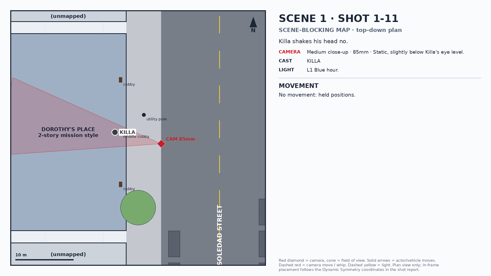

| Slot | Reference | File | Status |
|---|---|---|---|
| 1 | blocking_map | `03_department_outputs/scene_001/blocking_maps/1-11_blocking_map.png` | ready |
| 2 | character · KILLA | `02_bibles/refs/killa_reference.png` | missing |
| 3 | location · DOROTHYS_PLACE | `02_bibles/refs/dorothys_place_plate.png` | missing |
| 4 | expression_start · KILLA_cool_unbothered | `expr/KILLA_cool_unbothered.png` | missing |
| 5 | prop · MILK_CRATE | `02_bibles/refs/milk_crate.png` | missing |

```text
Image 1: Top-down scene-blocking map. Follow its positions and movement arrows; do not render the map itself.
Image 2 is KILLA (character).
Image 3 is DOROTHYS_PLACE (location).
Image 4 is KILLA_cool_unbothered (expression start).
Image 5 is MILK_CRATE (prop).

The man in the doorway slowly shakes his head, unhurried, almost amused. Stage the action exactly as the blocking map in Image 1 shows: where each person stands, the numbered movement arrows, and the camera position and viewing direction. In frame, the focal point (Killa's slow head shake) sits at Killa's face at (0.70, 0.66), eyeline screen-right toward Paul. Medium close-up, 85mm lens. Static, slightly below Killa's eye level. Lighting: L1 Blue hour. Cinematic tearjerker tone, emotionally intimate framing, soft natural light favoring dawn or dusk. Foil visible somewhere in frame — crumpled, glinting, or scattered nearby. Environment shows worn signs of habitation — blankets, bags, makeshift bedding — treated with visual dignity, not disorder. Camera lingers rather than cuts quickly, allowing emotional weight to build. Killa says: "Naw. There ain't been none out here all night."

Duration 4s. Cinematic 2.39:1 composition, photoreal, no on-screen text, no map graphics in the output.
```

---

## Shot 1-12 · 6s

**Beat:** Paul deflates and drops his head in defeat. Holds, crushed, for a drawn-out moment.

> MALE ADDICT #1 deflates and drops his head in defeat. 'Fuck man.' He stands there crushed, with his head hanging, for drawn-out moment…

**Upstream reports:** CRR-001-CAS (flagged_for_human_review), CRR-001-WAR (provisional_pending_upstream), CRR-001-PRO (provisional_pending_upstream), CRR-001-LOC (flagged_for_human_review), CRR-001-BLK (locked), CRR-001-SET (locked), CRR-001-CIN (provisional_pending_upstream), CRR-001-LGT (flagged_for_human_review), CRR-001-IMG (provisional_pending_upstream), CRR-001-VAG (provisional_pending_upstream), CRR-001-EDT (locked)

### Shot Report
- **Blocking / Set:** focal point is *Paul's bowed head* at LL (0.30, 0.33) — Head sinks from (0.30, 0.55) to (0.30, 0.33) over the beat. Spiral: Head's drop traces the inner coil of a bottom-left spiral. His drop moves the focal point downward into the lower-left eye — the frame itself sinks with him.
- **Set design:** Sky above him, negative space weighted overhead.
- **Camera:** Medium close-up, low intimate angle, 85mm. Low angle, just below his chin line (Cinematography Bible: low, intimate angles for vulnerable moments). Static — the camera lingers through the held beat.
- **Lighting:** L1 Blue hour; he's out of the streetlamp pool now — cool, unlit, alone.
- **Cast / wardrobe:** PAUL (present_day)
- **Props:** FOIL_CRUMPLED
- **Expression anchors:** PAUL_hope_desperation → PAUL_deflated_crushed
- **Editing:** Let this run long. Do not cut the hold.
- **How it works together:** the camera (85mm) arrives at the blocking's focal point — Paul's bowed head — under L1 Blue hour; he's out of the streetlamp pool now — cool, unlit, alone., so the beat "Paul deflates and drops his head in defeat" lands where the eye already is.
- **Open flags:** F-03

### Prompt pair — **BLOCKED**
Blockers:
- PAUL: no chosen reference image (F-18)
- SOLEDAD_SUEY_SING: no chosen location reference (F-18)

**LTX-2.3**

```text
[PAUL] Same character as reference image: white man in his late 20s to early 30s, gaunt thin build, dirty blonde wavy shoulder-length hair, disheveled, light patchy stubble, blue eyes, pained distressed expression, wearing a gray hooded sweatshirt. Maintain exact facial structure and build from reference. Scene: The Suey Sing Building on Soledad Street, Chinatown, Salinas: tan/cream single-story stucco building, weathered signage, boarded and graffiti-covered sections along the lower wall, no fence in front. The seven-story Moongate Apartments rise on its left. On its right, a dirt, weed and rock-filled field holds twenty weathered tents. Against the building's wall: a tent in each corner and a huge tarp-built two-unit structure between them, with shopping carts, bikes and belongings. The young man's shoulders sag and his head drops. He stands in a held pose, head hanging, completely deflated, breathing shallowly. Composition follows dynamic symmetry principles — subject(s) positioned along a diagonal sightline rather than center-frame, with deliberate negative space. Focal point — Paul's bowed head: Head sinks from (0.30, 0.55) to (0.30, 0.33) over the beat. Camera: Medium close-up, low intimate angle, 85mm lens. Low angle, just below his chin line (Cinematography Bible: low, intimate angles for vulnerable moments). Static — the camera lingers through the held beat. Lighting: L1 Blue hour; he's out of the streetlamp pool now — cool, unlit, alone. Props in frame: dozens of tiny crumpled balls of smoked aluminum foil scattered across the sidewalk and gutter, glinting. Cinematic tearjerker tone, emotionally intimate framing, soft natural light favoring dawn or dusk. Foil visible somewhere in frame — crumpled, glinting, or scattered nearby. Environment shows worn signs of habitation — blankets, bags, makeshift bedding — treated with visual dignity, not disorder. Camera lingers rather than cuts quickly, allowing emotional weight to build. Paul says: "Fuck man." Audio: His exhale; the distant group laughter continues, indifferent. Duration 6 seconds. Compose inside a centered 2.39:1 safe area of a 16:9 frame.
```

**Wan 2.2** (first frame `expr/PAUL_hope_desperation.png`, last frame `expr/PAUL_deflated_crushed.png`) — 6s > 5s: generate 2 segments, each segment's last frame seeds the next.

```text
[PAUL] Same character as reference image: white man in his late 20s to early 30s, gaunt thin build, dirty blonde wavy shoulder-length hair, disheveled, light patchy stubble, blue eyes, pained distressed expression, wearing a gray hooded sweatshirt. Maintain exact facial structure and build from reference. Scene: The young man's shoulders sag and his head drops. He stands in a held pose, head hanging, completely deflated, breathing shallowly. Medium close-up, low intimate angle, 85mm. Low angle, just below his chin line (Cinematography Bible: low, intimate angles for vulnerable moments). Static — the camera lingers through the held beat. Placement: Head sinks from (0.30, 0.55) to (0.30, 0.33) over the beat. L1 Blue hour; he's out of the streetlamp pool now — cool, unlit, alone.
```

Negative:

```text
no dead-center framing unless flagged as intentional, no clean or brand-new camping gear; tents show wear and dust, no high-contrast plastic or neon garbage bins, no harsh flat midday daylight, no garbled on-screen text, no neat/well-groomed hair, no clean-shaven face, no composed/calm default expression, no healthy/full build, no eye color other than blue, no formal or bright-colored wardrobe, Moongate Apartments on the left of Suey Sing, never the right, no fence in front of the Suey Sing Building, do not fill in, build over, or remove the open field, do not merge the building-side encampment with the field encampment
```

**MiniMax Omni** (5/9 references)

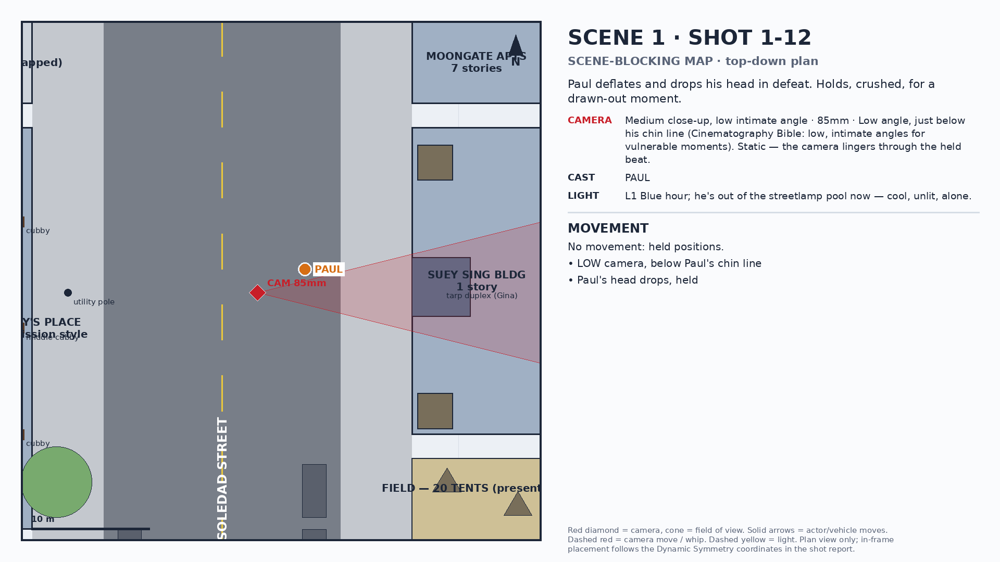

| Slot | Reference | File | Status |
|---|---|---|---|
| 1 | blocking_map | `03_department_outputs/scene_001/blocking_maps/1-12_blocking_map.png` | ready |
| 2 | character · PAUL | `02_bibles/refs/paul_reference.png` | missing |
| 3 | location · SOLEDAD_SUEY_SING | `02_bibles/refs/soledad_suey_sing_plate.png` | missing |
| 4 | expression_start · PAUL_hope_desperation | `expr/PAUL_hope_desperation.png` | missing |
| 5 | expression_end · PAUL_deflated_crushed | `expr/PAUL_deflated_crushed.png` | missing |

```text
Image 1: Top-down scene-blocking map. Follow its positions and movement arrows; do not render the map itself.
Image 2 is PAUL (character).
Image 3 is SOLEDAD_SUEY_SING (location).
Image 4 is PAUL_hope_desperation (expression start).
Image 5 is PAUL_deflated_crushed (expression end).

The young man's shoulders sag and his head drops. He stands in a held pose, head hanging, completely deflated, breathing shallowly. Stage the action exactly as the blocking map in Image 1 shows: where each person stands, the numbered movement arrows, and the camera position and viewing direction. In frame, the focal point (Paul's bowed head) sits at Head sinks from (0.30, 0.55) to (0.30, 0.33) over the beat. Medium close-up, low intimate angle, 85mm lens. Low angle, just below his chin line (Cinematography Bible: low, intimate angles for vulnerable moments). Static — the camera lingers through the held beat. Lighting: L1 Blue hour; he's out of the streetlamp pool now — cool, unlit, alone. Cinematic tearjerker tone, emotionally intimate framing, soft natural light favoring dawn or dusk. Foil visible somewhere in frame — crumpled, glinting, or scattered nearby. Environment shows worn signs of habitation — blankets, bags, makeshift bedding — treated with visual dignity, not disorder. Camera lingers rather than cuts quickly, allowing emotional weight to build. Paul says: "Fuck man."

Duration 6s. Cinematic 2.39:1 composition, photoreal, no on-screen text, no map graphics in the output.
```

---

## Shot 1-13 · 6s

**Beat:** Paul, sad and hurt: he's sick; should have bought the dime off his neighbor.

> MALE ADDICT: Fuck man Im sick. I shoulda just bought that dime off my neighbor.

**Upstream reports:** CRR-001-CAS (flagged_for_human_review), CRR-001-WAR (provisional_pending_upstream), CRR-001-PRO (provisional_pending_upstream), CRR-001-LOC (flagged_for_human_review), CRR-001-BLK (locked), CRR-001-SET (locked), CRR-001-CIN (provisional_pending_upstream), CRR-001-LGT (flagged_for_human_review), CRR-001-IMG (provisional_pending_upstream), CRR-001-VAG (provisional_pending_upstream), CRR-001-EDT (locked)

### Shot Report
- **Blocking / Set:** focal point is *Paul's wet, wincing eyes* at UL (0.30, 0.66) — Eyes at (0.30, 0.66); arms wrapped around himself in lower frame. Spiral: none. 
- **Set design:** Background fully soft.
- **Camera:** Close-up, 85mm. Static, eye level, very slow push-in.
- **Lighting:** L1 Blue hour, faint sheen of sweat catching the cool light.
- **Cast / wardrobe:** PAUL (present_day)
- **Expression anchors:** PAUL_deflated_crushed → PAUL_sick_pained
- **Editing:** —
- **How it works together:** the camera (85mm) arrives at the blocking's focal point — Paul's wet, wincing eyes — under L1 Blue hour, faint sheen of sweat catching the cool light., so the beat "Paul, sad and hurt: he's sick; should have bought the dime off his neighbor" lands where the eye already is.
- **Open flags:** F-03

### Prompt pair — **BLOCKED**
Blockers:
- PAUL: no chosen reference image (F-18)
- SOLEDAD_SUEY_SING: no chosen location reference (F-18)

**LTX-2.3**

```text
[PAUL] Same character as reference image: white man in his late 20s to early 30s, gaunt thin build, dirty blonde wavy shoulder-length hair, disheveled, light patchy stubble, blue eyes, pained distressed expression, wearing a gray hooded sweatshirt. Maintain exact facial structure and build from reference. Scene: The Suey Sing Building on Soledad Street, Chinatown, Salinas: tan/cream single-story stucco building, weathered signage, boarded and graffiti-covered sections along the lower wall, no fence in front. The seven-story Moongate Apartments rise on its left. On its right, a dirt, weed and rock-filled field holds twenty weathered tents. Against the building's wall: a tent in each corner and a huge tarp-built two-unit structure between them, with shopping carts, bikes and belongings. Close on the young man's face, a light sheen of sweat on his forehead, arms wrapped around himself against a chill, eyes watery and pained as he speaks quietly, half to himself. Composition follows dynamic symmetry principles — subject(s) positioned along a diagonal sightline rather than center-frame, with deliberate negative space. Focal point — Paul's wet, wincing eyes: Eyes at (0.30, 0.66); arms wrapped around himself in lower frame. Camera: Close-up, 85mm lens. Static, eye level, very slow push-in. Lighting: L1 Blue hour, faint sheen of sweat catching the cool light. Cinematic tearjerker tone, emotionally intimate framing, soft natural light favoring dawn or dusk. Foil visible somewhere in frame — crumpled, glinting, or scattered nearby. Environment shows worn signs of habitation — blankets, bags, makeshift bedding — treated with visual dignity, not disorder. Camera lingers rather than cuts quickly, allowing emotional weight to build. Paul says: "Fuck man, I'm sick. I shoulda just bought that dime off my neighbor." Duration 6 seconds. Compose inside a centered 2.39:1 safe area of a 16:9 frame.
```

**Wan 2.2** (first frame `expr/PAUL_deflated_crushed.png`, last frame `expr/PAUL_sick_pained.png`) — 6s > 5s: generate 2 segments, each segment's last frame seeds the next.

```text
[PAUL] Same character as reference image: white man in his late 20s to early 30s, gaunt thin build, dirty blonde wavy shoulder-length hair, disheveled, light patchy stubble, blue eyes, pained distressed expression, wearing a gray hooded sweatshirt. Maintain exact facial structure and build from reference. Scene: Close on the young man's face, a light sheen of sweat on his forehead, arms wrapped around himself against a chill, eyes watery and pained as he speaks quietly, half to himself. Close-up, 85mm. Static, eye level, very slow push-in. Placement: Eyes at (0.30, 0.66); arms wrapped around himself in lower frame. L1 Blue hour, faint sheen of sweat catching the cool light.
```

Negative:

```text
no dead-center framing unless flagged as intentional, no clean or brand-new camping gear; tents show wear and dust, no high-contrast plastic or neon garbage bins, no harsh flat midday daylight, no garbled on-screen text, no neat/well-groomed hair, no clean-shaven face, no composed/calm default expression, no healthy/full build, no eye color other than blue, no formal or bright-colored wardrobe, Moongate Apartments on the left of Suey Sing, never the right, no fence in front of the Suey Sing Building, do not fill in, build over, or remove the open field, do not merge the building-side encampment with the field encampment
```

**MiniMax Omni** (5/9 references)

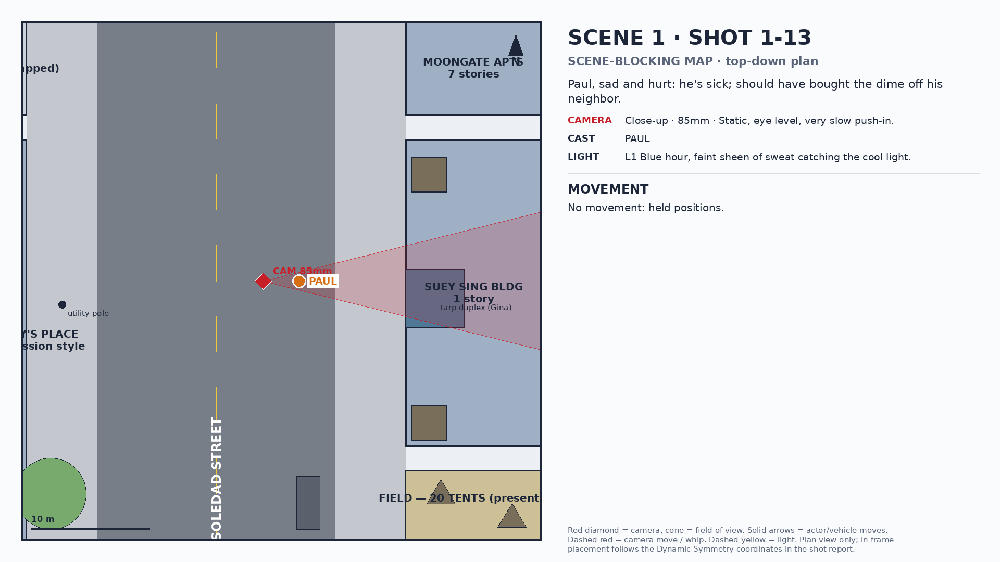

| Slot | Reference | File | Status |
|---|---|---|---|
| 1 | blocking_map | `03_department_outputs/scene_001/blocking_maps/1-13_blocking_map.png` | ready |
| 2 | character · PAUL | `02_bibles/refs/paul_reference.png` | missing |
| 3 | location · SOLEDAD_SUEY_SING | `02_bibles/refs/soledad_suey_sing_plate.png` | missing |
| 4 | expression_start · PAUL_deflated_crushed | `expr/PAUL_deflated_crushed.png` | missing |
| 5 | expression_end · PAUL_sick_pained | `expr/PAUL_sick_pained.png` | missing |

```text
Image 1: Top-down scene-blocking map. Follow its positions and movement arrows; do not render the map itself.
Image 2 is PAUL (character).
Image 3 is SOLEDAD_SUEY_SING (location).
Image 4 is PAUL_deflated_crushed (expression start).
Image 5 is PAUL_sick_pained (expression end).

Close on the young man's face, a light sheen of sweat on his forehead, arms wrapped around himself against a chill, eyes watery and pained as he speaks quietly, half to himself. Stage the action exactly as the blocking map in Image 1 shows: where each person stands, the numbered movement arrows, and the camera position and viewing direction. In frame, the focal point (Paul's wet, wincing eyes) sits at Eyes at (0.30, 0.66); arms wrapped around himself in lower frame. Close-up, 85mm lens. Static, eye level, very slow push-in. Lighting: L1 Blue hour, faint sheen of sweat catching the cool light. Cinematic tearjerker tone, emotionally intimate framing, soft natural light favoring dawn or dusk. Foil visible somewhere in frame — crumpled, glinting, or scattered nearby. Environment shows worn signs of habitation — blankets, bags, makeshift bedding — treated with visual dignity, not disorder. Camera lingers rather than cuts quickly, allowing emotional weight to build. Paul says: "Fuck man, I'm sick. I shoulda just bought that dime off my neighbor."

Duration 6s. Cinematic 2.39:1 composition, photoreal, no on-screen text, no map graphics in the output.
```

---

## Shot 1-14 · 7s

**Beat:** Killa, smirking and unsympathetic, reaches into the front of his pants for his sack and pitches the blues. Paul has crossed to the curb in front of Dorothy's.

> There's a smirkish, unsympathetic, expression on Killa's face, as he reaches down into the front of his pants for his sack. KILLA: You betta get you some of deez blue…

**Upstream reports:** CRR-001-CAS (flagged_for_human_review), CRR-001-WAR (provisional_pending_upstream), CRR-001-PRO (provisional_pending_upstream), CRR-001-LOC (flagged_for_human_review), CRR-001-BLK (locked), CRR-001-SET (locked), CRR-001-CIN (provisional_pending_upstream), CRR-001-LGT (flagged_for_human_review), CRR-001-IMG (provisional_pending_upstream), CRR-001-VAG (provisional_pending_upstream), CRR-001-EDT (locked)

### Shot Report
- **Blocking / Set:** focal point is *Killa's smirk* at UR (0.70, 0.66) — Paul lower-frame-left, hunched, head at (0.30, 0.40); Killa upper-frame-right, seated, face at (0.70, 0.66). Spiral: none. Scene Blocking Bible worked example (Male Addict #1 & Killa): Killa visually above despite being seated — reinforces his control. Blocking decision: Paul has crossed the street to the curb in front of Dorothy's between 1-13 and 1-14 so the transaction can happen at arm's length.
- **Set design:** Cubbyhole's step raises Killa above street level; utility pole at x=0.15 separates the two men's worlds.
- **Camera:** Two-shot, power diagonal, 35mm. Static, camera at street level low beside Paul.
- **Lighting:** L1 Blue hour.
- **Cast / wardrobe:** KILLA (present_day), PAUL (present_day)
- **Props:** MILK_CRATE, BLUE_PILLS
- **Expression anchors:** KILLA_smirk_unsympathetic → KILLA_smirk_unsympathetic
- **Editing:** Editing coverage gate: this is the scene's only Paul–Killa two-shot; keep it as the master for 1-15/1-16 inserts.
- **How it works together:** the camera (35mm) arrives at the blocking's focal point — Killa's smirk — under L1 Blue hour., so the beat "Killa, smirking and unsympathetic, reaches into the front of his pants for his sack and pitches the blues" lands where the eye already is.
- **Open flags:** F-03, F-16

### Prompt pair — **BLOCKED**
Blockers:
- KILLA: no chosen reference image (F-18)
- PAUL: no chosen reference image (F-18)
- DOROTHYS_PLACE: no chosen location reference (F-18)

**LTX-2.3**

```text
[KILLA] Same character as reference image: 40-year-old African American man, tall, slim build, long shoulder-length dreadlocks, missing front left tooth, clean-shaven, black eyes, sagging jawline, longish hands, smooth confident charming demeanor, several gold rings, gold nugget bracelet. Wearing a bomber jacket with a fake fur-lined hood, jeans, boots, and a dark brown beanie. Maintain exact facial structure and build from reference. [PAUL] Same character as reference image: white man in his late 20s to early 30s, gaunt thin build, dirty blonde wavy shoulder-length hair, disheveled, light patchy stubble, blue eyes, pained distressed expression, wearing a gray hooded sweatshirt. Maintain exact facial structure and build from reference. Scene: Dorothy's Place, directly across Soledad Street from the Suey Sing Building: two-story Spanish/mission-style building, yellow stucco walls, dark-red trim and support beams, upper wooden balcony with railing, green-trimmed windows, three recessed cubbyhole entrances at ground level, yellow brick wall topped with black steel spikes running left and right, a large shade tree, a utility pole standing directly in front near the entrance. A tall slim man seated on a crate in a recessed doorway smirks down at a hunched young man standing below him at the curb. He reaches down casually to his waistband, fishing out a small plastic baggie, and talks with unhurried amusement. Composition follows dynamic symmetry principles — subject(s) positioned along a diagonal sightline rather than center-frame, with deliberate negative space. Focal point — Killa's smirk: Paul lower-frame-left, hunched, head at (0.30, 0.40); Killa upper-frame-right, seated, face at (0.70, 0.66). Camera: Two-shot, power diagonal, 35mm lens. Static, camera at street level low beside Paul. Lighting: L1 Blue hour. Props in frame: a heavy-duty plastic milk crate, weathered black, flipped upside down as a street seat; a few small round light-blue pills from a small plastic baggie. Cinematic tearjerker tone, emotionally intimate framing, soft natural light favoring dawn or dusk. Foil visible somewhere in frame — crumpled, glinting, or scattered nearby. Environment shows worn signs of habitation — blankets, bags, makeshift bedding — treated with visual dignity, not disorder. Camera lingers rather than cuts quickly, allowing emotional weight to build. Killa says: "You betta get you some of deez blue, for you fuck around and shit on yourself or somethin'." Duration 7 seconds. Compose inside a centered 2.39:1 safe area of a 16:9 frame.
```

**Wan 2.2** (first frame `expr/KILLA_smirk_unsympathetic.png`, last frame `expr/KILLA_smirk_unsympathetic.png`) — 7s > 5s: generate 2 segments, each segment's last frame seeds the next.

```text
[KILLA] Same character as reference image: 40-year-old African American man, tall, slim build, long shoulder-length dreadlocks, missing front left tooth, clean-shaven, black eyes, sagging jawline, longish hands, smooth confident charming demeanor, several gold rings, gold nugget bracelet. Wearing a bomber jacket with a fake fur-lined hood, jeans, boots, and a dark brown beanie. Maintain exact facial structure and build from reference. [PAUL] Same character as reference image: white man in his late 20s to early 30s, gaunt thin build, dirty blonde wavy shoulder-length hair, disheveled, light patchy stubble, blue eyes, pained distressed expression, wearing a gray hooded sweatshirt. Maintain exact facial structure and build from reference. Scene: A tall slim man seated on a crate in a recessed doorway smirks down at a hunched young man standing below him at the curb. He reaches down casually to his waistband, fishing out a small plastic baggie, and talks with unhurried amusement. Two-shot, power diagonal, 35mm. Static, camera at street level low beside Paul. Placement: Paul lower-frame-left, hunched, head at (0.30, 0.40); Killa upper-frame-right, seated, face at (0.70, 0.66). L1 Blue hour.
```

Negative:

```text
no dead-center framing unless flagged as intentional, no clean or brand-new camping gear; tents show wear and dust, no high-contrast plastic or neon garbage bins, no harsh flat midday daylight, no garbled on-screen text, no short hair, no heavyset/stocky build, no full smile without the missing front left tooth showing, no facial hair, no eye color other than black, no firm/tight jawline, no reserved/timid demeanor, no flashback wardrobe elements, no missing gold jewelry, no neat/well-groomed hair, no clean-shaven face, no composed/calm default expression, no healthy/full build, no eye color other than blue, no formal or bright-colored wardrobe, never remove the utility pole in front of Dorothy's Place, no swapping architectural styles with the Suey Sing Building
```

**MiniMax Omni** (6/9 references)

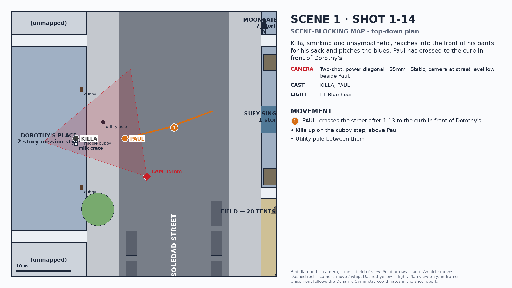

| Slot | Reference | File | Status |
|---|---|---|---|
| 1 | blocking_map | `03_department_outputs/scene_001/blocking_maps/1-14_blocking_map.png` | ready |
| 2 | character · KILLA | `02_bibles/refs/killa_reference.png` | missing |
| 3 | character · PAUL | `02_bibles/refs/paul_reference.png` | missing |
| 4 | location · DOROTHYS_PLACE | `02_bibles/refs/dorothys_place_plate.png` | missing |
| 5 | expression_start · KILLA_smirk_unsympathetic | `expr/KILLA_smirk_unsympathetic.png` | missing |
| 6 | prop · MILK_CRATE | `02_bibles/refs/milk_crate.png` | missing |

```text
Image 1: Top-down scene-blocking map. Follow its positions and movement arrows; do not render the map itself.
Image 2 is KILLA (character).
Image 3 is PAUL (character).
Image 4 is DOROTHYS_PLACE (location).
Image 5 is KILLA_smirk_unsympathetic (expression start).
Image 6 is MILK_CRATE (prop).

A tall slim man seated on a crate in a recessed doorway smirks down at a hunched young man standing below him at the curb. He reaches down casually to his waistband, fishing out a small plastic baggie, and talks with unhurried amusement. Stage the action exactly as the blocking map in Image 1 shows: where each person stands, the numbered movement arrows, and the camera position and viewing direction. In frame, the focal point (Killa's smirk) sits at Paul lower-frame-left, hunched, head at (0.30, 0.40); Killa upper-frame-right, seated, face at (0.70, 0.66). Two-shot, power diagonal, 35mm lens. Static, camera at street level low beside Paul. Lighting: L1 Blue hour. Cinematic tearjerker tone, emotionally intimate framing, soft natural light favoring dawn or dusk. Foil visible somewhere in frame — crumpled, glinting, or scattered nearby. Environment shows worn signs of habitation — blankets, bags, makeshift bedding — treated with visual dignity, not disorder. Camera lingers rather than cuts quickly, allowing emotional weight to build. Killa says: "You betta get you some of deez blue, for you fuck around and shit on yourself or somethin'."

Duration 7s. Cinematic 2.39:1 composition, photoreal, no on-screen text, no map graphics in the output.
```

---

## Shot 1-15 · 4s

**Beat:** Paul's expression goes thoughtful; he reaches into his pocket for his money.

> The shot switches to PAUL as his expression goes thoughtful and he reaches into his pocket for his money.

**Upstream reports:** CRR-001-CAS (flagged_for_human_review), CRR-001-WAR (provisional_pending_upstream), CRR-001-PRO (provisional_pending_upstream), CRR-001-LOC (flagged_for_human_review), CRR-001-BLK (locked), CRR-001-SET (locked), CRR-001-CIN (provisional_pending_upstream), CRR-001-LGT (flagged_for_human_review), CRR-001-IMG (provisional_pending_upstream), CRR-001-VAG (provisional_pending_upstream), CRR-001-EDT (locked)

### Shot Report
- **Blocking / Set:** focal point is *Paul's face shifting to thoughtful, then his hand* at UL (0.30, 0.66) → LL (0.30, 0.33) — Face at (0.30, 0.66); tilt ends on hand at (0.30, 0.33). Spiral: none. 
- **Camera:** Medium close-up, 85mm. Static, slight downward tilt following his hand to the hoodie pocket.
- **Lighting:** L1 Blue hour.
- **Cast / wardrobe:** PAUL (present_day)
- **Expression anchors:** PAUL_sick_pained → PAUL_thoughtful_weighing
- **Editing:** —
- **How it works together:** the camera (85mm) arrives at the blocking's focal point — Paul's face shifting to thoughtful, then his hand — under L1 Blue hour., so the beat "Paul's expression goes thoughtful; he reaches into his pocket for his money" lands where the eye already is.
- **Open flags:** F-03

### Prompt pair — **BLOCKED**
Blockers:
- PAUL: no chosen reference image (F-18)
- DOROTHYS_PLACE: no chosen location reference (F-18)

**LTX-2.3**

```text
[PAUL] Same character as reference image: white man in his late 20s to early 30s, gaunt thin build, dirty blonde wavy shoulder-length hair, disheveled, light patchy stubble, blue eyes, pained distressed expression, wearing a gray hooded sweatshirt. Maintain exact facial structure and build from reference. Scene: Dorothy's Place, directly across Soledad Street from the Suey Sing Building: two-story Spanish/mission-style building, yellow stucco walls, dark-red trim and support beams, upper wooden balcony with railing, green-trimmed windows, three recessed cubbyhole entrances at ground level, yellow brick wall topped with black steel spikes running left and right, a large shade tree, a utility pole standing directly in front near the entrance. The young man's pained face goes still and thoughtful, weighing it. His hand slides into the pocket of his gray hoodie and draws out a few folded bills. Composition follows dynamic symmetry principles — subject(s) positioned along a diagonal sightline rather than center-frame, with deliberate negative space. Focal point — Paul's face shifting to thoughtful, then his hand: Face at (0.30, 0.66); tilt ends on hand at (0.30, 0.33). Camera: Medium close-up, 85mm lens. Static, slight downward tilt following his hand to the hoodie pocket. Lighting: L1 Blue hour. Cinematic tearjerker tone, emotionally intimate framing, soft natural light favoring dawn or dusk. Foil visible somewhere in frame — crumpled, glinting, or scattered nearby. Environment shows worn signs of habitation — blankets, bags, makeshift bedding — treated with visual dignity, not disorder. Camera lingers rather than cuts quickly, allowing emotional weight to build. Audio: Cloth rustle, bills unfolding. Duration 4 seconds. Compose inside a centered 2.39:1 safe area of a 16:9 frame.
```

**Wan 2.2** (first frame `expr/PAUL_sick_pained.png`, last frame `expr/PAUL_thoughtful_weighing.png`)

```text
[PAUL] Same character as reference image: white man in his late 20s to early 30s, gaunt thin build, dirty blonde wavy shoulder-length hair, disheveled, light patchy stubble, blue eyes, pained distressed expression, wearing a gray hooded sweatshirt. Maintain exact facial structure and build from reference. Scene: The young man's pained face goes still and thoughtful, weighing it. His hand slides into the pocket of his gray hoodie and draws out a few folded bills. Medium close-up, 85mm. Static, slight downward tilt following his hand to the hoodie pocket. Placement: Face at (0.30, 0.66); tilt ends on hand at (0.30, 0.33). L1 Blue hour.
```

Negative:

```text
no dead-center framing unless flagged as intentional, no clean or brand-new camping gear; tents show wear and dust, no high-contrast plastic or neon garbage bins, no harsh flat midday daylight, no garbled on-screen text, no neat/well-groomed hair, no clean-shaven face, no composed/calm default expression, no healthy/full build, no eye color other than blue, no formal or bright-colored wardrobe, never remove the utility pole in front of Dorothy's Place, no swapping architectural styles with the Suey Sing Building
```

**MiniMax Omni** (5/9 references)

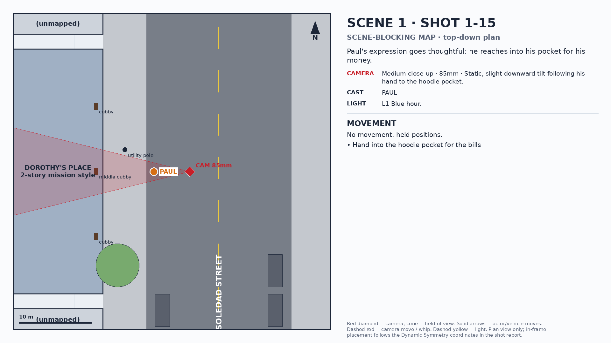

| Slot | Reference | File | Status |
|---|---|---|---|
| 1 | blocking_map | `03_department_outputs/scene_001/blocking_maps/1-15_blocking_map.png` | ready |
| 2 | character · PAUL | `02_bibles/refs/paul_reference.png` | missing |
| 3 | location · DOROTHYS_PLACE | `02_bibles/refs/dorothys_place_plate.png` | missing |
| 4 | expression_start · PAUL_sick_pained | `expr/PAUL_sick_pained.png` | missing |
| 5 | expression_end · PAUL_thoughtful_weighing | `expr/PAUL_thoughtful_weighing.png` | missing |

```text
Image 1: Top-down scene-blocking map. Follow its positions and movement arrows; do not render the map itself.
Image 2 is PAUL (character).
Image 3 is DOROTHYS_PLACE (location).
Image 4 is PAUL_sick_pained (expression start).
Image 5 is PAUL_thoughtful_weighing (expression end).

The young man's pained face goes still and thoughtful, weighing it. His hand slides into the pocket of his gray hoodie and draws out a few folded bills. Stage the action exactly as the blocking map in Image 1 shows: where each person stands, the numbered movement arrows, and the camera position and viewing direction. In frame, the focal point (Paul's face shifting to thoughtful, then his hand) sits at Face at (0.30, 0.66); tilt ends on hand at (0.30, 0.33). Medium close-up, 85mm lens. Static, slight downward tilt following his hand to the hoodie pocket. Lighting: L1 Blue hour. Cinematic tearjerker tone, emotionally intimate framing, soft natural light favoring dawn or dusk. Foil visible somewhere in frame — crumpled, glinting, or scattered nearby. Environment shows worn signs of habitation — blankets, bags, makeshift bedding — treated with visual dignity, not disorder. Camera lingers rather than cuts quickly, allowing emotional weight to build.

Duration 4s. Cinematic 2.39:1 composition, photoreal, no on-screen text, no map graphics in the output.
```

---

## Shot 1-16 · 4s

**Beat:** Killa smiles and dumps a few pills into his palm. 'How many you want?'

> Killa smiles and dumps a few of the pills into the palm of his hand. KILLA: How many you want?

**Upstream reports:** CRR-001-CAS (flagged_for_human_review), CRR-001-WAR (provisional_pending_upstream), CRR-001-PRO (provisional_pending_upstream), CRR-001-LOC (flagged_for_human_review), CRR-001-BLK (locked), CRR-001-SET (locked), CRR-001-CIN (provisional_pending_upstream), CRR-001-LGT (flagged_for_human_review), CRR-001-IMG (provisional_pending_upstream), CRR-001-VAG (provisional_pending_upstream), CRR-001-EDT (locked)

### Shot Report
- **Blocking / Set:** focal point is *Pills in his palm, then his gap-toothed smile* at LR (0.70, 0.33) → UR (0.70, 0.66) — Palm at (0.70, 0.33); smile at (0.70, 0.66) after rack. Spiral: none. 
- **Camera:** Insert: extreme close-up on hand, rack to medium close-up on smile, 100mm macro. Static insert on the palm, rack focus up to Killa's smile.
- **Lighting:** L1 Blue hour; the gold rings and nugget bracelet pick up the only warm highlights in the frame.
- **Cast / wardrobe:** KILLA (present_day)
- **Props:** BLUE_PILLS
- **Expression anchors:** KILLA_smile_dealing → KILLA_smile_dealing
- **Editing:** —
- **How it works together:** the camera (100mm macro) arrives at the blocking's focal point — Pills in his palm, then his gap-toothed smile — under L1 Blue hour; the gold rings and nugget bracelet pick up the only warm highlights in the frame., so the beat "Killa smiles and dumps a few pills into his palm" lands where the eye already is.
- **Open flags:** F-16

### Prompt pair — **BLOCKED**
Blockers:
- KILLA: no chosen reference image (F-18)
- DOROTHYS_PLACE: no chosen location reference (F-18)

**LTX-2.3**

```text
[KILLA] Same character as reference image: 40-year-old African American man, tall, slim build, long shoulder-length dreadlocks, missing front left tooth, clean-shaven, black eyes, sagging jawline, longish hands, smooth confident charming demeanor, several gold rings, gold nugget bracelet. Wearing a bomber jacket with a fake fur-lined hood, jeans, boots, and a dark brown beanie. Maintain exact facial structure and build from reference. Scene: Dorothy's Place, directly across Soledad Street from the Suey Sing Building: two-story Spanish/mission-style building, yellow stucco walls, dark-red trim and support beams, upper wooden balcony with railing, green-trimmed windows, three recessed cubbyhole entrances at ground level, yellow brick wall topped with black steel spikes running left and right, a large shade tree, a utility pole standing directly in front near the entrance. Close on a man's long hand heavy with gold rings and a gold nugget bracelet as a few small round light-blue pills tip out of a baggie into his palm. Focus racks up to his face: a slow smile that shows his missing front tooth. Composition follows dynamic symmetry principles — subject(s) positioned along a diagonal sightline rather than center-frame, with deliberate negative space. Focal point — Pills in his palm, then his gap-toothed smile: Palm at (0.70, 0.33); smile at (0.70, 0.66) after rack. Camera: Insert: extreme close-up on hand, rack to medium close-up on smile, 100mm macro lens. Static insert on the palm, rack focus up to Killa's smile. Lighting: L1 Blue hour; the gold rings and nugget bracelet pick up the only warm highlights in the frame. Props in frame: a few small round light-blue pills from a small plastic baggie. Cinematic tearjerker tone, emotionally intimate framing, soft natural light favoring dawn or dusk. Foil visible somewhere in frame — crumpled, glinting, or scattered nearby. Environment shows worn signs of habitation — blankets, bags, makeshift bedding — treated with visual dignity, not disorder. Camera lingers rather than cuts quickly, allowing emotional weight to build. Killa says: "How many you want?" Audio: Tiny click of pills in the palm. Duration 4 seconds. Compose inside a centered 2.39:1 safe area of a 16:9 frame.
```

**Wan 2.2** (first frame `expr/KILLA_smile_dealing.png`, last frame `expr/KILLA_smile_dealing.png`)

```text
[KILLA] Same character as reference image: 40-year-old African American man, tall, slim build, long shoulder-length dreadlocks, missing front left tooth, clean-shaven, black eyes, sagging jawline, longish hands, smooth confident charming demeanor, several gold rings, gold nugget bracelet. Wearing a bomber jacket with a fake fur-lined hood, jeans, boots, and a dark brown beanie. Maintain exact facial structure and build from reference. Scene: Close on a man's long hand heavy with gold rings and a gold nugget bracelet as a few small round light-blue pills tip out of a baggie into his palm. Focus racks up to his face: a slow smile that shows his missing front tooth. Insert: extreme close-up on hand, rack to medium close-up on smile, 100mm macro. Static insert on the palm, rack focus up to Killa's smile. Placement: Palm at (0.70, 0.33); smile at (0.70, 0.66) after rack. L1 Blue hour; the gold rings and nugget bracelet pick up the only warm highlights in the frame.
```

Negative:

```text
no dead-center framing unless flagged as intentional, no clean or brand-new camping gear; tents show wear and dust, no high-contrast plastic or neon garbage bins, no harsh flat midday daylight, no garbled on-screen text, no short hair, no heavyset/stocky build, no full smile without the missing front left tooth showing, no facial hair, no eye color other than black, no firm/tight jawline, no reserved/timid demeanor, no flashback wardrobe elements, no missing gold jewelry, never remove the utility pole in front of Dorothy's Place, no swapping architectural styles with the Suey Sing Building
```

**MiniMax Omni** (4/9 references)

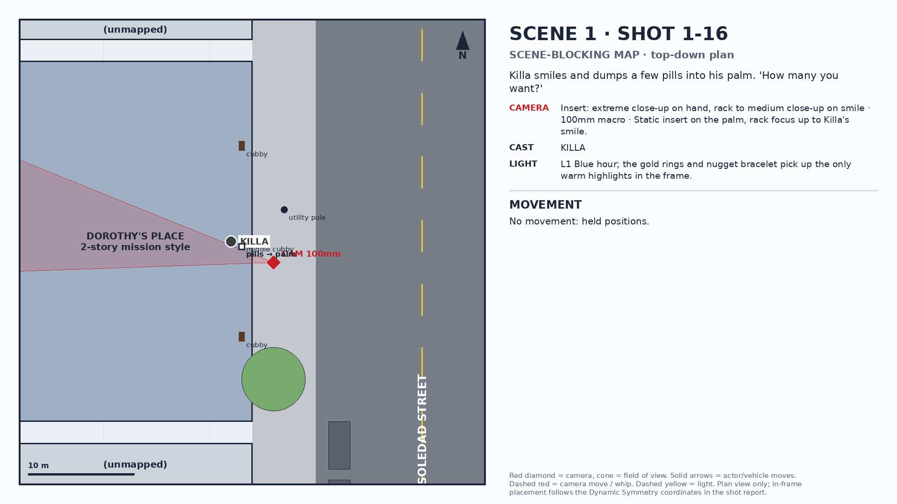

| Slot | Reference | File | Status |
|---|---|---|---|
| 1 | blocking_map | `03_department_outputs/scene_001/blocking_maps/1-16_blocking_map.png` | ready |
| 2 | character · KILLA | `02_bibles/refs/killa_reference.png` | missing |
| 3 | location · DOROTHYS_PLACE | `02_bibles/refs/dorothys_place_plate.png` | missing |
| 4 | expression_start · KILLA_smile_dealing | `expr/KILLA_smile_dealing.png` | missing |

```text
Image 1: Top-down scene-blocking map. Follow its positions and movement arrows; do not render the map itself.
Image 2 is KILLA (character).
Image 3 is DOROTHYS_PLACE (location).
Image 4 is KILLA_smile_dealing (expression start).

Close on a man's long hand heavy with gold rings and a gold nugget bracelet as a few small round light-blue pills tip out of a baggie into his palm. Focus racks up to his face: a slow smile that shows his missing front tooth. Stage the action exactly as the blocking map in Image 1 shows: where each person stands, the numbered movement arrows, and the camera position and viewing direction. In frame, the focal point (Pills in his palm, then his gap-toothed smile) sits at Palm at (0.70, 0.33); smile at (0.70, 0.66) after rack. Insert: extreme close-up on hand, rack to medium close-up on smile, 100mm macro lens. Static insert on the palm, rack focus up to Killa's smile. Lighting: L1 Blue hour; the gold rings and nugget bracelet pick up the only warm highlights in the frame. Cinematic tearjerker tone, emotionally intimate framing, soft natural light favoring dawn or dusk. Foil visible somewhere in frame — crumpled, glinting, or scattered nearby. Environment shows worn signs of habitation — blankets, bags, makeshift bedding — treated with visual dignity, not disorder. Camera lingers rather than cuts quickly, allowing emotional weight to build. Killa says: "How many you want?"

Duration 4s. Cinematic 2.39:1 composition, photoreal, no on-screen text, no map graphics in the output.
```

---

## Shot 1-17 · 4s

**Beat:** Headlights of a vehicle turning onto the street light up Killa's face; he turns, eyes go big, whistles appreciatively.

> The headlights from a vehicle turning onto the street, light up Killa's face, and when KILLA turns toward it his eyes go big and he whistles appreciatively.

**Upstream reports:** CRR-001-CAS (flagged_for_human_review), CRR-001-WAR (provisional_pending_upstream), CRR-001-PRO (provisional_pending_upstream), CRR-001-LOC (flagged_for_human_review), CRR-001-BLK (locked), CRR-001-SET (locked), CRR-001-CIN (provisional_pending_upstream), CRR-001-LGT (flagged_for_human_review), CRR-001-IMG (provisional_pending_upstream), CRR-001-VAG (provisional_pending_upstream), CRR-001-EDT (locked)

### Shot Report
- **Blocking / Set:** focal point is *Killa's eyes widening* at UR (0.70, 0.66) — Face at (0.70, 0.66); headlight sweep travels left-to-right across frame. Spiral: none. 
- **Camera:** Close-up, 85mm. Static.
- **Lighting:** L2 Intrusion: hard white headlights rake across his face left-to-right — the only hard light in the scene. Deliberate departure from soft-light standard (see Lighting CRR).
- **Cast / wardrobe:** KILLA (present_day)
- **Expression anchors:** KILLA_smile_dealing → KILLA_wide_eyed_impressed
- **Editing:** Cut on the head turn into 1-18.
- **How it works together:** the camera (85mm) arrives at the blocking's focal point — Killa's eyes widening — under L2 Intrusion, so the beat "Headlights of a vehicle turning onto the street light up Killa's face; he turns, eyes go big, whistles appreciatively" lands where the eye already is.

### Prompt pair — **BLOCKED**
Blockers:
- KILLA: no chosen reference image (F-18)
- DOROTHYS_PLACE: no chosen location reference (F-18)

**LTX-2.3**

```text
[KILLA] Same character as reference image: 40-year-old African American man, tall, slim build, long shoulder-length dreadlocks, missing front left tooth, clean-shaven, black eyes, sagging jawline, longish hands, smooth confident charming demeanor, several gold rings, gold nugget bracelet. Wearing a bomber jacket with a fake fur-lined hood, jeans, boots, and a dark brown beanie. Maintain exact facial structure and build from reference. Scene: Dorothy's Place, directly across Soledad Street from the Suey Sing Building: two-story Spanish/mission-style building, yellow stucco walls, dark-red trim and support beams, upper wooden balcony with railing, green-trimmed windows, three recessed cubbyhole entrances at ground level, yellow brick wall topped with black steel spikes running left and right, a large shade tree, a utility pole standing directly in front near the entrance. Hard white headlights sweep across the seated man's face. He turns toward them, his eyes going wide, and lets out a long, appreciative whistle. Composition follows dynamic symmetry principles — subject(s) positioned along a diagonal sightline rather than center-frame, with deliberate negative space. Focal point — Killa's eyes widening: Face at (0.70, 0.66); headlight sweep travels left-to-right across frame. Camera: Close-up, 85mm lens. Static. Lighting: L2 Intrusion: hard white headlights rake across his face left-to-right — the only hard light in the scene. Deliberate departure from soft-light standard (see Lighting CRR). Cinematic tearjerker tone, emotionally intimate framing, soft natural light favoring dawn or dusk. Foil visible somewhere in frame — crumpled, glinting, or scattered nearby. Environment shows worn signs of habitation — blankets, bags, makeshift bedding — treated with visual dignity, not disorder. Camera lingers rather than cuts quickly, allowing emotional weight to build. Audio: Deep engine purr approaching, the whistle. Duration 4 seconds. Compose inside a centered 2.39:1 safe area of a 16:9 frame.
```

**Wan 2.2** (first frame `expr/KILLA_smile_dealing.png`, last frame `expr/KILLA_wide_eyed_impressed.png`)

```text
[KILLA] Same character as reference image: 40-year-old African American man, tall, slim build, long shoulder-length dreadlocks, missing front left tooth, clean-shaven, black eyes, sagging jawline, longish hands, smooth confident charming demeanor, several gold rings, gold nugget bracelet. Wearing a bomber jacket with a fake fur-lined hood, jeans, boots, and a dark brown beanie. Maintain exact facial structure and build from reference. Scene: Hard white headlights sweep across the seated man's face. He turns toward them, his eyes going wide, and lets out a long, appreciative whistle. Close-up, 85mm. Static. Placement: Face at (0.70, 0.66); headlight sweep travels left-to-right across frame. L2 Intrusion: hard white headlights rake across his face left-to-right — the only hard light in the scene. Deliberate departure from soft-light standard (see Lighting CRR).
```

Negative:

```text
no dead-center framing unless flagged as intentional, no clean or brand-new camping gear; tents show wear and dust, no high-contrast plastic or neon garbage bins, no harsh flat midday daylight, no garbled on-screen text, no short hair, no heavyset/stocky build, no full smile without the missing front left tooth showing, no facial hair, no eye color other than black, no firm/tight jawline, no reserved/timid demeanor, no flashback wardrobe elements, no missing gold jewelry, never remove the utility pole in front of Dorothy's Place, no swapping architectural styles with the Suey Sing Building
```

**MiniMax Omni** (5/9 references)

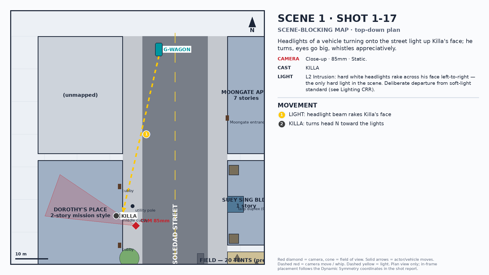

| Slot | Reference | File | Status |
|---|---|---|---|
| 1 | blocking_map | `03_department_outputs/scene_001/blocking_maps/1-17_blocking_map.png` | ready |
| 2 | character · KILLA | `02_bibles/refs/killa_reference.png` | missing |
| 3 | location · DOROTHYS_PLACE | `02_bibles/refs/dorothys_place_plate.png` | missing |
| 4 | expression_start · KILLA_smile_dealing | `expr/KILLA_smile_dealing.png` | missing |
| 5 | expression_end · KILLA_wide_eyed_impressed | `expr/KILLA_wide_eyed_impressed.png` | missing |

```text
Image 1: Top-down scene-blocking map. Follow its positions and movement arrows; do not render the map itself.
Image 2 is KILLA (character).
Image 3 is DOROTHYS_PLACE (location).
Image 4 is KILLA_smile_dealing (expression start).
Image 5 is KILLA_wide_eyed_impressed (expression end).

Hard white headlights sweep across the seated man's face. He turns toward them, his eyes going wide, and lets out a long, appreciative whistle. Stage the action exactly as the blocking map in Image 1 shows: where each person stands, the numbered movement arrows, and the camera position and viewing direction. In frame, the focal point (Killa's eyes widening) sits at Face at (0.70, 0.66); headlight sweep travels left-to-right across frame. Close-up, 85mm lens. Static. Lighting: L2 Intrusion: hard white headlights rake across his face left-to-right — the only hard light in the scene. Deliberate departure from soft-light standard (see Lighting CRR). Cinematic tearjerker tone, emotionally intimate framing, soft natural light favoring dawn or dusk. Foil visible somewhere in frame — crumpled, glinting, or scattered nearby. Environment shows worn signs of habitation — blankets, bags, makeshift bedding — treated with visual dignity, not disorder. Camera lingers rather than cuts quickly, allowing emotional weight to build.

Duration 4s. Cinematic 2.39:1 composition, photoreal, no on-screen text, no map graphics in the output.
```

---

## Shot 1-18 · 7s

**Beat:** Right-side OTS over Killa's shoulder: the southern half of the block, the 2023 Mercedes G-Wagon on white Forgiatos pulling to the curb at the Victory Mission.

> A right-side OTS from KILLA'S perspective frames the southern half of block… and catches the 2023 Mercedes Benz Wagon on white Forgiato rim… pulling to the curb at the Victory Mission to talk to the people hanging out front.

**Upstream reports:** CRR-001-CAS (flagged_for_human_review), CRR-001-WAR (provisional_pending_upstream), CRR-001-PRO (provisional_pending_upstream), CRR-001-LOC (flagged_for_human_review), CRR-001-BLK (locked), CRR-001-SET (locked), CRR-001-CIN (provisional_pending_upstream), CRR-001-LGT (flagged_for_human_review), CRR-001-IMG (provisional_pending_upstream), CRR-001-VAG (provisional_pending_upstream), CRR-001-EDT (locked)

### Shot Report
- **Blocking / Set:** focal point is *The G-Wagon* at LL (0.30, 0.33) at rest — Killa's right shoulder and dreadlocks fill frame-right x=0.75–1.0; vehicle enters upper-right and travels the inner arc to rest at (0.30, 0.33) in front of the Victory Mission. Spiral: Inner arc, bottom-left orientation — vehicles entering frame per Spiral Path rule. OTS over the RIGHT shoulder per script.
- **Set design:** Victory Mission brick front at the far end; tent field runs along the left side of the street between Killa and the mission.
- **Camera:** Over-the-shoulder, Killa's right shoulder, 50mm. Static OTS; slow pan follows the vehicle to the curb.
- **Lighting:** L2 → L1: the vehicle's headlights and polished paint are the brightest thing in the frame against the blue street.
- **Cast / wardrobe:** KILLA (present_day)
- **Props:** G_WAGON, FOIL_CRUMPLED
- **Editing:** Dialogue is off-screen (back of Killa's head).
- **How it works together:** the camera (50mm) arrives at the blocking's focal point — The G-Wagon — under L2 → L1, so the beat "Right-side OTS over Killa's shoulder: the southern half of the block, the 2023 Mercedes G-Wagon on white Forgiatos pulling to the curb at the Victory Mission" lands where the eye already is.
- **Open flags:** F-12, F-13, F-17

### Prompt pair — **BLOCKED**
Blockers:
- KILLA: no chosen reference image (F-18)
- VICTORY_MISSION: no chosen location reference (F-18)

**LTX-2.3**

```text
[KILLA] Same character as reference image: 40-year-old African American man, tall, slim build, long shoulder-length dreadlocks, missing front left tooth, clean-shaven, black eyes, sagging jawline, longish hands, smooth confident charming demeanor, several gold rings, gold nugget bracelet. Wearing a bomber jacket with a fake fur-lined hood, jeans, boots, and a dark brown beanie. Maintain exact facial structure and build from reference. Scene: The Victory Mission at the southern end of the block, a brick building past the tent field, people hanging out in front. Over a seated man's right shoulder and dreadlocks, a gleaming luxury SUV on oversized white rims glides down the street past the tents and eases to the curb in front of a brick mission building where people are gathered. Heads turn toward it. Composition follows dynamic symmetry principles — subject(s) positioned along a diagonal sightline rather than center-frame, with deliberate negative space. Focal point — The G-Wagon: Killa's right shoulder and dreadlocks fill frame-right x=0.75–1.0; vehicle enters upper-right and travels the inner arc to rest at (0.30, 0.33) in front of the Victory Mission. Camera: Over-the-shoulder, Killa's right shoulder, 50mm lens. Static OTS; slow pan follows the vehicle to the curb. Lighting: L2 → L1: the vehicle's headlights and polished paint are the brightest thing in the frame against the blue street. Props in frame: a 2023 Mercedes-Benz G-Class wagon on oversized white Forgiato rims, spotless and gleaming; dozens of tiny crumpled balls of smoked aluminum foil scattered across the sidewalk and gutter, glinting. Cinematic tearjerker tone, emotionally intimate framing, soft natural light favoring dawn or dusk. Foil visible somewhere in frame — crumpled, glinting, or scattered nearby. Environment shows worn signs of habitation — blankets, bags, makeshift bedding — treated with visual dignity, not disorder. Camera lingers rather than cuts quickly, allowing emotional weight to build. Killa says: "This muthafucka done slid, bitch — a spaceship tho! Lookit' dis shit." Audio: Engine purr, tires crunching over grit, then idle. Duration 7 seconds. Compose inside a centered 2.39:1 safe area of a 16:9 frame.
```

**Wan 2.2** (first frame `None`, last frame `None`) — 7s > 5s: generate 2 segments, each segment's last frame seeds the next.

```text
[KILLA] Same character as reference image: 40-year-old African American man, tall, slim build, long shoulder-length dreadlocks, missing front left tooth, clean-shaven, black eyes, sagging jawline, longish hands, smooth confident charming demeanor, several gold rings, gold nugget bracelet. Wearing a bomber jacket with a fake fur-lined hood, jeans, boots, and a dark brown beanie. Maintain exact facial structure and build from reference. Scene: Over a seated man's right shoulder and dreadlocks, a gleaming luxury SUV on oversized white rims glides down the street past the tents and eases to the curb in front of a brick mission building where people are gathered. Heads turn toward it. Over-the-shoulder, Killa's right shoulder, 50mm. Static OTS; slow pan follows the vehicle to the curb. Placement: Killa's right shoulder and dreadlocks fill frame-right x=0.75–1.0; vehicle enters upper-right and travels the inner arc to rest at (0.30, 0.33) in front of the Victory Mission. L2 → L1: the vehicle's headlights and polished paint are the brightest thing in the frame against the blue street.
```

Negative:

```text
no dead-center framing unless flagged as intentional, no clean or brand-new camping gear; tents show wear and dust, no high-contrast plastic or neon garbage bins, no harsh flat midday daylight, no garbled on-screen text, no short hair, no heavyset/stocky build, no full smile without the missing front left tooth showing, no facial hair, no eye color other than black, no firm/tight jawline, no reserved/timid demeanor, no flashback wardrobe elements, no missing gold jewelry
```

**MiniMax Omni** (4/9 references)

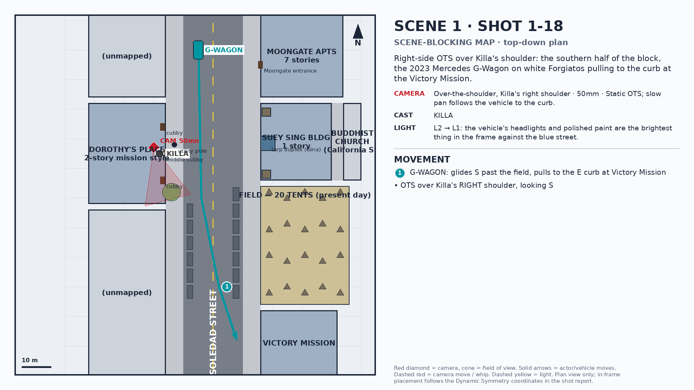

| Slot | Reference | File | Status |
|---|---|---|---|
| 1 | blocking_map | `03_department_outputs/scene_001/blocking_maps/1-18_blocking_map.png` | ready |
| 2 | character · KILLA | `02_bibles/refs/killa_reference.png` | missing |
| 3 | location · VICTORY_MISSION | `02_bibles/refs/victory_mission_plate.png` | missing |
| 4 | prop · G_WAGON | `02_bibles/refs/g_wagon.png` | missing |

```text
Image 1: Top-down scene-blocking map. Follow its positions and movement arrows; do not render the map itself.
Image 2 is KILLA (character).
Image 3 is VICTORY_MISSION (location).
Image 4 is G_WAGON (prop).

Over a seated man's right shoulder and dreadlocks, a gleaming luxury SUV on oversized white rims glides down the street past the tents and eases to the curb in front of a brick mission building where people are gathered. Heads turn toward it. Stage the action exactly as the blocking map in Image 1 shows: where each person stands, the numbered movement arrows, and the camera position and viewing direction. In frame, the focal point (The G-Wagon) sits at Killa's right shoulder and dreadlocks fill frame-right x=0.75–1.0; vehicle enters upper-right and travels the inner arc to rest at (0.30, 0.33) in front of the Victory Mission. Over-the-shoulder, Killa's right shoulder, 50mm lens. Static OTS; slow pan follows the vehicle to the curb. Lighting: L2 → L1: the vehicle's headlights and polished paint are the brightest thing in the frame against the blue street. Cinematic tearjerker tone, emotionally intimate framing, soft natural light favoring dawn or dusk. Foil visible somewhere in frame — crumpled, glinting, or scattered nearby. Environment shows worn signs of habitation — blankets, bags, makeshift bedding — treated with visual dignity, not disorder. Camera lingers rather than cuts quickly, allowing emotional weight to build. Killa says: "This muthafucka done slid, bitch — a spaceship tho! Lookit' dis shit."

Duration 7s. Cinematic 2.39:1 composition, photoreal, no on-screen text, no map graphics in the output.
```

---

## Shot 1-19 · 3s

**Beat:** Close-up: the G-Wagon pulling to the curb.

> (get a close-up and an ECU pulling to the curb at the Victory Mission…)

**Upstream reports:** CRR-001-CAS (flagged_for_human_review), CRR-001-WAR (provisional_pending_upstream), CRR-001-PRO (provisional_pending_upstream), CRR-001-LOC (flagged_for_human_review), CRR-001-BLK (locked), CRR-001-SET (locked), CRR-001-CIN (provisional_pending_upstream), CRR-001-LGT (flagged_for_human_review), CRR-001-IMG (provisional_pending_upstream), CRR-001-VAG (provisional_pending_upstream), CRR-001-EDT (locked)

### Shot Report
- **Blocking / Set:** focal point is *Front grille and headlight* at UR (0.70, 0.66) — Grille at (0.70, 0.60). Spiral: none. 
- **Set design:** Reflections of tents slide across the polished paint.
- **Camera:** Close-up on vehicle, 50mm. Low tracking alongside the vehicle's front quarter as it slows.
- **Lighting:** L1 Blue hour reflected in the paint.
- **Cast / wardrobe:** none
- **Props:** G_WAGON
- **Editing:** —
- **How it works together:** the camera (50mm) arrives at the blocking's focal point — Front grille and headlight — under L1 Blue hour reflected in the paint., so the beat "Close-up: the G-Wagon pulling to the curb" lands where the eye already is.
- **Open flags:** F-13

### Prompt pair — **BLOCKED**
Blockers:
- VICTORY_MISSION: no chosen location reference (F-18)

**LTX-2.3**

```text
Scene: The Victory Mission at the southern end of the block, a brick building past the tent field, people hanging out in front. Close on the front quarter of a spotless luxury SUV as it slows to the curb, the tents and street reflected sliding across its glossy paint. Composition follows dynamic symmetry principles — subject(s) positioned along a diagonal sightline rather than center-frame, with deliberate negative space. Focal point — Front grille and headlight: Grille at (0.70, 0.60). Camera: Close-up on vehicle, 50mm lens. Low tracking alongside the vehicle's front quarter as it slows. Lighting: L1 Blue hour reflected in the paint. Props in frame: a 2023 Mercedes-Benz G-Class wagon on oversized white Forgiato rims, spotless and gleaming. Cinematic tearjerker tone, emotionally intimate framing, soft natural light favoring dawn or dusk. Foil visible somewhere in frame — crumpled, glinting, or scattered nearby. Environment shows worn signs of habitation — blankets, bags, makeshift bedding — treated with visual dignity, not disorder. Camera lingers rather than cuts quickly, allowing emotional weight to build. Audio: Engine idle. Duration 3 seconds. Compose inside a centered 2.39:1 safe area of a 16:9 frame.
```

**Wan 2.2** (first frame `None`, last frame `None`)

```text
Scene: Close on the front quarter of a spotless luxury SUV as it slows to the curb, the tents and street reflected sliding across its glossy paint. Close-up on vehicle, 50mm. Low tracking alongside the vehicle's front quarter as it slows. Placement: Grille at (0.70, 0.60). L1 Blue hour reflected in the paint.
```

Negative:

```text
no dead-center framing unless flagged as intentional, no clean or brand-new camping gear; tents show wear and dust, no high-contrast plastic or neon garbage bins, no harsh flat midday daylight, no garbled on-screen text
```

**MiniMax Omni** (3/9 references)

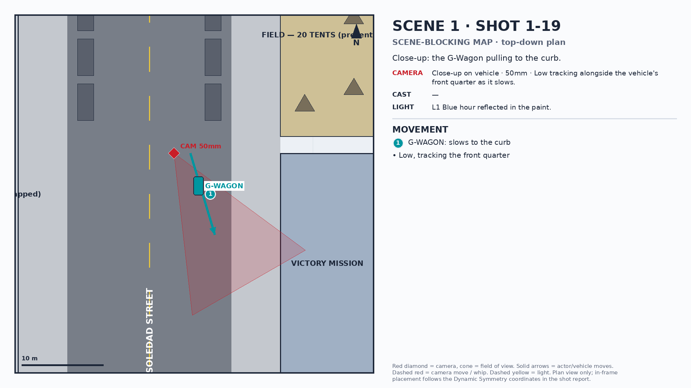

| Slot | Reference | File | Status |
|---|---|---|---|
| 1 | blocking_map | `03_department_outputs/scene_001/blocking_maps/1-19_blocking_map.png` | ready |
| 2 | location · VICTORY_MISSION | `02_bibles/refs/victory_mission_plate.png` | missing |
| 3 | prop · G_WAGON | `02_bibles/refs/g_wagon.png` | missing |

```text
Image 1: Top-down scene-blocking map. Follow its positions and movement arrows; do not render the map itself.
Image 2 is VICTORY_MISSION (location).
Image 3 is G_WAGON (prop).

Close on the front quarter of a spotless luxury SUV as it slows to the curb, the tents and street reflected sliding across its glossy paint. Stage the action exactly as the blocking map in Image 1 shows: where each person stands, the numbered movement arrows, and the camera position and viewing direction. In frame, the focal point (Front grille and headlight) sits at Grille at (0.70, 0.60). Close-up on vehicle, 50mm lens. Low tracking alongside the vehicle's front quarter as it slows. Lighting: L1 Blue hour reflected in the paint. Cinematic tearjerker tone, emotionally intimate framing, soft natural light favoring dawn or dusk. Foil visible somewhere in frame — crumpled, glinting, or scattered nearby. Environment shows worn signs of habitation — blankets, bags, makeshift bedding — treated with visual dignity, not disorder. Camera lingers rather than cuts quickly, allowing emotional weight to build.

Duration 3s. Cinematic 2.39:1 composition, photoreal, no on-screen text, no map graphics in the output.
```

---

## Shot 1-20 · 3s

**Beat:** ECU: a white Forgiato rim rolling to a stop.

> (get a close-up and an ECU …)

**Upstream reports:** CRR-001-CAS (flagged_for_human_review), CRR-001-WAR (provisional_pending_upstream), CRR-001-PRO (provisional_pending_upstream), CRR-001-LOC (flagged_for_human_review), CRR-001-BLK (locked), CRR-001-SET (locked), CRR-001-CIN (provisional_pending_upstream), CRR-001-LGT (flagged_for_human_review), CRR-001-IMG (provisional_pending_upstream), CRR-001-VAG (provisional_pending_upstream), CRR-001-EDT (locked)

### Shot Report
- **Blocking / Set:** focal point is *Rim stopping beside crumpled foil* at LR (0.70, 0.33) — Wheel hub at (0.70, 0.40); foil ball at (0.30, 0.12). Spiral: none. 
- **Set design:** A crumpled foil ball sits in the gutter inches from the tire — wealth and want in one frame.
- **Camera:** Extreme close-up, 100mm macro. Static at gutter level.
- **Lighting:** L1 Blue hour; chrome catches the streetlamp.
- **Cast / wardrobe:** none
- **Props:** G_WAGON, FOIL_CRUMPLED
- **Editing:** —
- **How it works together:** the camera (100mm macro) arrives at the blocking's focal point — Rim stopping beside crumpled foil — under L1 Blue hour; chrome catches the streetlamp., so the beat "ECU: a white Forgiato rim rolling to a stop" lands where the eye already is.
- **Open flags:** F-13

### Prompt pair — **BLOCKED**
Blockers:
- VICTORY_MISSION: no chosen location reference (F-18)

**LTX-2.3**

```text
Scene: The Victory Mission at the southern end of the block, a brick building past the tent field, people hanging out in front. Extreme close-up at gutter level: an oversized glossy white wheel rolls slowly and stops, inches from a small crumpled ball of foil in the gutter. Composition follows dynamic symmetry principles — subject(s) positioned along a diagonal sightline rather than center-frame, with deliberate negative space. Focal point — Rim stopping beside crumpled foil: Wheel hub at (0.70, 0.40); foil ball at (0.30, 0.12). Camera: Extreme close-up, 100mm macro lens. Static at gutter level. Lighting: L1 Blue hour; chrome catches the streetlamp. Props in frame: a 2023 Mercedes-Benz G-Class wagon on oversized white Forgiato rims, spotless and gleaming; dozens of tiny crumpled balls of smoked aluminum foil scattered across the sidewalk and gutter, glinting. Cinematic tearjerker tone, emotionally intimate framing, soft natural light favoring dawn or dusk. Foil visible somewhere in frame — crumpled, glinting, or scattered nearby. Environment shows worn signs of habitation — blankets, bags, makeshift bedding — treated with visual dignity, not disorder. Camera lingers rather than cuts quickly, allowing emotional weight to build. Audio: Tire crunch, stop. Duration 3 seconds. Compose inside a centered 2.39:1 safe area of a 16:9 frame.
```

**Wan 2.2** (first frame `None`, last frame `None`)

```text
Scene: Extreme close-up at gutter level: an oversized glossy white wheel rolls slowly and stops, inches from a small crumpled ball of foil in the gutter. Extreme close-up, 100mm macro. Static at gutter level. Placement: Wheel hub at (0.70, 0.40); foil ball at (0.30, 0.12). L1 Blue hour; chrome catches the streetlamp.
```

Negative:

```text
no dead-center framing unless flagged as intentional, no clean or brand-new camping gear; tents show wear and dust, no high-contrast plastic or neon garbage bins, no harsh flat midday daylight, no garbled on-screen text
```

**MiniMax Omni** (3/9 references)

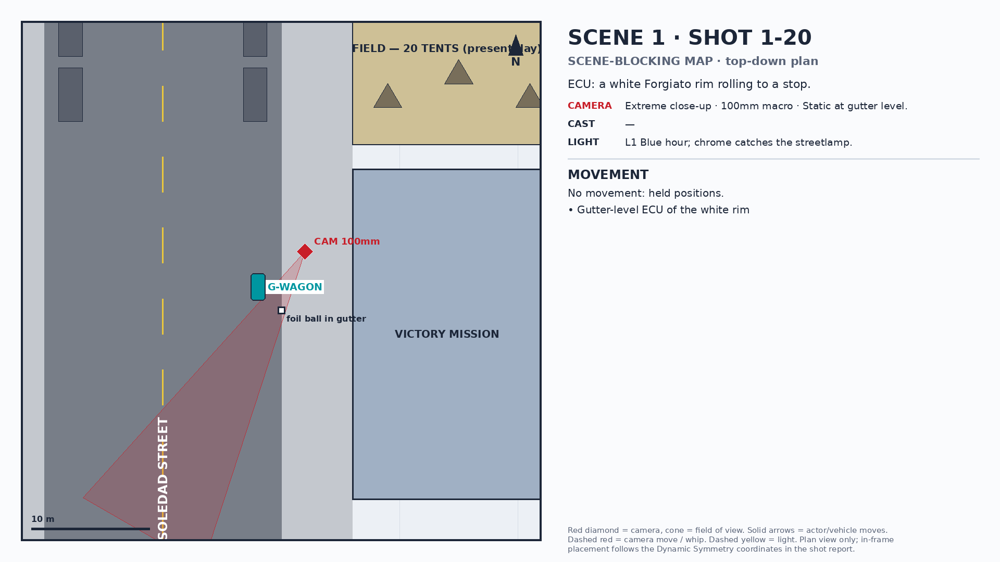

| Slot | Reference | File | Status |
|---|---|---|---|
| 1 | blocking_map | `03_department_outputs/scene_001/blocking_maps/1-20_blocking_map.png` | ready |
| 2 | location · VICTORY_MISSION | `02_bibles/refs/victory_mission_plate.png` | missing |
| 3 | prop · G_WAGON | `02_bibles/refs/g_wagon.png` | missing |

```text
Image 1: Top-down scene-blocking map. Follow its positions and movement arrows; do not render the map itself.
Image 2 is VICTORY_MISSION (location).
Image 3 is G_WAGON (prop).

Extreme close-up at gutter level: an oversized glossy white wheel rolls slowly and stops, inches from a small crumpled ball of foil in the gutter. Stage the action exactly as the blocking map in Image 1 shows: where each person stands, the numbered movement arrows, and the camera position and viewing direction. In frame, the focal point (Rim stopping beside crumpled foil) sits at Wheel hub at (0.70, 0.40); foil ball at (0.30, 0.12). Extreme close-up, 100mm macro lens. Static at gutter level. Lighting: L1 Blue hour; chrome catches the streetlamp. Cinematic tearjerker tone, emotionally intimate framing, soft natural light favoring dawn or dusk. Foil visible somewhere in frame — crumpled, glinting, or scattered nearby. Environment shows worn signs of habitation — blankets, bags, makeshift bedding — treated with visual dignity, not disorder. Camera lingers rather than cuts quickly, allowing emotional weight to build.

Duration 3s. Cinematic 2.39:1 composition, photoreal, no on-screen text, no map graphics in the output.
```

---

## Shot 1-21 · 4s

**Beat:** Perspective series (a): the loaded shopping carts.

> Next, a series of perspective shots show the loaded shopping carts, trash, tents, furnishings, homeless, addicts and drug dealers there.

**Upstream reports:** CRR-001-CAS (flagged_for_human_review), CRR-001-WAR (provisional_pending_upstream), CRR-001-PRO (provisional_pending_upstream), CRR-001-LOC (flagged_for_human_review), CRR-001-BLK (locked), CRR-001-SET (locked), CRR-001-CIN (provisional_pending_upstream), CRR-001-LGT (flagged_for_human_review), CRR-001-IMG (provisional_pending_upstream), CRR-001-VAG (provisional_pending_upstream), CRR-001-EDT (locked)

### Shot Report
- **Blocking / Set:** focal point is *A photograph tucked into a cart's blanket bundle* at UL (0.30, 0.66) — Photo at (0.30, 0.60). Spiral: none. 
- **Set design:** Two carts stacked with blankets, tarps and plastic bags — a whole life compressed. A child's stuffed animal tied to the handle.
- **Camera:** Medium detail, 50mm. Slow lateral slide.
- **Lighting:** L1 → L3 transition begins: the first hint of warm light on the tops of the buildings.
- **Cast / wardrobe:** none
- **Props:** SHOPPING_CARTS
- **Editing:** Montage beat 1 of 3; ~4s each, lingering, not quick-cut.
- **How it works together:** the camera (50mm) arrives at the blocking's focal point — A photograph tucked into a cart's blanket bundle — under L1 → L3 transition begins, so the beat "Perspective series (a): the loaded shopping carts" lands where the eye already is.

### Prompt pair — **BLOCKED**
Blockers:
- SOLEDAD_SUEY_SING: no chosen location reference (F-18)

**LTX-2.3**

```text
Scene: The Suey Sing Building on Soledad Street, Chinatown, Salinas: tan/cream single-story stucco building, weathered signage, boarded and graffiti-covered sections along the lower wall, no fence in front. The seven-story Moongate Apartments rise on its left. On its right, a dirt, weed and rock-filled field holds twenty weathered tents. Against the building's wall: a tent in each corner and a huge tarp-built two-unit structure between them, with shopping carts, bikes and belongings. A slow slide past two shopping carts packed with bundled blankets, tarps and plastic bags, a small stuffed animal tied to one handle and a photograph tucked into the folds of a blanket. Composition follows dynamic symmetry principles — subject(s) positioned along a diagonal sightline rather than center-frame, with deliberate negative space. Focal point — A photograph tucked into a cart's blanket bundle: Photo at (0.30, 0.60). Camera: Medium detail, 50mm lens. Slow lateral slide. Lighting: L1 → L3 transition begins: the first hint of warm light on the tops of the buildings. Props in frame: metal shopping carts stacked with bundled blankets, tarps, and plastic bags, treated with visual dignity. Cinematic tearjerker tone, emotionally intimate framing, soft natural light favoring dawn or dusk. Foil visible somewhere in frame — crumpled, glinting, or scattered nearby. Environment shows worn signs of habitation — blankets, bags, makeshift bedding — treated with visual dignity, not disorder. Camera lingers rather than cuts quickly, allowing emotional weight to build. Duration 4 seconds. Compose inside a centered 2.39:1 safe area of a 16:9 frame.
```

**Wan 2.2** (first frame `None`, last frame `None`)

```text
Scene: A slow slide past two shopping carts packed with bundled blankets, tarps and plastic bags, a small stuffed animal tied to one handle and a photograph tucked into the folds of a blanket. Medium detail, 50mm. Slow lateral slide. Placement: Photo at (0.30, 0.60). L1 → L3 transition begins: the first hint of warm light on the tops of the buildings.
```

Negative:

```text
no dead-center framing unless flagged as intentional, no clean or brand-new camping gear; tents show wear and dust, no high-contrast plastic or neon garbage bins, no harsh flat midday daylight, no garbled on-screen text, Moongate Apartments on the left of Suey Sing, never the right, no fence in front of the Suey Sing Building, do not fill in, build over, or remove the open field, do not merge the building-side encampment with the field encampment
```

**MiniMax Omni** (2/9 references)

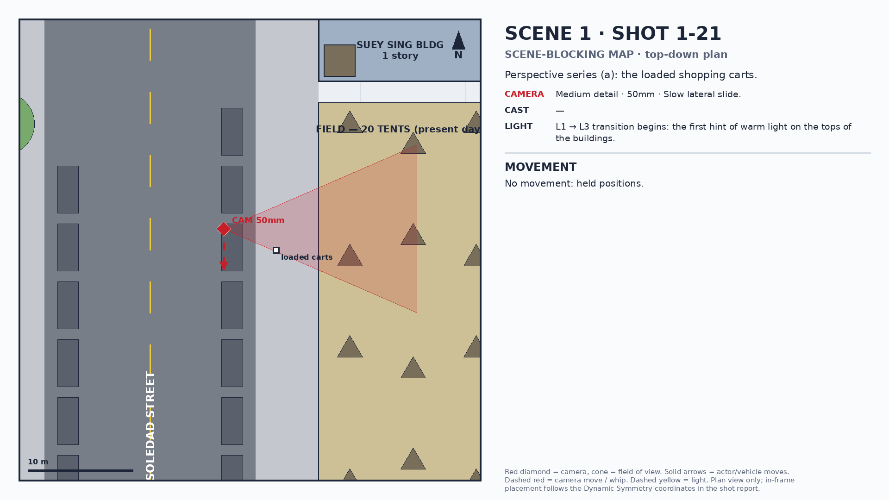

| Slot | Reference | File | Status |
|---|---|---|---|
| 1 | blocking_map | `03_department_outputs/scene_001/blocking_maps/1-21_blocking_map.png` | ready |
| 2 | location · SOLEDAD_SUEY_SING | `02_bibles/refs/soledad_suey_sing_plate.png` | missing |

```text
Image 1: Top-down scene-blocking map. Follow its positions and movement arrows; do not render the map itself.
Image 2 is SOLEDAD_SUEY_SING (location).

A slow slide past two shopping carts packed with bundled blankets, tarps and plastic bags, a small stuffed animal tied to one handle and a photograph tucked into the folds of a blanket. Stage the action exactly as the blocking map in Image 1 shows: where each person stands, the numbered movement arrows, and the camera position and viewing direction. In frame, the focal point (A photograph tucked into a cart's blanket bundle) sits at Photo at (0.30, 0.60). Medium detail, 50mm lens. Slow lateral slide. Lighting: L1 → L3 transition begins: the first hint of warm light on the tops of the buildings. Cinematic tearjerker tone, emotionally intimate framing, soft natural light favoring dawn or dusk. Foil visible somewhere in frame — crumpled, glinting, or scattered nearby. Environment shows worn signs of habitation — blankets, bags, makeshift bedding — treated with visual dignity, not disorder. Camera lingers rather than cuts quickly, allowing emotional weight to build.

Duration 4s. Cinematic 2.39:1 composition, photoreal, no on-screen text, no map graphics in the output.
```

---

## Shot 1-22 · 4s

**Beat:** Perspective series (b): tents and furnishings in the field.

> (series of perspective shots…)

**Upstream reports:** CRR-001-CAS (flagged_for_human_review), CRR-001-WAR (provisional_pending_upstream), CRR-001-PRO (provisional_pending_upstream), CRR-001-LOC (flagged_for_human_review), CRR-001-BLK (locked), CRR-001-SET (locked), CRR-001-CIN (provisional_pending_upstream), CRR-001-LGT (flagged_for_human_review), CRR-001-IMG (provisional_pending_upstream), CRR-001-VAG (provisional_pending_upstream), CRR-001-EDT (locked)

### Shot Report
- **Blocking / Set:** focal point is *A pair of worn shoes set neatly outside a tent flap* at LL (0.30, 0.33) — Shoes at (0.30, 0.25). Spiral: none. 
- **Set design:** An armchair set outside a tent like a front porch; a rug laid in the dirt.
- **Camera:** Medium-wide, 35mm. Static.
- **Lighting:** L1/L3 transition.
- **Cast / wardrobe:** none
- **Props:** FOIL_CRUMPLED
- **Editing:** Montage beat 2 of 3.
- **How it works together:** the camera (35mm) arrives at the blocking's focal point — A pair of worn shoes set neatly outside a tent flap — under L1/L3 transition., so the beat "Perspective series (b): tents and furnishings in the field" lands where the eye already is.
- **Open flags:** F-10

### Prompt pair — **BLOCKED**
Blockers:
- SOLEDAD_SUEY_SING: no chosen location reference (F-18)

**LTX-2.3**

```text
Scene: The Suey Sing Building on Soledad Street, Chinatown, Salinas: tan/cream single-story stucco building, weathered signage, boarded and graffiti-covered sections along the lower wall, no fence in front. The seven-story Moongate Apartments rise on its left. On its right, a dirt, weed and rock-filled field holds twenty weathered tents. Against the building's wall: a tent in each corner and a huge tarp-built two-unit structure between them, with shopping carts, bikes and belongings. A weathered tent in a dirt field, a pair of worn shoes set neatly side by side outside its flap, an old armchair and a rug arranged in front of it like a front porch. Composition follows dynamic symmetry principles — subject(s) positioned along a diagonal sightline rather than center-frame, with deliberate negative space. Focal point — A pair of worn shoes set neatly outside a tent flap: Shoes at (0.30, 0.25). Camera: Medium-wide, 35mm lens. Static. Lighting: L1/L3 transition. Props in frame: dozens of tiny crumpled balls of smoked aluminum foil scattered across the sidewalk and gutter, glinting. Cinematic tearjerker tone, emotionally intimate framing, soft natural light favoring dawn or dusk. Foil visible somewhere in frame — crumpled, glinting, or scattered nearby. Environment shows worn signs of habitation — blankets, bags, makeshift bedding — treated with visual dignity, not disorder. Camera lingers rather than cuts quickly, allowing emotional weight to build. Duration 4 seconds. Compose inside a centered 2.39:1 safe area of a 16:9 frame.
```

**Wan 2.2** (first frame `None`, last frame `None`)

```text
Scene: A weathered tent in a dirt field, a pair of worn shoes set neatly side by side outside its flap, an old armchair and a rug arranged in front of it like a front porch. Medium-wide, 35mm. Static. Placement: Shoes at (0.30, 0.25). L1/L3 transition.
```

Negative:

```text
no dead-center framing unless flagged as intentional, no clean or brand-new camping gear; tents show wear and dust, no high-contrast plastic or neon garbage bins, no harsh flat midday daylight, no garbled on-screen text, Moongate Apartments on the left of Suey Sing, never the right, no fence in front of the Suey Sing Building, do not fill in, build over, or remove the open field, do not merge the building-side encampment with the field encampment
```

**MiniMax Omni** (2/9 references)

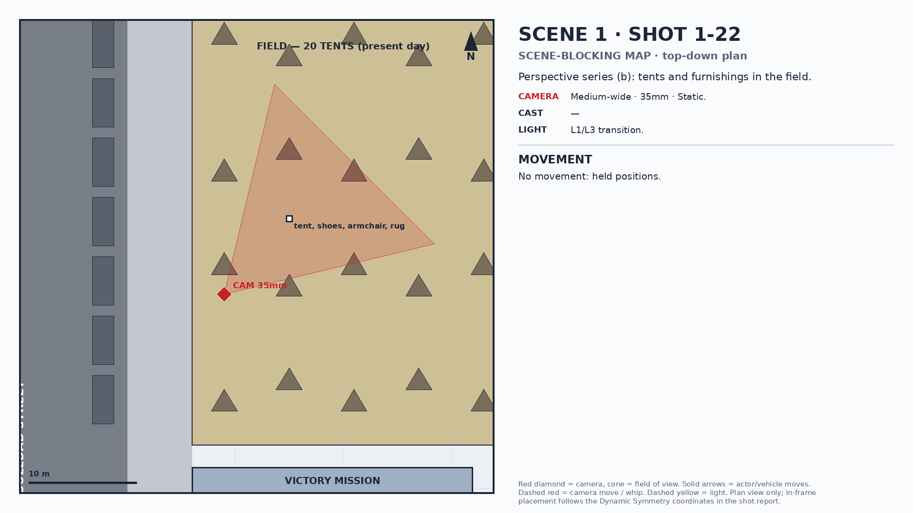

| Slot | Reference | File | Status |
|---|---|---|---|
| 1 | blocking_map | `03_department_outputs/scene_001/blocking_maps/1-22_blocking_map.png` | ready |
| 2 | location · SOLEDAD_SUEY_SING | `02_bibles/refs/soledad_suey_sing_plate.png` | missing |

```text
Image 1: Top-down scene-blocking map. Follow its positions and movement arrows; do not render the map itself.
Image 2 is SOLEDAD_SUEY_SING (location).

A weathered tent in a dirt field, a pair of worn shoes set neatly side by side outside its flap, an old armchair and a rug arranged in front of it like a front porch. Stage the action exactly as the blocking map in Image 1 shows: where each person stands, the numbered movement arrows, and the camera position and viewing direction. In frame, the focal point (A pair of worn shoes set neatly outside a tent flap) sits at Shoes at (0.30, 0.25). Medium-wide, 35mm lens. Static. Lighting: L1/L3 transition. Cinematic tearjerker tone, emotionally intimate framing, soft natural light favoring dawn or dusk. Foil visible somewhere in frame — crumpled, glinting, or scattered nearby. Environment shows worn signs of habitation — blankets, bags, makeshift bedding — treated with visual dignity, not disorder. Camera lingers rather than cuts quickly, allowing emotional weight to build.

Duration 4s. Cinematic 2.39:1 composition, photoreal, no on-screen text, no map graphics in the output.
```

---

## Shot 1-23 · 4s

**Beat:** Perspective series (c): the people — hanging out, nodding, dealing.

> (series of perspective shots… homeless, addicts and drug dealers there.)

**Upstream reports:** CRR-001-CAS (flagged_for_human_review), CRR-001-WAR (provisional_pending_upstream), CRR-001-PRO (provisional_pending_upstream), CRR-001-LOC (flagged_for_human_review), CRR-001-BLK (locked), CRR-001-SET (locked), CRR-001-CIN (provisional_pending_upstream), CRR-001-LGT (flagged_for_human_review), CRR-001-IMG (provisional_pending_upstream), CRR-001-VAG (provisional_pending_upstream), CRR-001-EDT (locked)

### Shot Report
- **Blocking / Set:** focal point is *A seated figure folded forward, gently swaying* at UR (0.70, 0.66) — Figure at (0.70, 0.55); a quick hand-to-hand exchange soft in background at (0.30, 0.45). Spiral: none. Atmospheric, not sensational (Cinematography Bible — Nodding motif).
- **Camera:** Medium-wide, 50mm. Static, long lens compression.
- **Lighting:** L1/L3 transition.
- **Cast / wardrobe:** none
- **Props:** FOIL_CRUMPLED
- **Editing:** Montage beat 3 of 3. Transition to Ruby.
- **How it works together:** the camera (50mm) arrives at the blocking's focal point — A seated figure folded forward, gently swaying — under L1/L3 transition., so the beat "Perspective series (c): the people — hanging out, nodding, dealing" lands where the eye already is.

### Prompt pair — **BLOCKED**
Blockers:
- SOLEDAD_SUEY_SING: no chosen location reference (F-18)

**LTX-2.3**

```text
Scene: The Suey Sing Building on Soledad Street, Chinatown, Salinas: tan/cream single-story stucco building, weathered signage, boarded and graffiti-covered sections along the lower wall, no fence in front. The seven-story Moongate Apartments rise on its left. On its right, a dirt, weed and rock-filled field holds twenty weathered tents. Against the building's wall: a tent in each corner and a huge tarp-built two-unit structure between them, with shopping carts, bikes and belongings. A figure sits on a curb folded forward at the waist, still except for a slow, gentle sway. Behind him, out of focus, two people make a quick hand-to-hand exchange and part. Composition follows dynamic symmetry principles — subject(s) positioned along a diagonal sightline rather than center-frame, with deliberate negative space. Focal point — A seated figure folded forward, gently swaying: Figure at (0.70, 0.55); a quick hand-to-hand exchange soft in background at (0.30, 0.45). Camera: Medium-wide, 50mm lens. Static, long lens compression. Lighting: L1/L3 transition. Props in frame: dozens of tiny crumpled balls of smoked aluminum foil scattered across the sidewalk and gutter, glinting. Cinematic tearjerker tone, emotionally intimate framing, soft natural light favoring dawn or dusk. Foil visible somewhere in frame — crumpled, glinting, or scattered nearby. Environment shows worn signs of habitation — blankets, bags, makeshift bedding — treated with visual dignity, not disorder. Camera lingers rather than cuts quickly, allowing emotional weight to build. Duration 4 seconds. Compose inside a centered 2.39:1 safe area of a 16:9 frame.
```

**Wan 2.2** (first frame `None`, last frame `None`)

```text
Scene: A figure sits on a curb folded forward at the waist, still except for a slow, gentle sway. Behind him, out of focus, two people make a quick hand-to-hand exchange and part. Medium-wide, 50mm. Static, long lens compression. Placement: Figure at (0.70, 0.55); a quick hand-to-hand exchange soft in background at (0.30, 0.45). L1/L3 transition.
```

Negative:

```text
no dead-center framing unless flagged as intentional, no clean or brand-new camping gear; tents show wear and dust, no high-contrast plastic or neon garbage bins, no harsh flat midday daylight, no garbled on-screen text, Moongate Apartments on the left of Suey Sing, never the right, no fence in front of the Suey Sing Building, do not fill in, build over, or remove the open field, do not merge the building-side encampment with the field encampment
```

**MiniMax Omni** (2/9 references)

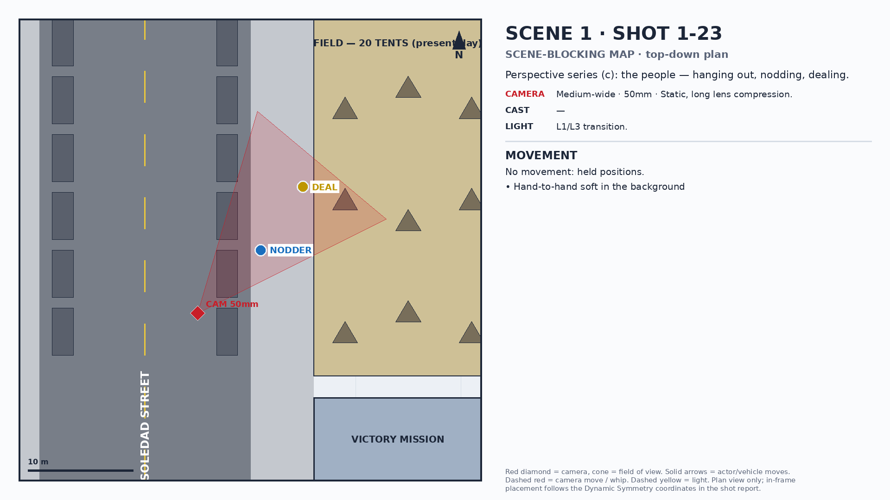

| Slot | Reference | File | Status |
|---|---|---|---|
| 1 | blocking_map | `03_department_outputs/scene_001/blocking_maps/1-23_blocking_map.png` | ready |
| 2 | location · SOLEDAD_SUEY_SING | `02_bibles/refs/soledad_suey_sing_plate.png` | missing |

```text
Image 1: Top-down scene-blocking map. Follow its positions and movement arrows; do not render the map itself.
Image 2 is SOLEDAD_SUEY_SING (location).

A figure sits on a curb folded forward at the waist, still except for a slow, gentle sway. Behind him, out of focus, two people make a quick hand-to-hand exchange and part. Stage the action exactly as the blocking map in Image 1 shows: where each person stands, the numbered movement arrows, and the camera position and viewing direction. In frame, the focal point (A seated figure folded forward, gently swaying) sits at Figure at (0.70, 0.55); a quick hand-to-hand exchange soft in background at (0.30, 0.45). Medium-wide, 50mm lens. Static, long lens compression. Lighting: L1/L3 transition. Cinematic tearjerker tone, emotionally intimate framing, soft natural light favoring dawn or dusk. Foil visible somewhere in frame — crumpled, glinting, or scattered nearby. Environment shows worn signs of habitation — blankets, bags, makeshift bedding — treated with visual dignity, not disorder. Camera lingers rather than cuts quickly, allowing emotional weight to build.

Duration 4s. Cinematic 2.39:1 composition, photoreal, no on-screen text, no map graphics in the output.
```

---

## Shot 1-24 · 7s

**Beat:** The camera finds Ruby standing out front of the Moongate, smoking a cigarette in her robe.

> Finally the camera finds RUBY STEEVES 60NAF standing out front of The Moon gate, smoking a cigarette in her robe.

**Upstream reports:** CRR-001-CAS (flagged_for_human_review), CRR-001-WAR (provisional_pending_upstream), CRR-001-PRO (provisional_pending_upstream), CRR-001-LOC (flagged_for_human_review), CRR-001-BLK (locked), CRR-001-SET (locked), CRR-001-CIN (provisional_pending_upstream), CRR-001-LGT (flagged_for_human_review), CRR-001-IMG (provisional_pending_upstream), CRR-001-VAG (provisional_pending_upstream), CRR-001-EDT (locked)

### Shot Report
- **Blocking / Set:** focal point is *Ruby's face and cigarette smoke* at UL (0.30, 0.66) — Ruby standing at (0.30, 0.50), face arriving at (0.30, 0.66) at end of push. Spiral: none. Coffee mug established here in her non-smoking hand so the 1-31 threat pays off.
- **Set design:** Moongate Apartments' entrance and tower rising behind her on the right, emphasizing her smallness against the building; sidewalk empty around her.
- **Camera:** Wide to medium, 35mm → 50mm equivalent. Slow push-in from wide to medium over the full 7s.
- **Lighting:** L3 First light: first low warm sun catches the top floors of the tower above her; Ruby still in cool shade — the light hasn't reached her.
- **Cast / wardrobe:** RUBY (present_day_robe)
- **Props:** RUBY_CIGARETTE, RUBY_COFFEE_MUG
- **Expression anchors:** RUBY_nervous_worried → RUBY_nervous_worried
- **Editing:** —
- **How it works together:** the camera (35mm → 50mm equivalent) arrives at the blocking's focal point — Ruby's face and cigarette smoke — under L3 First light, so the beat "The camera finds Ruby standing out front of the Moongate, smoking a cigarette in her robe" lands where the eye already is.
- **Open flags:** F-05, F-06, F-12

### Prompt pair — **BLOCKED**
Blockers:
- RUBY: no chosen reference image (F-18)
- MOONGATE_FRONT: no chosen location reference (F-18)

**LTX-2.3**

```text
[RUBY] Same character as reference image: 66-year-old Cherokee woman, smooth skin with only faint fine lines at the eyes, high cheekbones, sharp restless dark eyes, thick dark hair with silver strands in a loose braid, wearing a pink robe, barefoot, turquoise ring, turquoise pendant necklace. No facial tattoos, no gray-all-over hair, no gaunt features, no wrinkling. Maintain exact facial structure from reference. Scene: The sidewalk in front of the entrance of the seven-story Moongate Apartments on Soledad Street, the Suey Sing Building to its right. Standing alone in front of a tall apartment building's entrance, an older woman in a pink robe, barefoot, holds a coffee mug in one hand and draws hard on a cigarette with the other, her eyes darting up and down the street. Composition follows dynamic symmetry principles — subject(s) positioned along a diagonal sightline rather than center-frame, with deliberate negative space. Focal point — Ruby's face and cigarette smoke: Ruby standing at (0.30, 0.50), face arriving at (0.30, 0.66) at end of push. Camera: Wide to medium, 35mm → 50mm equivalent lens. Slow push-in from wide to medium over the full 7s. Lighting: L3 First light: first low warm sun catches the top floors of the tower above her; Ruby still in cool shade — the light hasn't reached her. Props in frame: a lit cigarette; a ceramic coffee mug. Cinematic tearjerker tone, emotionally intimate framing, soft natural light favoring dawn or dusk. Foil visible somewhere in frame — crumpled, glinting, or scattered nearby. Environment shows worn signs of habitation — blankets, bags, makeshift bedding — treated with visual dignity, not disorder. Camera lingers rather than cuts quickly, allowing emotional weight to build. Audio: Cigarette crackle, exhale. Duration 7 seconds. Compose inside a centered 2.39:1 safe area of a 16:9 frame.
```

**Wan 2.2** (first frame `expr/RUBY_nervous_worried.png`, last frame `expr/RUBY_nervous_worried.png`) — 7s > 5s: generate 2 segments, each segment's last frame seeds the next.

```text
[RUBY] Same character as reference image: 66-year-old Cherokee woman, smooth skin with only faint fine lines at the eyes, high cheekbones, sharp restless dark eyes, thick dark hair with silver strands in a loose braid, wearing a pink robe, barefoot, turquoise ring, turquoise pendant necklace. No facial tattoos, no gray-all-over hair, no gaunt features, no wrinkling. Maintain exact facial structure from reference. Scene: Standing alone in front of a tall apartment building's entrance, an older woman in a pink robe, barefoot, holds a coffee mug in one hand and draws hard on a cigarette with the other, her eyes darting up and down the street. Wide to medium, 35mm → 50mm equivalent. Slow push-in from wide to medium over the full 7s. Placement: Ruby standing at (0.30, 0.50), face arriving at (0.30, 0.66) at end of push. L3 First light: first low warm sun catches the top floors of the tower above her; Ruby still in cool shade — the light hasn't reached her.
```

Negative:

```text
no dead-center framing unless flagged as intentional, no clean or brand-new camping gear; tents show wear and dust, no high-contrast plastic or neon garbage bins, no harsh flat midday daylight, no garbled on-screen text, no facial tattoos, no sunken/gaunt cheekbones, no fully gray or white hair, no heavy wrinkling, forehead lines, or aged skin texture, no hunched or frail posture, no jewelry beyond turquoise ring and pendant, no default smiling, Moongate is the tallest structure on the block
```

**MiniMax Omni** (4/9 references)

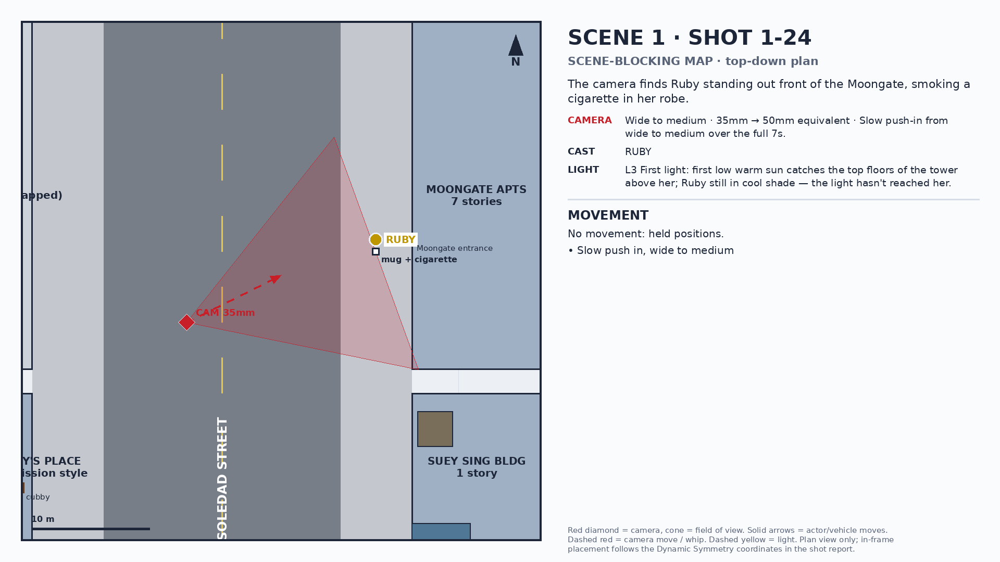

| Slot | Reference | File | Status |
|---|---|---|---|
| 1 | blocking_map | `03_department_outputs/scene_001/blocking_maps/1-24_blocking_map.png` | ready |
| 2 | character · RUBY | `02_bibles/refs/ruby_reference.png` | missing |
| 3 | location · MOONGATE_FRONT | `02_bibles/refs/moongate_front_plate.png` | missing |
| 4 | expression_start · RUBY_nervous_worried | `expr/RUBY_nervous_worried.png` | missing |

```text
Image 1: Top-down scene-blocking map. Follow its positions and movement arrows; do not render the map itself.
Image 2 is RUBY (character).
Image 3 is MOONGATE_FRONT (location).
Image 4 is RUBY_nervous_worried (expression start).

Standing alone in front of a tall apartment building's entrance, an older woman in a pink robe, barefoot, holds a coffee mug in one hand and draws hard on a cigarette with the other, her eyes darting up and down the street. Stage the action exactly as the blocking map in Image 1 shows: where each person stands, the numbered movement arrows, and the camera position and viewing direction. In frame, the focal point (Ruby's face and cigarette smoke) sits at Ruby standing at (0.30, 0.50), face arriving at (0.30, 0.66) at end of push. Wide to medium, 35mm → 50mm equivalent lens. Slow push-in from wide to medium over the full 7s. Lighting: L3 First light: first low warm sun catches the top floors of the tower above her; Ruby still in cool shade — the light hasn't reached her. Cinematic tearjerker tone, emotionally intimate framing, soft natural light favoring dawn or dusk. Foil visible somewhere in frame — crumpled, glinting, or scattered nearby. Environment shows worn signs of habitation — blankets, bags, makeshift bedding — treated with visual dignity, not disorder. Camera lingers rather than cuts quickly, allowing emotional weight to build.

Duration 7s. Cinematic 2.39:1 composition, photoreal, no on-screen text, no map graphics in the output.
```

---

## Shot 1-25 · 5s

**Beat:** Closer: Ruby puffing hard and fast on the cigarette, nervous.

> A closer look shows RUBY puffing hard and fast on the cigarette, in a nervous way.

**Upstream reports:** CRR-001-CAS (flagged_for_human_review), CRR-001-WAR (provisional_pending_upstream), CRR-001-PRO (provisional_pending_upstream), CRR-001-LOC (flagged_for_human_review), CRR-001-BLK (locked), CRR-001-SET (locked), CRR-001-CIN (provisional_pending_upstream), CRR-001-LGT (flagged_for_human_review), CRR-001-IMG (provisional_pending_upstream), CRR-001-VAG (provisional_pending_upstream), CRR-001-EDT (locked)

### Shot Report
- **Blocking / Set:** focal point is *Her restless eyes* at UR (0.70, 0.66) — Eyes at (0.70, 0.66); cigarette hand enters at (0.55, 0.40). Spiral: none. 
- **Camera:** Close-up, 85mm. Static, eye level.
- **Lighting:** L3 First light: a warm edge on her smoke, face still in cool shade.
- **Cast / wardrobe:** RUBY (present_day_robe)
- **Props:** RUBY_CIGARETTE
- **Expression anchors:** RUBY_nervous_worried → RUBY_nervous_worried
- **Editing:** —
- **How it works together:** the camera (85mm) arrives at the blocking's focal point — Her restless eyes — under L3 First light, so the beat "Closer: Ruby puffing hard and fast on the cigarette, nervous" lands where the eye already is.
- **Open flags:** F-05

### Prompt pair — **BLOCKED**
Blockers:
- RUBY: no chosen reference image (F-18)
- MOONGATE_FRONT: no chosen location reference (F-18)

**LTX-2.3**

```text
[RUBY] Same character as reference image: 66-year-old Cherokee woman, smooth skin with only faint fine lines at the eyes, high cheekbones, sharp restless dark eyes, thick dark hair with silver strands in a loose braid, wearing a pink robe, barefoot, turquoise ring, turquoise pendant necklace. No facial tattoos, no gray-all-over hair, no gaunt features, no wrinkling. Maintain exact facial structure from reference. Scene: The sidewalk in front of the entrance of the seven-story Moongate Apartments on Soledad Street, the Suey Sing Building to its right. Close on her face: she drags hard and fast on the cigarette, exhales, drags again, her sharp dark eyes flicking restlessly from one point to another. Composition follows dynamic symmetry principles — subject(s) positioned along a diagonal sightline rather than center-frame, with deliberate negative space. Focal point — Her restless eyes: Eyes at (0.70, 0.66); cigarette hand enters at (0.55, 0.40). Camera: Close-up, 85mm lens. Static, eye level. Lighting: L3 First light: a warm edge on her smoke, face still in cool shade. Props in frame: a lit cigarette. Cinematic tearjerker tone, emotionally intimate framing, soft natural light favoring dawn or dusk. Foil visible somewhere in frame — crumpled, glinting, or scattered nearby. Environment shows worn signs of habitation — blankets, bags, makeshift bedding — treated with visual dignity, not disorder. Camera lingers rather than cuts quickly, allowing emotional weight to build. Audio: Rapid inhales. Duration 5 seconds. Compose inside a centered 2.39:1 safe area of a 16:9 frame.
```

**Wan 2.2** (first frame `expr/RUBY_nervous_worried.png`, last frame `expr/RUBY_nervous_worried.png`)

```text
[RUBY] Same character as reference image: 66-year-old Cherokee woman, smooth skin with only faint fine lines at the eyes, high cheekbones, sharp restless dark eyes, thick dark hair with silver strands in a loose braid, wearing a pink robe, barefoot, turquoise ring, turquoise pendant necklace. No facial tattoos, no gray-all-over hair, no gaunt features, no wrinkling. Maintain exact facial structure from reference. Scene: Close on her face: she drags hard and fast on the cigarette, exhales, drags again, her sharp dark eyes flicking restlessly from one point to another. Close-up, 85mm. Static, eye level. Placement: Eyes at (0.70, 0.66); cigarette hand enters at (0.55, 0.40). L3 First light: a warm edge on her smoke, face still in cool shade.
```

Negative:

```text
no dead-center framing unless flagged as intentional, no clean or brand-new camping gear; tents show wear and dust, no high-contrast plastic or neon garbage bins, no harsh flat midday daylight, no garbled on-screen text, no facial tattoos, no sunken/gaunt cheekbones, no fully gray or white hair, no heavy wrinkling, forehead lines, or aged skin texture, no hunched or frail posture, no jewelry beyond turquoise ring and pendant, no default smiling, Moongate is the tallest structure on the block
```

**MiniMax Omni** (4/9 references)

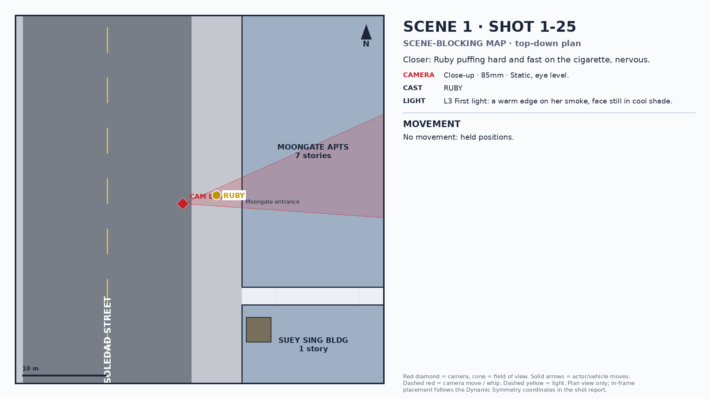

| Slot | Reference | File | Status |
|---|---|---|---|
| 1 | blocking_map | `03_department_outputs/scene_001/blocking_maps/1-25_blocking_map.png` | ready |
| 2 | character · RUBY | `02_bibles/refs/ruby_reference.png` | missing |
| 3 | location · MOONGATE_FRONT | `02_bibles/refs/moongate_front_plate.png` | missing |
| 4 | expression_start · RUBY_nervous_worried | `expr/RUBY_nervous_worried.png` | missing |

```text
Image 1: Top-down scene-blocking map. Follow its positions and movement arrows; do not render the map itself.
Image 2 is RUBY (character).
Image 3 is MOONGATE_FRONT (location).
Image 4 is RUBY_nervous_worried (expression start).

Close on her face: she drags hard and fast on the cigarette, exhales, drags again, her sharp dark eyes flicking restlessly from one point to another. Stage the action exactly as the blocking map in Image 1 shows: where each person stands, the numbered movement arrows, and the camera position and viewing direction. In frame, the focal point (Her restless eyes) sits at Eyes at (0.70, 0.66); cigarette hand enters at (0.55, 0.40). Close-up, 85mm lens. Static, eye level. Lighting: L3 First light: a warm edge on her smoke, face still in cool shade. Cinematic tearjerker tone, emotionally intimate framing, soft natural light favoring dawn or dusk. Foil visible somewhere in frame — crumpled, glinting, or scattered nearby. Environment shows worn signs of habitation — blankets, bags, makeshift bedding — treated with visual dignity, not disorder. Camera lingers rather than cuts quickly, allowing emotional weight to build.

Duration 5s. Cinematic 2.39:1 composition, photoreal, no on-screen text, no map graphics in the output.
```

---

## Shot 1-26 · 8s

**Beat:** Rick and Tina walk hand in hand toward Ruby; their expressions grow concerned as they get close.

> A couple, RICK 30WM and TINA 30WF come walking hand in hand, down the sidewalk, towards Ruby, and when they get close, their expressions grow concerned and they speak.

**Upstream reports:** CRR-001-CAS (flagged_for_human_review), CRR-001-WAR (provisional_pending_upstream), CRR-001-PRO (provisional_pending_upstream), CRR-001-LOC (flagged_for_human_review), CRR-001-BLK (locked), CRR-001-SET (locked), CRR-001-CIN (provisional_pending_upstream), CRR-001-LGT (flagged_for_human_review), CRR-001-IMG (provisional_pending_upstream), CRR-001-VAG (provisional_pending_upstream), CRR-001-EDT (locked)

### Shot Report
- **Blocking / Set:** focal point is *Ruby* at UL (0.30, 0.66) — Ruby frame-left at (0.30, 0.55); the couple enters frame-right at (0.90, 0.45) and walks the arc inward, stopping at (0.62, 0.50). Spiral: Outer→inner arc, top-left orientation: their approach path leads the eye to Ruby. Scene Blocking Bible worked example (Ruby, Rick, Tina): three-person diagonal, the couple's approach leads the eye toward her.
- **Camera:** Medium-wide three-shot, 35mm. Static.
- **Lighting:** L3 First light.
- **Cast / wardrobe:** RUBY (present_day_robe), RICK (present_day), TINA (present_day)
- **Props:** RUBY_CIGARETTE, RUBY_COFFEE_MUG
- **Expression anchors:** RUBY_nervous_worried → RUBY_nervous_worried
- **Editing:** —
- **How it works together:** the camera (35mm) arrives at the blocking's focal point — Ruby — under L3 First light., so the beat "Rick and Tina walk hand in hand toward Ruby; their expressions grow concerned as they get close" lands where the eye already is.
- **Open flags:** F-09

### Prompt pair — **BLOCKED**
Blockers:
- RUBY: no chosen reference image (F-18)
- RICK: sheet supplied but file not committed (F-18)
- RICK: Character Bible is provisional (F-09)
- TINA: no chosen reference image (F-18)
- TINA: Character Bible is provisional (F-09)
- MOONGATE_FRONT: no chosen location reference (F-18)

**LTX-2.3**

```text
[RUBY] Same character as reference image: 66-year-old Cherokee woman, smooth skin with only faint fine lines at the eyes, high cheekbones, sharp restless dark eyes, thick dark hair with silver strands in a loose braid, wearing a pink robe, barefoot, turquoise ring, turquoise pendant necklace. No facial tattoos, no gray-all-over hair, no gaunt features, no wrinkling. Maintain exact facial structure from reference. [RICK] Same character as reference image: white man with messy tousled brown hair and a full scruffy beard, lean build, weathered face, wearing a worn blue knit sweater, faded light-wash jeans and black slide sandals. Maintain exact facial structure and build from reference. [TINA] 30-year-old white woman, worn street clothes. Scene: The sidewalk in front of the entrance of the seven-story Moongate Apartments on Soledad Street, the Suey Sing Building to its right. A couple walks hand in hand down the sidewalk toward the woman in the robe. As they get close, their easy expressions turn concerned and they slow to a stop in front of her. Composition follows dynamic symmetry principles — subject(s) positioned along a diagonal sightline rather than center-frame, with deliberate negative space. Focal point — Ruby: Ruby frame-left at (0.30, 0.55); the couple enters frame-right at (0.90, 0.45) and walks the arc inward, stopping at (0.62, 0.50). Camera: Medium-wide three-shot, 35mm lens. Static. Lighting: L3 First light. Props in frame: a lit cigarette; a ceramic coffee mug. Cinematic tearjerker tone, emotionally intimate framing, soft natural light favoring dawn or dusk. Foil visible somewhere in frame — crumpled, glinting, or scattered nearby. Environment shows worn signs of habitation — blankets, bags, makeshift bedding — treated with visual dignity, not disorder. Camera lingers rather than cuts quickly, allowing emotional weight to build. Rick says: "What's got you out here lookin' so worried, so early in the morning, Ms. Ruby?" Tina says: "Yeah, you look like you seent a ghost, Ms. Ruby." Audio: Footsteps, then stillness. Duration 8 seconds. Compose inside a centered 2.39:1 safe area of a 16:9 frame.
```

**Wan 2.2** (first frame `expr/RUBY_nervous_worried.png`, last frame `expr/RUBY_nervous_worried.png`) — 8s > 5s: generate 2 segments, each segment's last frame seeds the next.

```text
[RUBY] Same character as reference image: 66-year-old Cherokee woman, smooth skin with only faint fine lines at the eyes, high cheekbones, sharp restless dark eyes, thick dark hair with silver strands in a loose braid, wearing a pink robe, barefoot, turquoise ring, turquoise pendant necklace. No facial tattoos, no gray-all-over hair, no gaunt features, no wrinkling. Maintain exact facial structure from reference. [RICK] Same character as reference image: white man with messy tousled brown hair and a full scruffy beard, lean build, weathered face, wearing a worn blue knit sweater, faded light-wash jeans and black slide sandals. Maintain exact facial structure and build from reference. [TINA] 30-year-old white woman, worn street clothes. Scene: A couple walks hand in hand down the sidewalk toward the woman in the robe. As they get close, their easy expressions turn concerned and they slow to a stop in front of her. Medium-wide three-shot, 35mm. Static. Placement: Ruby frame-left at (0.30, 0.55); the couple enters frame-right at (0.90, 0.45) and walks the arc inward, stopping at (0.62, 0.50). L3 First light.
```

Negative:

```text
no dead-center framing unless flagged as intentional, no clean or brand-new camping gear; tents show wear and dust, no high-contrast plastic or neon garbage bins, no harsh flat midday daylight, no garbled on-screen text, no facial tattoos, no sunken/gaunt cheekbones, no fully gray or white hair, no heavy wrinkling, forehead lines, or aged skin texture, no hunched or frail posture, no jewelry beyond turquoise ring and pendant, no default smiling, Moongate is the tallest structure on the block
```

**MiniMax Omni** (6/9 references)

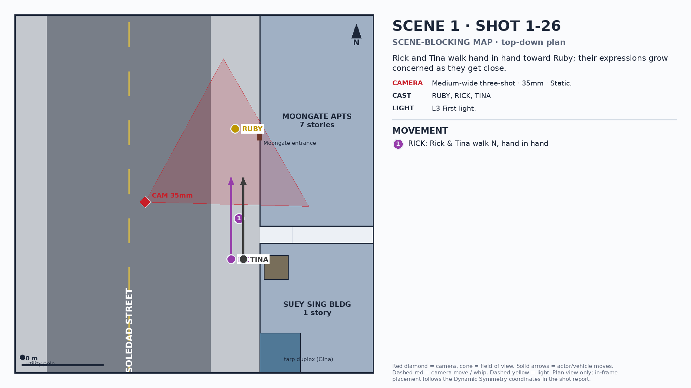

| Slot | Reference | File | Status |
|---|---|---|---|
| 1 | blocking_map | `03_department_outputs/scene_001/blocking_maps/1-26_blocking_map.png` | ready |
| 2 | character · RUBY | `02_bibles/refs/ruby_reference.png` | missing |
| 3 | character · RICK | `02_bibles/refs/rick_reference_sheet.png` | missing |
| 4 | character · TINA | `02_bibles/refs/tina_reference.png` | missing |
| 5 | location · MOONGATE_FRONT | `02_bibles/refs/moongate_front_plate.png` | missing |
| 6 | expression_start · RUBY_nervous_worried | `expr/RUBY_nervous_worried.png` | missing |

```text
Image 1: Top-down scene-blocking map. Follow its positions and movement arrows; do not render the map itself.
Image 2 is RUBY (character).
Image 3 is RICK (character).
Image 4 is TINA (character).
Image 5 is MOONGATE_FRONT (location).
Image 6 is RUBY_nervous_worried (expression start).

A couple walks hand in hand down the sidewalk toward the woman in the robe. As they get close, their easy expressions turn concerned and they slow to a stop in front of her. Stage the action exactly as the blocking map in Image 1 shows: where each person stands, the numbered movement arrows, and the camera position and viewing direction. In frame, the focal point (Ruby) sits at Ruby frame-left at (0.30, 0.55); the couple enters frame-right at (0.90, 0.45) and walks the arc inward, stopping at (0.62, 0.50). Medium-wide three-shot, 35mm lens. Static. Lighting: L3 First light. Cinematic tearjerker tone, emotionally intimate framing, soft natural light favoring dawn or dusk. Foil visible somewhere in frame — crumpled, glinting, or scattered nearby. Environment shows worn signs of habitation — blankets, bags, makeshift bedding — treated with visual dignity, not disorder. Camera lingers rather than cuts quickly, allowing emotional weight to build. Rick says: "What's got you out here lookin' so worried, so early in the morning, Ms. Ruby?" Tina says: "Yeah, you look like you seent a ghost, Ms. Ruby."

Duration 8s. Cinematic 2.39:1 composition, photoreal, no on-screen text, no map graphics in the output.
```

---

## Shot 1-27 · 6s

**Beat:** Ruby exhales a wearied breath: she dreamed Dances overdosed and has been up ever since.

> Ruby exhales a wearied-breath. RUBY: I had a dream that Dances overdosed and I been up ever since.

**Upstream reports:** CRR-001-CAS (flagged_for_human_review), CRR-001-WAR (provisional_pending_upstream), CRR-001-PRO (provisional_pending_upstream), CRR-001-LOC (flagged_for_human_review), CRR-001-BLK (locked), CRR-001-SET (locked), CRR-001-CIN (provisional_pending_upstream), CRR-001-LGT (flagged_for_human_review), CRR-001-IMG (provisional_pending_upstream), CRR-001-VAG (provisional_pending_upstream), CRR-001-EDT (locked)

### Shot Report
- **Blocking / Set:** focal point is *Ruby's eyes as she names the fear* at UL (0.30, 0.66) — Eyes at (0.30, 0.66); open negative space screen-right (where Dances is not). Spiral: none. Emotional key of the scene — the film's heroine is introduced through her grandmother's fear. Weighted empty space frame-right is deliberate.
- **Set design:** Background soft; nothing competes.
- **Camera:** Close-up, 85mm. Low, just below her eye line; imperceptibly slow push-in. The camera lingers.
- **Lighting:** L3 First light: face in soft shade, a thin warm rim on her hair only.
- **Cast / wardrobe:** RUBY (present_day_robe)
- **Props:** RUBY_CIGARETTE
- **Expression anchors:** RUBY_nervous_worried → RUBY_haunted_fear
- **Editing:** The scene's emotional anchor — hold 1s after the line.
- **How it works together:** the camera (85mm) arrives at the blocking's focal point — Ruby's eyes as she names the fear — under L3 First light, so the beat "Ruby exhales a wearied breath: she dreamed Dances overdosed and has been up ever since" lands where the eye already is.
- **Open flags:** F-16

### Prompt pair — **BLOCKED**
Blockers:
- RUBY: no chosen reference image (F-18)
- MOONGATE_FRONT: no chosen location reference (F-18)

**LTX-2.3**

```text
[RUBY] Same character as reference image: 66-year-old Cherokee woman, smooth skin with only faint fine lines at the eyes, high cheekbones, sharp restless dark eyes, thick dark hair with silver strands in a loose braid, wearing a pink robe, barefoot, turquoise ring, turquoise pendant necklace. No facial tattoos, no gray-all-over hair, no gaunt features, no wrinkling. Maintain exact facial structure from reference. Scene: The sidewalk in front of the entrance of the seven-story Moongate Apartments on Soledad Street, the Suey Sing Building to its right. Close on the older woman. She lets out a long, weary breath, the toughness in her face giving way for a moment to exhaustion and fear as she speaks. Composition follows dynamic symmetry principles — subject(s) positioned along a diagonal sightline rather than center-frame, with deliberate negative space. Focal point — Ruby's eyes as she names the fear: Eyes at (0.30, 0.66); open negative space screen-right (where Dances is not). Camera: Close-up, 85mm lens. Low, just below her eye line; imperceptibly slow push-in. The camera lingers. Lighting: L3 First light: face in soft shade, a thin warm rim on her hair only. Props in frame: a lit cigarette. Cinematic tearjerker tone, emotionally intimate framing, soft natural light favoring dawn or dusk. Foil visible somewhere in frame — crumpled, glinting, or scattered nearby. Environment shows worn signs of habitation — blankets, bags, makeshift bedding — treated with visual dignity, not disorder. Camera lingers rather than cuts quickly, allowing emotional weight to build. Ruby says: "I had a dream that Dances overdosed and I been up ever since." Audio: Her exhale. Street sound drops low. Duration 6 seconds. Compose inside a centered 2.39:1 safe area of a 16:9 frame.
```

**Wan 2.2** (first frame `expr/RUBY_nervous_worried.png`, last frame `expr/RUBY_haunted_fear.png`) — 6s > 5s: generate 2 segments, each segment's last frame seeds the next.

```text
[RUBY] Same character as reference image: 66-year-old Cherokee woman, smooth skin with only faint fine lines at the eyes, high cheekbones, sharp restless dark eyes, thick dark hair with silver strands in a loose braid, wearing a pink robe, barefoot, turquoise ring, turquoise pendant necklace. No facial tattoos, no gray-all-over hair, no gaunt features, no wrinkling. Maintain exact facial structure from reference. Scene: Close on the older woman. She lets out a long, weary breath, the toughness in her face giving way for a moment to exhaustion and fear as she speaks. Close-up, 85mm. Low, just below her eye line; imperceptibly slow push-in. The camera lingers. Placement: Eyes at (0.30, 0.66); open negative space screen-right (where Dances is not). L3 First light: face in soft shade, a thin warm rim on her hair only.
```

Negative:

```text
no dead-center framing unless flagged as intentional, no clean or brand-new camping gear; tents show wear and dust, no high-contrast plastic or neon garbage bins, no harsh flat midday daylight, no garbled on-screen text, no facial tattoos, no sunken/gaunt cheekbones, no fully gray or white hair, no heavy wrinkling, forehead lines, or aged skin texture, no hunched or frail posture, no jewelry beyond turquoise ring and pendant, no default smiling, Moongate is the tallest structure on the block
```

**MiniMax Omni** (5/9 references)

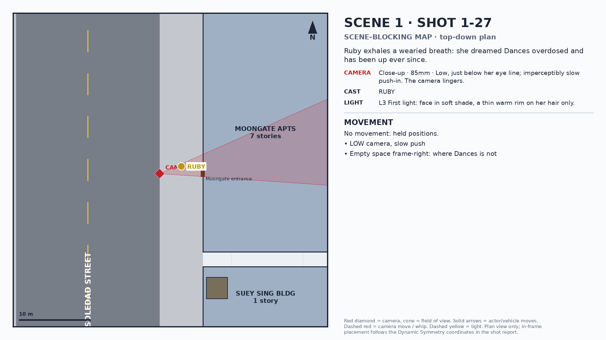

| Slot | Reference | File | Status |
|---|---|---|---|
| 1 | blocking_map | `03_department_outputs/scene_001/blocking_maps/1-27_blocking_map.png` | ready |
| 2 | character · RUBY | `02_bibles/refs/ruby_reference.png` | missing |
| 3 | location · MOONGATE_FRONT | `02_bibles/refs/moongate_front_plate.png` | missing |
| 4 | expression_start · RUBY_nervous_worried | `expr/RUBY_nervous_worried.png` | missing |
| 5 | expression_end · RUBY_haunted_fear | `expr/RUBY_haunted_fear.png` | missing |

```text
Image 1: Top-down scene-blocking map. Follow its positions and movement arrows; do not render the map itself.
Image 2 is RUBY (character).
Image 3 is MOONGATE_FRONT (location).
Image 4 is RUBY_nervous_worried (expression start).
Image 5 is RUBY_haunted_fear (expression end).

Close on the older woman. She lets out a long, weary breath, the toughness in her face giving way for a moment to exhaustion and fear as she speaks. Stage the action exactly as the blocking map in Image 1 shows: where each person stands, the numbered movement arrows, and the camera position and viewing direction. In frame, the focal point (Ruby's eyes as she names the fear) sits at Eyes at (0.30, 0.66); open negative space screen-right (where Dances is not). Close-up, 85mm lens. Low, just below her eye line; imperceptibly slow push-in. The camera lingers. Lighting: L3 First light: face in soft shade, a thin warm rim on her hair only. Cinematic tearjerker tone, emotionally intimate framing, soft natural light favoring dawn or dusk. Foil visible somewhere in frame — crumpled, glinting, or scattered nearby. Environment shows worn signs of habitation — blankets, bags, makeshift bedding — treated with visual dignity, not disorder. Camera lingers rather than cuts quickly, allowing emotional weight to build. Ruby says: "I had a dream that Dances overdosed and I been up ever since."

Duration 6s. Cinematic 2.39:1 composition, photoreal, no on-screen text, no map graphics in the output.
```

---

## Shot 1-28 · 4s

**Beat:** Rick and Tina look guiltily to each other, then back at Ruby.

> Rick and Tina look to guiltily to each other then back at Ruby.

**Upstream reports:** CRR-001-CAS (flagged_for_human_review), CRR-001-WAR (provisional_pending_upstream), CRR-001-PRO (provisional_pending_upstream), CRR-001-LOC (flagged_for_human_review), CRR-001-BLK (locked), CRR-001-SET (locked), CRR-001-CIN (provisional_pending_upstream), CRR-001-LGT (flagged_for_human_review), CRR-001-IMG (provisional_pending_upstream), CRR-001-VAG (provisional_pending_upstream), CRR-001-EDT (locked)

### Shot Report
- **Blocking / Set:** focal point is *The exchanged glance* at golden section x=0.382 and x=0.618 — Rick at (0.38, 0.62), Tina at (0.62, 0.62). Spiral: none. 
- **Camera:** Two-shot, 50mm. Static.
- **Lighting:** L3 First light.
- **Cast / wardrobe:** RICK (present_day), TINA (present_day)
- **Expression anchors:** RICK_concerned → RICK_guilty
- **Editing:** —
- **How it works together:** the camera (50mm) arrives at the blocking's focal point — The exchanged glance — under L3 First light., so the beat "Rick and Tina look guiltily to each other, then back at Ruby" lands where the eye already is.
- **Open flags:** F-09

### Prompt pair — **BLOCKED**
Blockers:
- RICK: sheet supplied but file not committed (F-18)
- RICK: Character Bible is provisional (F-09)
- TINA: no chosen reference image (F-18)
- TINA: Character Bible is provisional (F-09)
- MOONGATE_FRONT: no chosen location reference (F-18)

**LTX-2.3**

```text
[RICK] Same character as reference image: white man with messy tousled brown hair and a full scruffy beard, lean build, weathered face, wearing a worn blue knit sweater, faded light-wash jeans and black slide sandals. Maintain exact facial structure and build from reference. [TINA] 30-year-old white woman, worn street clothes. Scene: The sidewalk in front of the entrance of the seven-story Moongate Apartments on Soledad Street, the Suey Sing Building to its right. The man and woman glance at each other with a flicker of guilt, then look back at the woman in front of them. Composition follows dynamic symmetry principles — subject(s) positioned along a diagonal sightline rather than center-frame, with deliberate negative space. Focal point — The exchanged glance: Rick at (0.38, 0.62), Tina at (0.62, 0.62). Camera: Two-shot, 50mm lens. Static. Lighting: L3 First light. Cinematic tearjerker tone, emotionally intimate framing, soft natural light favoring dawn or dusk. Foil visible somewhere in frame — crumpled, glinting, or scattered nearby. Environment shows worn signs of habitation — blankets, bags, makeshift bedding — treated with visual dignity, not disorder. Camera lingers rather than cuts quickly, allowing emotional weight to build. Duration 4 seconds. Compose inside a centered 2.39:1 safe area of a 16:9 frame.
```

**Wan 2.2** (first frame `expr/RICK_concerned.png`, last frame `expr/RICK_guilty.png`)

```text
[RICK] Same character as reference image: white man with messy tousled brown hair and a full scruffy beard, lean build, weathered face, wearing a worn blue knit sweater, faded light-wash jeans and black slide sandals. Maintain exact facial structure and build from reference. [TINA] 30-year-old white woman, worn street clothes. Scene: The man and woman glance at each other with a flicker of guilt, then look back at the woman in front of them. Two-shot, 50mm. Static. Placement: Rick at (0.38, 0.62), Tina at (0.62, 0.62). L3 First light.
```

Negative:

```text
no dead-center framing unless flagged as intentional, no clean or brand-new camping gear; tents show wear and dust, no high-contrast plastic or neon garbage bins, no harsh flat midday daylight, no garbled on-screen text, Moongate is the tallest structure on the block
```

**MiniMax Omni** (6/9 references)

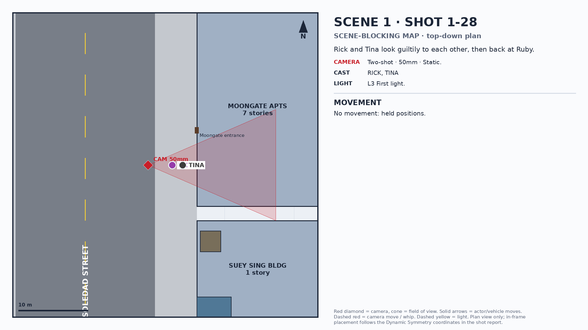

| Slot | Reference | File | Status |
|---|---|---|---|
| 1 | blocking_map | `03_department_outputs/scene_001/blocking_maps/1-28_blocking_map.png` | ready |
| 2 | character · RICK | `02_bibles/refs/rick_reference_sheet.png` | missing |
| 3 | character · TINA | `02_bibles/refs/tina_reference.png` | missing |
| 4 | location · MOONGATE_FRONT | `02_bibles/refs/moongate_front_plate.png` | missing |
| 5 | expression_start · RICK_concerned | `expr/RICK_concerned.png` | missing |
| 6 | expression_end · RICK_guilty | `expr/RICK_guilty.png` | missing |

```text
Image 1: Top-down scene-blocking map. Follow its positions and movement arrows; do not render the map itself.
Image 2 is RICK (character).
Image 3 is TINA (character).
Image 4 is MOONGATE_FRONT (location).
Image 5 is RICK_concerned (expression start).
Image 6 is RICK_guilty (expression end).

The man and woman glance at each other with a flicker of guilt, then look back at the woman in front of them. Stage the action exactly as the blocking map in Image 1 shows: where each person stands, the numbered movement arrows, and the camera position and viewing direction. In frame, the focal point (The exchanged glance) sits at Rick at (0.38, 0.62), Tina at (0.62, 0.62). Two-shot, 50mm lens. Static. Lighting: L3 First light. Cinematic tearjerker tone, emotionally intimate framing, soft natural light favoring dawn or dusk. Foil visible somewhere in frame — crumpled, glinting, or scattered nearby. Environment shows worn signs of habitation — blankets, bags, makeshift bedding — treated with visual dignity, not disorder. Camera lingers rather than cuts quickly, allowing emotional weight to build.

Duration 4s. Cinematic 2.39:1 composition, photoreal, no on-screen text, no map graphics in the output.
```

---

## Shot 1-29 · 4s

**Beat:** Ruby notices; suspicion. 'Either of you seen her?'

> Ruby notices the look and her face fills with suspicion. RUBY: Either of you seen her?

**Upstream reports:** CRR-001-CAS (flagged_for_human_review), CRR-001-WAR (provisional_pending_upstream), CRR-001-PRO (provisional_pending_upstream), CRR-001-LOC (flagged_for_human_review), CRR-001-BLK (locked), CRR-001-SET (locked), CRR-001-CIN (provisional_pending_upstream), CRR-001-LGT (flagged_for_human_review), CRR-001-IMG (provisional_pending_upstream), CRR-001-VAG (provisional_pending_upstream), CRR-001-EDT (locked)

### Shot Report
- **Blocking / Set:** focal point is *Ruby's narrowing eyes* at UL (0.30, 0.66) — Eyes at (0.30, 0.66). Spiral: none. 
- **Camera:** Medium close-up, 85mm. Static.
- **Lighting:** L3 First light.
- **Cast / wardrobe:** RUBY (present_day_robe)
- **Props:** RUBY_CIGARETTE
- **Expression anchors:** RUBY_haunted_fear → RUBY_suspicious
- **Editing:** —
- **How it works together:** the camera (85mm) arrives at the blocking's focal point — Ruby's narrowing eyes — under L3 First light., so the beat "Ruby notices; suspicion" lands where the eye already is.

### Prompt pair — **BLOCKED**
Blockers:
- RUBY: no chosen reference image (F-18)
- MOONGATE_FRONT: no chosen location reference (F-18)

**LTX-2.3**

```text
[RUBY] Same character as reference image: 66-year-old Cherokee woman, smooth skin with only faint fine lines at the eyes, high cheekbones, sharp restless dark eyes, thick dark hair with silver strands in a loose braid, wearing a pink robe, barefoot, turquoise ring, turquoise pendant necklace. No facial tattoos, no gray-all-over hair, no gaunt features, no wrinkling. Maintain exact facial structure from reference. Scene: The sidewalk in front of the entrance of the seven-story Moongate Apartments on Soledad Street, the Suey Sing Building to its right. Her eyes narrow, her whole face hardening with suspicion as she looks from one to the other. Composition follows dynamic symmetry principles — subject(s) positioned along a diagonal sightline rather than center-frame, with deliberate negative space. Focal point — Ruby's narrowing eyes: Eyes at (0.30, 0.66). Camera: Medium close-up, 85mm lens. Static. Lighting: L3 First light. Props in frame: a lit cigarette. Cinematic tearjerker tone, emotionally intimate framing, soft natural light favoring dawn or dusk. Foil visible somewhere in frame — crumpled, glinting, or scattered nearby. Environment shows worn signs of habitation — blankets, bags, makeshift bedding — treated with visual dignity, not disorder. Camera lingers rather than cuts quickly, allowing emotional weight to build. Ruby says: "Either of you seen her?" Duration 4 seconds. Compose inside a centered 2.39:1 safe area of a 16:9 frame.
```

**Wan 2.2** (first frame `expr/RUBY_haunted_fear.png`, last frame `expr/RUBY_suspicious.png`)

```text
[RUBY] Same character as reference image: 66-year-old Cherokee woman, smooth skin with only faint fine lines at the eyes, high cheekbones, sharp restless dark eyes, thick dark hair with silver strands in a loose braid, wearing a pink robe, barefoot, turquoise ring, turquoise pendant necklace. No facial tattoos, no gray-all-over hair, no gaunt features, no wrinkling. Maintain exact facial structure from reference. Scene: Her eyes narrow, her whole face hardening with suspicion as she looks from one to the other. Medium close-up, 85mm. Static. Placement: Eyes at (0.30, 0.66). L3 First light.
```

Negative:

```text
no dead-center framing unless flagged as intentional, no clean or brand-new camping gear; tents show wear and dust, no high-contrast plastic or neon garbage bins, no harsh flat midday daylight, no garbled on-screen text, no facial tattoos, no sunken/gaunt cheekbones, no fully gray or white hair, no heavy wrinkling, forehead lines, or aged skin texture, no hunched or frail posture, no jewelry beyond turquoise ring and pendant, no default smiling, Moongate is the tallest structure on the block
```

**MiniMax Omni** (5/9 references)

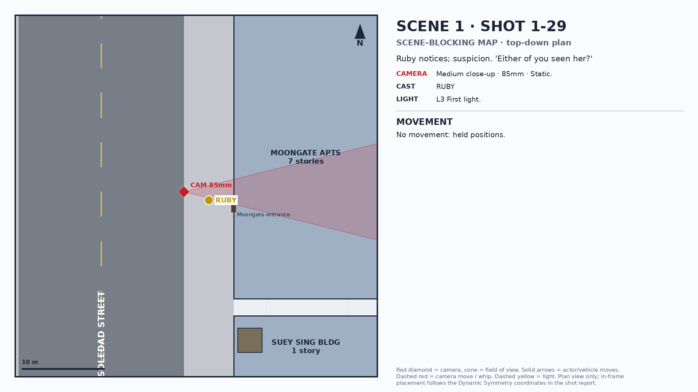

| Slot | Reference | File | Status |
|---|---|---|---|
| 1 | blocking_map | `03_department_outputs/scene_001/blocking_maps/1-29_blocking_map.png` | ready |
| 2 | character · RUBY | `02_bibles/refs/ruby_reference.png` | missing |
| 3 | location · MOONGATE_FRONT | `02_bibles/refs/moongate_front_plate.png` | missing |
| 4 | expression_start · RUBY_haunted_fear | `expr/RUBY_haunted_fear.png` | missing |
| 5 | expression_end · RUBY_suspicious | `expr/RUBY_suspicious.png` | missing |

```text
Image 1: Top-down scene-blocking map. Follow its positions and movement arrows; do not render the map itself.
Image 2 is RUBY (character).
Image 3 is MOONGATE_FRONT (location).
Image 4 is RUBY_haunted_fear (expression start).
Image 5 is RUBY_suspicious (expression end).

Her eyes narrow, her whole face hardening with suspicion as she looks from one to the other. Stage the action exactly as the blocking map in Image 1 shows: where each person stands, the numbered movement arrows, and the camera position and viewing direction. In frame, the focal point (Ruby's narrowing eyes) sits at Eyes at (0.30, 0.66). Medium close-up, 85mm lens. Static. Lighting: L3 First light. Cinematic tearjerker tone, emotionally intimate framing, soft natural light favoring dawn or dusk. Foil visible somewhere in frame — crumpled, glinting, or scattered nearby. Environment shows worn signs of habitation — blankets, bags, makeshift bedding — treated with visual dignity, not disorder. Camera lingers rather than cuts quickly, allowing emotional weight to build. Ruby says: "Either of you seen her?"

Duration 4s. Cinematic 2.39:1 composition, photoreal, no on-screen text, no map graphics in the output.
```

---

## Shot 1-30 · 4s

**Beat:** Rick gives a barely perceptible head shake to Tina. Ruby sees it.

> This time when Rick and Tina look at each other Rick gives a barely perceptible shake of his head. Ruby sees it and makes sour-face.

**Upstream reports:** CRR-001-CAS (flagged_for_human_review), CRR-001-WAR (provisional_pending_upstream), CRR-001-PRO (provisional_pending_upstream), CRR-001-LOC (flagged_for_human_review), CRR-001-BLK (locked), CRR-001-SET (locked), CRR-001-CIN (provisional_pending_upstream), CRR-001-LGT (flagged_for_human_review), CRR-001-IMG (provisional_pending_upstream), CRR-001-VAG (provisional_pending_upstream), CRR-001-EDT (locked)

### Shot Report
- **Blocking / Set:** focal point is *Rick's tiny head shake* at UR (0.70, 0.66) — Ruby's shoulder and braid soft at frame-left x=0–0.25; Rick's face at (0.70, 0.66), Tina at (0.50, 0.62). Spiral: none. The shake must land on a hotspot or the audience misses the beat Ruby catches. OTS puts us in Ruby's position — we catch it with her.
- **Camera:** Over-the-shoulder from behind Ruby, 85mm. Static OTS over Ruby's shoulder, shallow depth of field.
- **Lighting:** L3 First light.
- **Cast / wardrobe:** RUBY (present_day_robe), RICK (present_day), TINA (present_day)
- **Expression anchors:** RICK_guilty → RICK_guilty
- **Editing:** Cut to Ruby's sour face at the head of 1-31.
- **How it works together:** the camera (85mm) arrives at the blocking's focal point — Rick's tiny head shake — under L3 First light., so the beat "Rick gives a barely perceptible head shake to Tina" lands where the eye already is.
- **Open flags:** F-09

### Prompt pair — **BLOCKED**
Blockers:
- RUBY: no chosen reference image (F-18)
- RICK: sheet supplied but file not committed (F-18)
- RICK: Character Bible is provisional (F-09)
- TINA: no chosen reference image (F-18)
- TINA: Character Bible is provisional (F-09)
- MOONGATE_FRONT: no chosen location reference (F-18)

**LTX-2.3**

```text
[RUBY] Same character as reference image: 66-year-old Cherokee woman, smooth skin with only faint fine lines at the eyes, high cheekbones, sharp restless dark eyes, thick dark hair with silver strands in a loose braid, wearing a pink robe, barefoot, turquoise ring, turquoise pendant necklace. No facial tattoos, no gray-all-over hair, no gaunt features, no wrinkling. Maintain exact facial structure from reference. [RICK] Same character as reference image: white man with messy tousled brown hair and a full scruffy beard, lean build, weathered face, wearing a worn blue knit sweater, faded light-wash jeans and black slide sandals. Maintain exact facial structure and build from reference. [TINA] 30-year-old white woman, worn street clothes. Scene: The sidewalk in front of the entrance of the seven-story Moongate Apartments on Soledad Street, the Suey Sing Building to its right. Over the older woman's shoulder: the couple exchange another look, and the man gives a tiny, barely perceptible shake of his head. Composition follows dynamic symmetry principles — subject(s) positioned along a diagonal sightline rather than center-frame, with deliberate negative space. Focal point — Rick's tiny head shake: Ruby's shoulder and braid soft at frame-left x=0–0.25; Rick's face at (0.70, 0.66), Tina at (0.50, 0.62). Camera: Over-the-shoulder from behind Ruby, 85mm lens. Static OTS over Ruby's shoulder, shallow depth of field. Lighting: L3 First light. Cinematic tearjerker tone, emotionally intimate framing, soft natural light favoring dawn or dusk. Foil visible somewhere in frame — crumpled, glinting, or scattered nearby. Environment shows worn signs of habitation — blankets, bags, makeshift bedding — treated with visual dignity, not disorder. Camera lingers rather than cuts quickly, allowing emotional weight to build. Duration 4 seconds. Compose inside a centered 2.39:1 safe area of a 16:9 frame.
```

**Wan 2.2** (first frame `expr/RICK_guilty.png`, last frame `expr/RICK_guilty.png`)

```text
[RUBY] Same character as reference image: 66-year-old Cherokee woman, smooth skin with only faint fine lines at the eyes, high cheekbones, sharp restless dark eyes, thick dark hair with silver strands in a loose braid, wearing a pink robe, barefoot, turquoise ring, turquoise pendant necklace. No facial tattoos, no gray-all-over hair, no gaunt features, no wrinkling. Maintain exact facial structure from reference. [RICK] Same character as reference image: white man with messy tousled brown hair and a full scruffy beard, lean build, weathered face, wearing a worn blue knit sweater, faded light-wash jeans and black slide sandals. Maintain exact facial structure and build from reference. [TINA] 30-year-old white woman, worn street clothes. Scene: Over the older woman's shoulder: the couple exchange another look, and the man gives a tiny, barely perceptible shake of his head. Over-the-shoulder from behind Ruby, 85mm. Static OTS over Ruby's shoulder, shallow depth of field. Placement: Ruby's shoulder and braid soft at frame-left x=0–0.25; Rick's face at (0.70, 0.66), Tina at (0.50, 0.62). L3 First light.
```

Negative:

```text
no dead-center framing unless flagged as intentional, no clean or brand-new camping gear; tents show wear and dust, no high-contrast plastic or neon garbage bins, no harsh flat midday daylight, no garbled on-screen text, no facial tattoos, no sunken/gaunt cheekbones, no fully gray or white hair, no heavy wrinkling, forehead lines, or aged skin texture, no hunched or frail posture, no jewelry beyond turquoise ring and pendant, no default smiling, Moongate is the tallest structure on the block
```

**MiniMax Omni** (6/9 references)

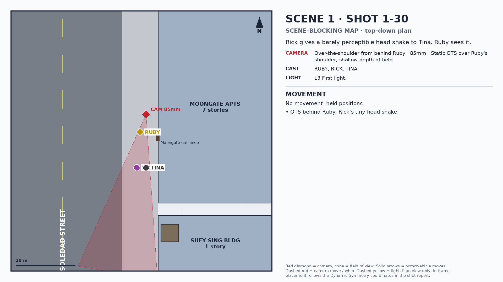

| Slot | Reference | File | Status |
|---|---|---|---|
| 1 | blocking_map | `03_department_outputs/scene_001/blocking_maps/1-30_blocking_map.png` | ready |
| 2 | character · RUBY | `02_bibles/refs/ruby_reference.png` | missing |
| 3 | character · RICK | `02_bibles/refs/rick_reference_sheet.png` | missing |
| 4 | character · TINA | `02_bibles/refs/tina_reference.png` | missing |
| 5 | location · MOONGATE_FRONT | `02_bibles/refs/moongate_front_plate.png` | missing |
| 6 | expression_start · RICK_guilty | `expr/RICK_guilty.png` | missing |

```text
Image 1: Top-down scene-blocking map. Follow its positions and movement arrows; do not render the map itself.
Image 2 is RUBY (character).
Image 3 is RICK (character).
Image 4 is TINA (character).
Image 5 is MOONGATE_FRONT (location).
Image 6 is RICK_guilty (expression start).

Over the older woman's shoulder: the couple exchange another look, and the man gives a tiny, barely perceptible shake of his head. Stage the action exactly as the blocking map in Image 1 shows: where each person stands, the numbered movement arrows, and the camera position and viewing direction. In frame, the focal point (Rick's tiny head shake) sits at Ruby's shoulder and braid soft at frame-left x=0–0.25; Rick's face at (0.70, 0.66), Tina at (0.50, 0.62). Over-the-shoulder from behind Ruby, 85mm lens. Static OTS over Ruby's shoulder, shallow depth of field. Lighting: L3 First light. Cinematic tearjerker tone, emotionally intimate framing, soft natural light favoring dawn or dusk. Foil visible somewhere in frame — crumpled, glinting, or scattered nearby. Environment shows worn signs of habitation — blankets, bags, makeshift bedding — treated with visual dignity, not disorder. Camera lingers rather than cuts quickly, allowing emotional weight to build.

Duration 4s. Cinematic 2.39:1 composition, photoreal, no on-screen text, no map graphics in the output.
```

---

## Shot 1-31 · 8s

**Beat:** Ruby's sour face; she threatens them with the coffee mug. They start moving at 'get'; she curses at their backs.

> RUBY: You two get the fuck away from me before I bop you both upside the head with this coffee mug! Rick and Tina start moving at the word 'get', and Ruby curses them to their backs.

**Upstream reports:** CRR-001-CAS (flagged_for_human_review), CRR-001-WAR (provisional_pending_upstream), CRR-001-PRO (provisional_pending_upstream), CRR-001-LOC (flagged_for_human_review), CRR-001-BLK (locked), CRR-001-SET (locked), CRR-001-CIN (provisional_pending_upstream), CRR-001-LGT (flagged_for_human_review), CRR-001-IMG (provisional_pending_upstream), CRR-001-VAG (provisional_pending_upstream), CRR-001-EDT (locked)

### Shot Report
- **Blocking / Set:** focal point is *Ruby raising the mug* at UL (0.30, 0.66) — Ruby at (0.30, 0.55), mug raised to (0.35, 0.75); couple retreats from (0.62, 0.50) out of frame-right. Spiral: Reverse of 1-26 path — they leave along the arc they came in on. 
- **Camera:** Medium-wide, 35mm. Static; the couple exits frame-right.
- **Lighting:** L3 First light.
- **Cast / wardrobe:** RUBY (present_day_robe), RICK (present_day), TINA (present_day)
- **Props:** RUBY_COFFEE_MUG, RUBY_CIGARETTE
- **Expression anchors:** RUBY_sour_face → RUBY_sour_face
- **Editing:** Her cursing is cut off by the next beat (1-32).
- **How it works together:** the camera (35mm) arrives at the blocking's focal point — Ruby raising the mug — under L3 First light., so the beat "Ruby's sour face; she threatens them with the coffee mug" lands where the eye already is.
- **Open flags:** F-06, F-16

### Prompt pair — **BLOCKED**
Blockers:
- RUBY: no chosen reference image (F-18)
- RICK: sheet supplied but file not committed (F-18)
- RICK: Character Bible is provisional (F-09)
- TINA: no chosen reference image (F-18)
- TINA: Character Bible is provisional (F-09)
- MOONGATE_FRONT: no chosen location reference (F-18)

**LTX-2.3**

```text
[RUBY] Same character as reference image: 66-year-old Cherokee woman, smooth skin with only faint fine lines at the eyes, high cheekbones, sharp restless dark eyes, thick dark hair with silver strands in a loose braid, wearing a pink robe, barefoot, turquoise ring, turquoise pendant necklace. No facial tattoos, no gray-all-over hair, no gaunt features, no wrinkling. Maintain exact facial structure from reference. [RICK] Same character as reference image: white man with messy tousled brown hair and a full scruffy beard, lean build, weathered face, wearing a worn blue knit sweater, faded light-wash jeans and black slide sandals. Maintain exact facial structure and build from reference. [TINA] 30-year-old white woman, worn street clothes. Scene: The sidewalk in front of the entrance of the seven-story Moongate Apartments on Soledad Street, the Suey Sing Building to its right. Her face sours. She raises her coffee mug threateningly and snaps at the couple, who scramble away down the sidewalk at once. She keeps yelling after their retreating backs. Composition follows dynamic symmetry principles — subject(s) positioned along a diagonal sightline rather than center-frame, with deliberate negative space. Focal point — Ruby raising the mug: Ruby at (0.30, 0.55), mug raised to (0.35, 0.75); couple retreats from (0.62, 0.50) out of frame-right. Camera: Medium-wide, 35mm lens. Static; the couple exits frame-right. Lighting: L3 First light. Props in frame: a ceramic coffee mug; a lit cigarette. Cinematic tearjerker tone, emotionally intimate framing, soft natural light favoring dawn or dusk. Foil visible somewhere in frame — crumpled, glinting, or scattered nearby. Environment shows worn signs of habitation — blankets, bags, makeshift bedding — treated with visual dignity, not disorder. Camera lingers rather than cuts quickly, allowing emotional weight to build. Ruby says: "You two get the fuck away from me before I bop you both upside the head with this coffee mug!" Ruby says: "You ole bitch-made son of a bitches, I'ma blow up the goddamn— soon as I find out where the fuck it's at—" Duration 8 seconds. Compose inside a centered 2.39:1 safe area of a 16:9 frame.
```

**Wan 2.2** (first frame `expr/RUBY_sour_face.png`, last frame `expr/RUBY_sour_face.png`) — 8s > 5s: generate 2 segments, each segment's last frame seeds the next.

```text
[RUBY] Same character as reference image: 66-year-old Cherokee woman, smooth skin with only faint fine lines at the eyes, high cheekbones, sharp restless dark eyes, thick dark hair with silver strands in a loose braid, wearing a pink robe, barefoot, turquoise ring, turquoise pendant necklace. No facial tattoos, no gray-all-over hair, no gaunt features, no wrinkling. Maintain exact facial structure from reference. [RICK] Same character as reference image: white man with messy tousled brown hair and a full scruffy beard, lean build, weathered face, wearing a worn blue knit sweater, faded light-wash jeans and black slide sandals. Maintain exact facial structure and build from reference. [TINA] 30-year-old white woman, worn street clothes. Scene: Her face sours. She raises her coffee mug threateningly and snaps at the couple, who scramble away down the sidewalk at once. She keeps yelling after their retreating backs. Medium-wide, 35mm. Static; the couple exits frame-right. Placement: Ruby at (0.30, 0.55), mug raised to (0.35, 0.75); couple retreats from (0.62, 0.50) out of frame-right. L3 First light.
```

Negative:

```text
no dead-center framing unless flagged as intentional, no clean or brand-new camping gear; tents show wear and dust, no high-contrast plastic or neon garbage bins, no harsh flat midday daylight, no garbled on-screen text, no facial tattoos, no sunken/gaunt cheekbones, no fully gray or white hair, no heavy wrinkling, forehead lines, or aged skin texture, no hunched or frail posture, no jewelry beyond turquoise ring and pendant, no default smiling, Moongate is the tallest structure on the block
```

**MiniMax Omni** (6/9 references)

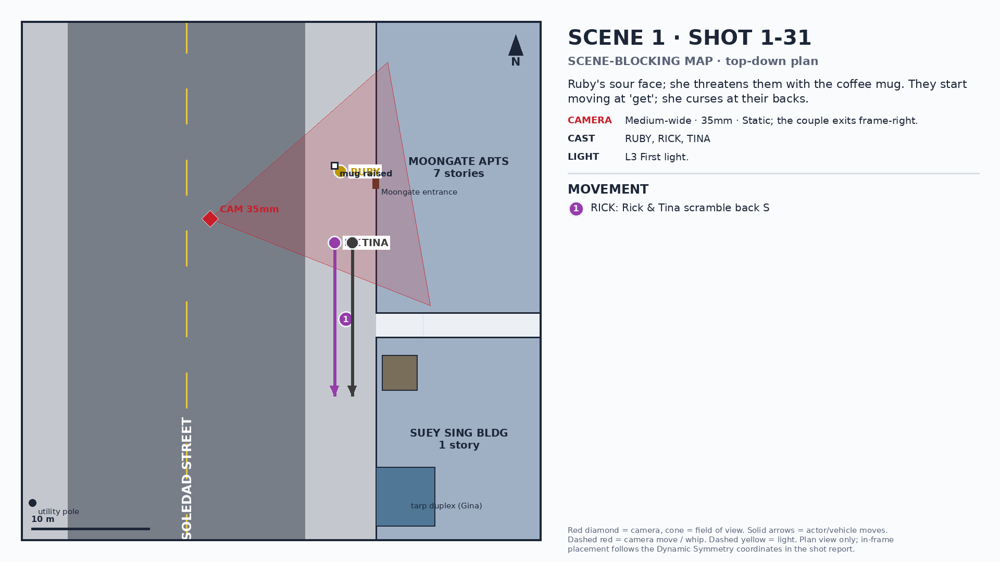

| Slot | Reference | File | Status |
|---|---|---|---|
| 1 | blocking_map | `03_department_outputs/scene_001/blocking_maps/1-31_blocking_map.png` | ready |
| 2 | character · RUBY | `02_bibles/refs/ruby_reference.png` | missing |
| 3 | character · RICK | `02_bibles/refs/rick_reference_sheet.png` | missing |
| 4 | character · TINA | `02_bibles/refs/tina_reference.png` | missing |
| 5 | location · MOONGATE_FRONT | `02_bibles/refs/moongate_front_plate.png` | missing |
| 6 | expression_start · RUBY_sour_face | `expr/RUBY_sour_face.png` | missing |

```text
Image 1: Top-down scene-blocking map. Follow its positions and movement arrows; do not render the map itself.
Image 2 is RUBY (character).
Image 3 is RICK (character).
Image 4 is TINA (character).
Image 5 is MOONGATE_FRONT (location).
Image 6 is RUBY_sour_face (expression start).

Her face sours. She raises her coffee mug threateningly and snaps at the couple, who scramble away down the sidewalk at once. She keeps yelling after their retreating backs. Stage the action exactly as the blocking map in Image 1 shows: where each person stands, the numbered movement arrows, and the camera position and viewing direction. In frame, the focal point (Ruby raising the mug) sits at Ruby at (0.30, 0.55), mug raised to (0.35, 0.75); couple retreats from (0.62, 0.50) out of frame-right. Medium-wide, 35mm lens. Static; the couple exits frame-right. Lighting: L3 First light. Cinematic tearjerker tone, emotionally intimate framing, soft natural light favoring dawn or dusk. Foil visible somewhere in frame — crumpled, glinting, or scattered nearby. Environment shows worn signs of habitation — blankets, bags, makeshift bedding — treated with visual dignity, not disorder. Camera lingers rather than cuts quickly, allowing emotional weight to build. Ruby says: "You two get the fuck away from me before I bop you both upside the head with this coffee mug!" Ruby says: "You ole bitch-made son of a bitches, I'ma blow up the goddamn— soon as I find out where the fuck it's at—"

Duration 8s. Cinematic 2.39:1 composition, photoreal, no on-screen text, no map graphics in the output.
```

---

## Shot 1-32 · 4s

**Beat:** OTS from Ruby's POV: a vehicle turns onto the block.

> An OTS from Ruby's POV shows a vehicle turn onto the block…

**Upstream reports:** CRR-001-CAS (flagged_for_human_review), CRR-001-WAR (provisional_pending_upstream), CRR-001-PRO (provisional_pending_upstream), CRR-001-LOC (flagged_for_human_review), CRR-001-BLK (locked), CRR-001-SET (locked), CRR-001-CIN (provisional_pending_upstream), CRR-001-LGT (flagged_for_human_review), CRR-001-IMG (provisional_pending_upstream), CRR-001-VAG (provisional_pending_upstream), CRR-001-EDT (locked)

### Shot Report
- **Blocking / Set:** focal point is *The car turning in* at UR (0.70, 0.66) entering — Ruby's shoulder frame-left x=0–0.25; car turns in at (0.80, 0.60) and travels the inner arc toward camera. Spiral: Inner arc, top-right orientation (vehicle entering). 
- **Camera:** Over-the-shoulder, Ruby, 50mm. Static OTS.
- **Lighting:** L3 First light: the car turns in out of the sun, windshield flaring warm.
- **Cast / wardrobe:** RUBY (present_day_robe)
- **Props:** SEASONS_CAR
- **Editing:** —
- **How it works together:** the camera (50mm) arrives at the blocking's focal point — The car turning in — under L3 First light, so the beat "OTS from Ruby's POV: a vehicle turns onto the block" lands where the eye already is.
- **Open flags:** F-13

### Prompt pair — **BLOCKED**
Blockers:
- RUBY: no chosen reference image (F-18)
- MOONGATE_FRONT: no chosen location reference (F-18)

**LTX-2.3**

```text
[RUBY] Same character as reference image: 66-year-old Cherokee woman, smooth skin with only faint fine lines at the eyes, high cheekbones, sharp restless dark eyes, thick dark hair with silver strands in a loose braid, wearing a pink robe, barefoot, turquoise ring, turquoise pendant necklace. No facial tattoos, no gray-all-over hair, no gaunt features, no wrinkling. Maintain exact facial structure from reference. Scene: The sidewalk in front of the entrance of the seven-story Moongate Apartments on Soledad Street, the Suey Sing Building to its right. Over the woman's shoulder, a car turns onto the far end of the block, its windshield flaring gold with the low morning sun. Composition follows dynamic symmetry principles — subject(s) positioned along a diagonal sightline rather than center-frame, with deliberate negative space. Focal point — The car turning in: Ruby's shoulder frame-left x=0–0.25; car turns in at (0.80, 0.60) and travels the inner arc toward camera. Camera: Over-the-shoulder, Ruby, 50mm lens. Static OTS. Lighting: L3 First light: the car turns in out of the sun, windshield flaring warm. Props in frame: an ordinary, well-kept sedan. Cinematic tearjerker tone, emotionally intimate framing, soft natural light favoring dawn or dusk. Foil visible somewhere in frame — crumpled, glinting, or scattered nearby. Environment shows worn signs of habitation — blankets, bags, makeshift bedding — treated with visual dignity, not disorder. Camera lingers rather than cuts quickly, allowing emotional weight to build. Audio: Car turning in. Duration 4 seconds. Compose inside a centered 2.39:1 safe area of a 16:9 frame.
```

**Wan 2.2** (first frame `None`, last frame `None`)

```text
[RUBY] Same character as reference image: 66-year-old Cherokee woman, smooth skin with only faint fine lines at the eyes, high cheekbones, sharp restless dark eyes, thick dark hair with silver strands in a loose braid, wearing a pink robe, barefoot, turquoise ring, turquoise pendant necklace. No facial tattoos, no gray-all-over hair, no gaunt features, no wrinkling. Maintain exact facial structure from reference. Scene: Over the woman's shoulder, a car turns onto the far end of the block, its windshield flaring gold with the low morning sun. Over-the-shoulder, Ruby, 50mm. Static OTS. Placement: Ruby's shoulder frame-left x=0–0.25; car turns in at (0.80, 0.60) and travels the inner arc toward camera. L3 First light: the car turns in out of the sun, windshield flaring warm.
```

Negative:

```text
no dead-center framing unless flagged as intentional, no clean or brand-new camping gear; tents show wear and dust, no high-contrast plastic or neon garbage bins, no harsh flat midday daylight, no garbled on-screen text, no facial tattoos, no sunken/gaunt cheekbones, no fully gray or white hair, no heavy wrinkling, forehead lines, or aged skin texture, no hunched or frail posture, no jewelry beyond turquoise ring and pendant, no default smiling, Moongate is the tallest structure on the block
```

**MiniMax Omni** (4/9 references)

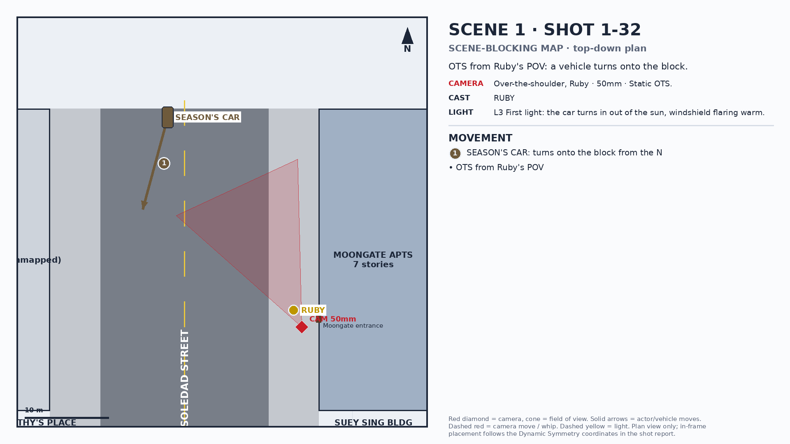

| Slot | Reference | File | Status |
|---|---|---|---|
| 1 | blocking_map | `03_department_outputs/scene_001/blocking_maps/1-32_blocking_map.png` | ready |
| 2 | character · RUBY | `02_bibles/refs/ruby_reference.png` | missing |
| 3 | location · MOONGATE_FRONT | `02_bibles/refs/moongate_front_plate.png` | missing |
| 4 | prop · SEASONS_CAR | `02_bibles/refs/seasons_car.png` | missing |

```text
Image 1: Top-down scene-blocking map. Follow its positions and movement arrows; do not render the map itself.
Image 2 is RUBY (character).
Image 3 is MOONGATE_FRONT (location).
Image 4 is SEASONS_CAR (prop).

Over the woman's shoulder, a car turns onto the far end of the block, its windshield flaring gold with the low morning sun. Stage the action exactly as the blocking map in Image 1 shows: where each person stands, the numbered movement arrows, and the camera position and viewing direction. In frame, the focal point (The car turning in) sits at Ruby's shoulder frame-left x=0–0.25; car turns in at (0.80, 0.60) and travels the inner arc toward camera. Over-the-shoulder, Ruby, 50mm lens. Static OTS. Lighting: L3 First light: the car turns in out of the sun, windshield flaring warm. Cinematic tearjerker tone, emotionally intimate framing, soft natural light favoring dawn or dusk. Foil visible somewhere in frame — crumpled, glinting, or scattered nearby. Environment shows worn signs of habitation — blankets, bags, makeshift bedding — treated with visual dignity, not disorder. Camera lingers rather than cuts quickly, allowing emotional weight to build.

Duration 4s. Cinematic 2.39:1 composition, photoreal, no on-screen text, no map graphics in the output.
```

---

## Shot 1-33 · 5s

**Beat:** Close-up: Ruby's face twists up in annoyance.

> …a close-up of Ruby's face shows it twist-up in annoyance. RUBY: Fuck my life, here this holier-than-thou-ass bitch come with her Jesus bullshit!

**Upstream reports:** CRR-001-CAS (flagged_for_human_review), CRR-001-WAR (provisional_pending_upstream), CRR-001-PRO (provisional_pending_upstream), CRR-001-LOC (flagged_for_human_review), CRR-001-BLK (locked), CRR-001-SET (locked), CRR-001-CIN (provisional_pending_upstream), CRR-001-LGT (flagged_for_human_review), CRR-001-IMG (provisional_pending_upstream), CRR-001-VAG (provisional_pending_upstream), CRR-001-EDT (locked)

### Shot Report
- **Blocking / Set:** focal point is *Ruby's twisting expression* at UL (0.30, 0.66) — Face at (0.30, 0.66). Spiral: none. 
- **Camera:** Close-up, 85mm. Static.
- **Lighting:** L3 First light, Ruby in shade.
- **Cast / wardrobe:** RUBY (present_day_robe)
- **Props:** RUBY_CIGARETTE
- **Expression anchors:** RUBY_sour_face → RUBY_annoyed
- **Editing:** —
- **How it works together:** the camera (85mm) arrives at the blocking's focal point — Ruby's twisting expression — under L3 First light, Ruby in shade., so the beat "Close-up: Ruby's face twists up in annoyance" lands where the eye already is.
- **Open flags:** F-16

### Prompt pair — **BLOCKED**
Blockers:
- RUBY: no chosen reference image (F-18)
- MOONGATE_FRONT: no chosen location reference (F-18)

**LTX-2.3**

```text
[RUBY] Same character as reference image: 66-year-old Cherokee woman, smooth skin with only faint fine lines at the eyes, high cheekbones, sharp restless dark eyes, thick dark hair with silver strands in a loose braid, wearing a pink robe, barefoot, turquoise ring, turquoise pendant necklace. No facial tattoos, no gray-all-over hair, no gaunt features, no wrinkling. Maintain exact facial structure from reference. Scene: The sidewalk in front of the entrance of the seven-story Moongate Apartments on Soledad Street, the Suey Sing Building to its right. Close on her face as recognition hits and it twists up in pure annoyance. Composition follows dynamic symmetry principles — subject(s) positioned along a diagonal sightline rather than center-frame, with deliberate negative space. Focal point — Ruby's twisting expression: Face at (0.30, 0.66). Camera: Close-up, 85mm lens. Static. Lighting: L3 First light, Ruby in shade. Props in frame: a lit cigarette. Cinematic tearjerker tone, emotionally intimate framing, soft natural light favoring dawn or dusk. Foil visible somewhere in frame — crumpled, glinting, or scattered nearby. Environment shows worn signs of habitation — blankets, bags, makeshift bedding — treated with visual dignity, not disorder. Camera lingers rather than cuts quickly, allowing emotional weight to build. Ruby says: "Fuck my life, here this holier-than-thou-ass bitch come with her Jesus bullshit!" Duration 5 seconds. Compose inside a centered 2.39:1 safe area of a 16:9 frame.
```

**Wan 2.2** (first frame `expr/RUBY_sour_face.png`, last frame `expr/RUBY_annoyed.png`)

```text
[RUBY] Same character as reference image: 66-year-old Cherokee woman, smooth skin with only faint fine lines at the eyes, high cheekbones, sharp restless dark eyes, thick dark hair with silver strands in a loose braid, wearing a pink robe, barefoot, turquoise ring, turquoise pendant necklace. No facial tattoos, no gray-all-over hair, no gaunt features, no wrinkling. Maintain exact facial structure from reference. Scene: Close on her face as recognition hits and it twists up in pure annoyance. Close-up, 85mm. Static. Placement: Face at (0.30, 0.66). L3 First light, Ruby in shade.
```

Negative:

```text
no dead-center framing unless flagged as intentional, no clean or brand-new camping gear; tents show wear and dust, no high-contrast plastic or neon garbage bins, no harsh flat midday daylight, no garbled on-screen text, no facial tattoos, no sunken/gaunt cheekbones, no fully gray or white hair, no heavy wrinkling, forehead lines, or aged skin texture, no hunched or frail posture, no jewelry beyond turquoise ring and pendant, no default smiling, Moongate is the tallest structure on the block
```

**MiniMax Omni** (5/9 references)

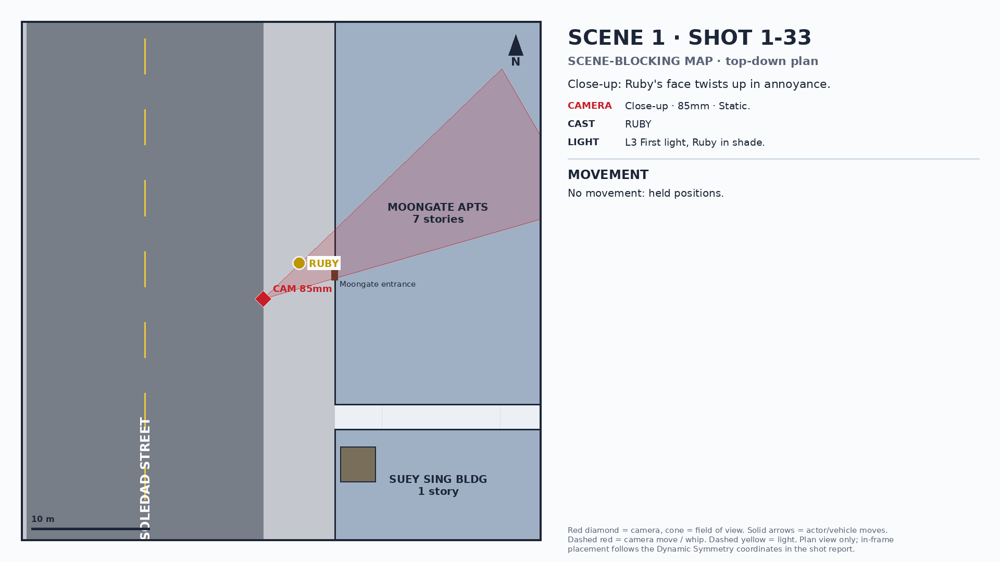

| Slot | Reference | File | Status |
|---|---|---|---|
| 1 | blocking_map | `03_department_outputs/scene_001/blocking_maps/1-33_blocking_map.png` | ready |
| 2 | character · RUBY | `02_bibles/refs/ruby_reference.png` | missing |
| 3 | location · MOONGATE_FRONT | `02_bibles/refs/moongate_front_plate.png` | missing |
| 4 | expression_start · RUBY_sour_face | `expr/RUBY_sour_face.png` | missing |
| 5 | expression_end · RUBY_annoyed | `expr/RUBY_annoyed.png` | missing |

```text
Image 1: Top-down scene-blocking map. Follow its positions and movement arrows; do not render the map itself.
Image 2 is RUBY (character).
Image 3 is MOONGATE_FRONT (location).
Image 4 is RUBY_sour_face (expression start).
Image 5 is RUBY_annoyed (expression end).

Close on her face as recognition hits and it twists up in pure annoyance. Stage the action exactly as the blocking map in Image 1 shows: where each person stands, the numbered movement arrows, and the camera position and viewing direction. In frame, the focal point (Ruby's twisting expression) sits at Face at (0.30, 0.66). Close-up, 85mm lens. Static. Lighting: L3 First light, Ruby in shade. Cinematic tearjerker tone, emotionally intimate framing, soft natural light favoring dawn or dusk. Foil visible somewhere in frame — crumpled, glinting, or scattered nearby. Environment shows worn signs of habitation — blankets, bags, makeshift bedding — treated with visual dignity, not disorder. Camera lingers rather than cuts quickly, allowing emotional weight to build. Ruby says: "Fuck my life, here this holier-than-thou-ass bitch come with her Jesus bullshit!"

Duration 5s. Cinematic 2.39:1 composition, photoreal, no on-screen text, no map graphics in the output.
```

---

## Shot 1-34 · 4s

**Beat:** Front-facing medium through the windshield: Season with a big goofy smile.

> As the cars draws closer a front-facing medium-shot through windshield catches RUBY'S daughter SEASON STEEVES 44… with a big, goofy smile on her face.

**Upstream reports:** CRR-001-CAS (flagged_for_human_review), CRR-001-WAR (provisional_pending_upstream), CRR-001-PRO (provisional_pending_upstream), CRR-001-LOC (flagged_for_human_review), CRR-001-BLK (locked), CRR-001-SET (locked), CRR-001-CIN (provisional_pending_upstream), CRR-001-LGT (flagged_for_human_review), CRR-001-IMG (provisional_pending_upstream), CRR-001-VAG (provisional_pending_upstream), CRR-001-EDT (locked)

### Shot Report
- **Blocking / Set:** focal point is *Season's grin* at UL (0.30, 0.66) — Face at (0.30, 0.66) (left-hand-drive driver seat). Spiral: none. 
- **Set design:** Windshield reflections of the street slide across the glass without covering her face.
- **Camera:** Medium through windshield, 50mm. Vehicle-mounted front, facing driver; car moving slowly.
- **Lighting:** L3 First light: Season is fully sunlit, warm and bright — the warmest face in the scene.
- **Cast / wardrobe:** SEASON (present_day)
- **Props:** SEASONS_CAR
- **Expression anchors:** SEASON_giddy_goofy_smile → SEASON_giddy_goofy_smile
- **Editing:** —
- **How it works together:** the camera (50mm) arrives at the blocking's focal point — Season's grin — under L3 First light, so the beat "Front-facing medium through the windshield: Season with a big goofy smile" lands where the eye already is.
- **Open flags:** F-07

### Prompt pair — **BLOCKED**
Blockers:
- SEASON: no chosen reference image (F-18)
- MOONGATE_FRONT: no chosen location reference (F-18)

**LTX-2.3**

```text
[SEASON] Same character as reference image: 44-year-old woman, half Cherokee and half Black, tall, overweight build, thick hair in a braid, black eyes, wears glasses, dimples visible when smiling, cross necklace, pigeon-toed stance, serious devout demeanor. Wearing a waitress work uniform. Maintain exact facial structure and build from reference. Scene: The sidewalk in front of the entrance of the seven-story Moongate Apartments on Soledad Street, the Suey Sing Building to its right. Through the windshield of a slowly moving car, a woman in glasses drives with a big, goofy, delighted smile, dimples showing, warm morning sun full on her face. Composition follows dynamic symmetry principles — subject(s) positioned along a diagonal sightline rather than center-frame, with deliberate negative space. Focal point — Season's grin: Face at (0.30, 0.66) (left-hand-drive driver seat). Camera: Medium through windshield, 50mm lens. Vehicle-mounted front, facing driver; car moving slowly. Lighting: L3 First light: Season is fully sunlit, warm and bright — the warmest face in the scene. Props in frame: an ordinary, well-kept sedan. Cinematic tearjerker tone, emotionally intimate framing, soft natural light favoring dawn or dusk. Foil visible somewhere in frame — crumpled, glinting, or scattered nearby. Environment shows worn signs of habitation — blankets, bags, makeshift bedding — treated with visual dignity, not disorder. Camera lingers rather than cuts quickly, allowing emotional weight to build. Audio: Muffled gospel radio inside the car. Duration 4 seconds. Compose inside a centered 2.39:1 safe area of a 16:9 frame.
```

**Wan 2.2** (first frame `expr/SEASON_giddy_goofy_smile.png`, last frame `expr/SEASON_giddy_goofy_smile.png`)

```text
[SEASON] Same character as reference image: 44-year-old woman, half Cherokee and half Black, tall, overweight build, thick hair in a braid, black eyes, wears glasses, dimples visible when smiling, cross necklace, pigeon-toed stance, serious devout demeanor. Wearing a waitress work uniform. Maintain exact facial structure and build from reference. Scene: Through the windshield of a slowly moving car, a woman in glasses drives with a big, goofy, delighted smile, dimples showing, warm morning sun full on her face. Medium through windshield, 50mm. Vehicle-mounted front, facing driver; car moving slowly. Placement: Face at (0.30, 0.66) (left-hand-drive driver seat). L3 First light: Season is fully sunlit, warm and bright — the warmest face in the scene.
```

Negative:

```text
no dead-center framing unless flagged as intentional, no clean or brand-new camping gear; tents show wear and dust, no high-contrast plastic or neon garbage bins, no harsh flat midday daylight, no garbled on-screen text, no short hair, no slender/thin build, no missing glasses, no missing cross necklace, no flat/dimple-less smile, no flashback wardrobe (yellow shorts/blouse), no eye color other than black, Moongate is the tallest structure on the block
```

**MiniMax Omni** (5/9 references)

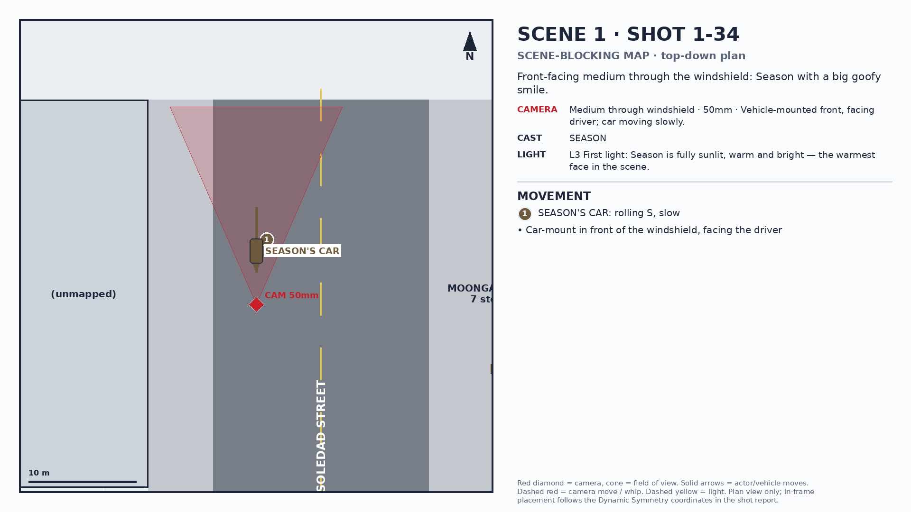

| Slot | Reference | File | Status |
|---|---|---|---|
| 1 | blocking_map | `03_department_outputs/scene_001/blocking_maps/1-34_blocking_map.png` | ready |
| 2 | character · SEASON | `02_bibles/refs/season_reference.png` | missing |
| 3 | location · MOONGATE_FRONT | `02_bibles/refs/moongate_front_plate.png` | missing |
| 4 | expression_start · SEASON_giddy_goofy_smile | `expr/SEASON_giddy_goofy_smile.png` | missing |
| 5 | prop · SEASONS_CAR | `02_bibles/refs/seasons_car.png` | missing |

```text
Image 1: Top-down scene-blocking map. Follow its positions and movement arrows; do not render the map itself.
Image 2 is SEASON (character).
Image 3 is MOONGATE_FRONT (location).
Image 4 is SEASON_giddy_goofy_smile (expression start).
Image 5 is SEASONS_CAR (prop).

Through the windshield of a slowly moving car, a woman in glasses drives with a big, goofy, delighted smile, dimples showing, warm morning sun full on her face. Stage the action exactly as the blocking map in Image 1 shows: where each person stands, the numbered movement arrows, and the camera position and viewing direction. In frame, the focal point (Season's grin) sits at Face at (0.30, 0.66) (left-hand-drive driver seat). Medium through windshield, 50mm lens. Vehicle-mounted front, facing driver; car moving slowly. Lighting: L3 First light: Season is fully sunlit, warm and bright — the warmest face in the scene. Cinematic tearjerker tone, emotionally intimate framing, soft natural light favoring dawn or dusk. Foil visible somewhere in frame — crumpled, glinting, or scattered nearby. Environment shows worn signs of habitation — blankets, bags, makeshift bedding — treated with visual dignity, not disorder. Camera lingers rather than cuts quickly, allowing emotional weight to build.

Duration 4s. Cinematic 2.39:1 composition, photoreal, no on-screen text, no map graphics in the output.
```

---

## Shot 1-35 · 3s

**Beat:** The shot switches from Season's giddiness to the mild irritation on Ruby's face.

> The shot switches from SEASON'S giddiness, to the mild-irritation on RUBY'S face.

**Upstream reports:** CRR-001-CAS (flagged_for_human_review), CRR-001-WAR (provisional_pending_upstream), CRR-001-PRO (provisional_pending_upstream), CRR-001-LOC (flagged_for_human_review), CRR-001-BLK (locked), CRR-001-SET (locked), CRR-001-CIN (provisional_pending_upstream), CRR-001-LGT (flagged_for_human_review), CRR-001-IMG (provisional_pending_upstream), CRR-001-VAG (provisional_pending_upstream), CRR-001-EDT (locked)

### Shot Report
- **Blocking / Set:** focal point is *Ruby's flat stare* at UL (0.30, 0.66) — Face at (0.30, 0.66). Spiral: none. 
- **Camera:** Medium close-up, 85mm. Static.
- **Lighting:** L3 First light, Ruby in shade.
- **Cast / wardrobe:** RUBY (present_day_robe)
- **Expression anchors:** RUBY_annoyed → RUBY_annoyed
- **Editing:** Direct cut from 1-34 — warm/cool contrast is the joke.
- **How it works together:** the camera (85mm) arrives at the blocking's focal point — Ruby's flat stare — under L3 First light, Ruby in shade., so the beat "The shot switches from Season's giddiness to the mild irritation on Ruby's face" lands where the eye already is.

### Prompt pair — **BLOCKED**
Blockers:
- RUBY: no chosen reference image (F-18)
- MOONGATE_FRONT: no chosen location reference (F-18)

**LTX-2.3**

```text
[RUBY] Same character as reference image: 66-year-old Cherokee woman, smooth skin with only faint fine lines at the eyes, high cheekbones, sharp restless dark eyes, thick dark hair with silver strands in a loose braid, wearing a pink robe, barefoot, turquoise ring, turquoise pendant necklace. No facial tattoos, no gray-all-over hair, no gaunt features, no wrinkling. Maintain exact facial structure from reference. Scene: The sidewalk in front of the entrance of the seven-story Moongate Apartments on Soledad Street, the Suey Sing Building to its right. The woman in the robe stands watching the approaching car, lips pressed flat in mild irritation. Composition follows dynamic symmetry principles — subject(s) positioned along a diagonal sightline rather than center-frame, with deliberate negative space. Focal point — Ruby's flat stare: Face at (0.30, 0.66). Camera: Medium close-up, 85mm lens. Static. Lighting: L3 First light, Ruby in shade. Cinematic tearjerker tone, emotionally intimate framing, soft natural light favoring dawn or dusk. Foil visible somewhere in frame — crumpled, glinting, or scattered nearby. Environment shows worn signs of habitation — blankets, bags, makeshift bedding — treated with visual dignity, not disorder. Camera lingers rather than cuts quickly, allowing emotional weight to build. Duration 3 seconds. Compose inside a centered 2.39:1 safe area of a 16:9 frame.
```

**Wan 2.2** (first frame `expr/RUBY_annoyed.png`, last frame `expr/RUBY_annoyed.png`)

```text
[RUBY] Same character as reference image: 66-year-old Cherokee woman, smooth skin with only faint fine lines at the eyes, high cheekbones, sharp restless dark eyes, thick dark hair with silver strands in a loose braid, wearing a pink robe, barefoot, turquoise ring, turquoise pendant necklace. No facial tattoos, no gray-all-over hair, no gaunt features, no wrinkling. Maintain exact facial structure from reference. Scene: The woman in the robe stands watching the approaching car, lips pressed flat in mild irritation. Medium close-up, 85mm. Static. Placement: Face at (0.30, 0.66). L3 First light, Ruby in shade.
```

Negative:

```text
no dead-center framing unless flagged as intentional, no clean or brand-new camping gear; tents show wear and dust, no high-contrast plastic or neon garbage bins, no harsh flat midday daylight, no garbled on-screen text, no facial tattoos, no sunken/gaunt cheekbones, no fully gray or white hair, no heavy wrinkling, forehead lines, or aged skin texture, no hunched or frail posture, no jewelry beyond turquoise ring and pendant, no default smiling, Moongate is the tallest structure on the block
```

**MiniMax Omni** (4/9 references)

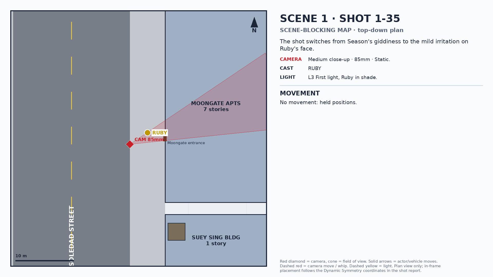

| Slot | Reference | File | Status |
|---|---|---|---|
| 1 | blocking_map | `03_department_outputs/scene_001/blocking_maps/1-35_blocking_map.png` | ready |
| 2 | character · RUBY | `02_bibles/refs/ruby_reference.png` | missing |
| 3 | location · MOONGATE_FRONT | `02_bibles/refs/moongate_front_plate.png` | missing |
| 4 | expression_start · RUBY_annoyed | `expr/RUBY_annoyed.png` | missing |

```text
Image 1: Top-down scene-blocking map. Follow its positions and movement arrows; do not render the map itself.
Image 2 is RUBY (character).
Image 3 is MOONGATE_FRONT (location).
Image 4 is RUBY_annoyed (expression start).

The woman in the robe stands watching the approaching car, lips pressed flat in mild irritation. Stage the action exactly as the blocking map in Image 1 shows: where each person stands, the numbered movement arrows, and the camera position and viewing direction. In frame, the focal point (Ruby's flat stare) sits at Face at (0.30, 0.66). Medium close-up, 85mm lens. Static. Lighting: L3 First light, Ruby in shade. Cinematic tearjerker tone, emotionally intimate framing, soft natural light favoring dawn or dusk. Foil visible somewhere in frame — crumpled, glinting, or scattered nearby. Environment shows worn signs of habitation — blankets, bags, makeshift bedding — treated with visual dignity, not disorder. Camera lingers rather than cuts quickly, allowing emotional weight to build.

Duration 3s. Cinematic 2.39:1 composition, photoreal, no on-screen text, no map graphics in the output.
```

---

## Shot 1-36 · 4s

**Beat:** Season parks at the curb across from the Moongate; side-view of her smiling through the passenger window.

> Season pulls up and parks at the curb, directly across the street from The Moongate, and we get a side-view shot of her smiling through the passenger-side window.

**Upstream reports:** CRR-001-CAS (flagged_for_human_review), CRR-001-WAR (provisional_pending_upstream), CRR-001-PRO (provisional_pending_upstream), CRR-001-LOC (flagged_for_human_review), CRR-001-BLK (locked), CRR-001-SET (locked), CRR-001-CIN (provisional_pending_upstream), CRR-001-LGT (flagged_for_human_review), CRR-001-IMG (provisional_pending_upstream), CRR-001-VAG (provisional_pending_upstream), CRR-001-EDT (locked)

### Shot Report
- **Blocking / Set:** focal point is *Season's smile through the glass* at UR (0.70, 0.66) — Face at (0.70, 0.62) framed by the window. Spiral: none. 
- **Camera:** Medium side view through passenger window, 50mm. Static from the Moongate side of the street.
- **Lighting:** L3 First light.
- **Cast / wardrobe:** SEASON (present_day)
- **Props:** SEASONS_CAR
- **Expression anchors:** SEASON_giddy_goofy_smile → SEASON_giddy_goofy_smile
- **Editing:** —
- **How it works together:** the camera (50mm) arrives at the blocking's focal point — Season's smile through the glass — under L3 First light., so the beat "Season parks at the curb across from the Moongate; side-view of her smiling through the passenger window" lands where the eye already is.
- **Open flags:** F-07

### Prompt pair — **BLOCKED**
Blockers:
- SEASON: no chosen reference image (F-18)
- MOONGATE_FRONT: no chosen location reference (F-18)

**LTX-2.3**

```text
[SEASON] Same character as reference image: 44-year-old woman, half Cherokee and half Black, tall, overweight build, thick hair in a braid, black eyes, wears glasses, dimples visible when smiling, cross necklace, pigeon-toed stance, serious devout demeanor. Wearing a waitress work uniform. Maintain exact facial structure and build from reference. Scene: The sidewalk in front of the entrance of the seven-story Moongate Apartments on Soledad Street, the Suey Sing Building to its right. The car eases to a stop at the curb. Through the passenger-side window, the driver beams across the street, waving. Composition follows dynamic symmetry principles — subject(s) positioned along a diagonal sightline rather than center-frame, with deliberate negative space. Focal point — Season's smile through the glass: Face at (0.70, 0.62) framed by the window. Camera: Medium side view through passenger window, 50mm lens. Static from the Moongate side of the street. Lighting: L3 First light. Props in frame: an ordinary, well-kept sedan. Cinematic tearjerker tone, emotionally intimate framing, soft natural light favoring dawn or dusk. Foil visible somewhere in frame — crumpled, glinting, or scattered nearby. Environment shows worn signs of habitation — blankets, bags, makeshift bedding — treated with visual dignity, not disorder. Camera lingers rather than cuts quickly, allowing emotional weight to build. Audio: Engine off. Duration 4 seconds. Compose inside a centered 2.39:1 safe area of a 16:9 frame.
```

**Wan 2.2** (first frame `expr/SEASON_giddy_goofy_smile.png`, last frame `expr/SEASON_giddy_goofy_smile.png`)

```text
[SEASON] Same character as reference image: 44-year-old woman, half Cherokee and half Black, tall, overweight build, thick hair in a braid, black eyes, wears glasses, dimples visible when smiling, cross necklace, pigeon-toed stance, serious devout demeanor. Wearing a waitress work uniform. Maintain exact facial structure and build from reference. Scene: The car eases to a stop at the curb. Through the passenger-side window, the driver beams across the street, waving. Medium side view through passenger window, 50mm. Static from the Moongate side of the street. Placement: Face at (0.70, 0.62) framed by the window. L3 First light.
```

Negative:

```text
no dead-center framing unless flagged as intentional, no clean or brand-new camping gear; tents show wear and dust, no high-contrast plastic or neon garbage bins, no harsh flat midday daylight, no garbled on-screen text, no short hair, no slender/thin build, no missing glasses, no missing cross necklace, no flat/dimple-less smile, no flashback wardrobe (yellow shorts/blouse), no eye color other than black, Moongate is the tallest structure on the block
```

**MiniMax Omni** (5/9 references)

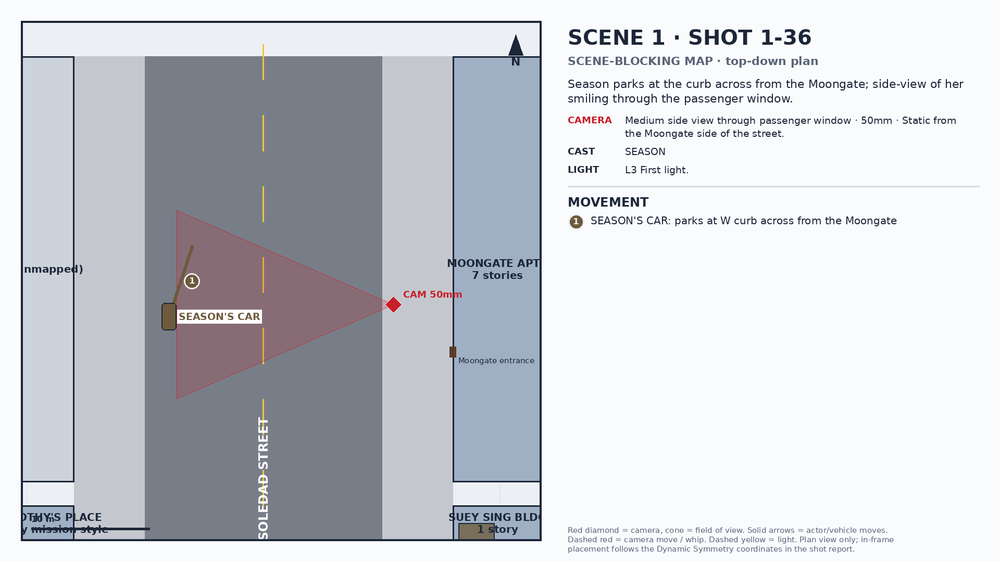

| Slot | Reference | File | Status |
|---|---|---|---|
| 1 | blocking_map | `03_department_outputs/scene_001/blocking_maps/1-36_blocking_map.png` | ready |
| 2 | character · SEASON | `02_bibles/refs/season_reference.png` | missing |
| 3 | location · MOONGATE_FRONT | `02_bibles/refs/moongate_front_plate.png` | missing |
| 4 | expression_start · SEASON_giddy_goofy_smile | `expr/SEASON_giddy_goofy_smile.png` | missing |
| 5 | prop · SEASONS_CAR | `02_bibles/refs/seasons_car.png` | missing |

```text
Image 1: Top-down scene-blocking map. Follow its positions and movement arrows; do not render the map itself.
Image 2 is SEASON (character).
Image 3 is MOONGATE_FRONT (location).
Image 4 is SEASON_giddy_goofy_smile (expression start).
Image 5 is SEASONS_CAR (prop).

The car eases to a stop at the curb. Through the passenger-side window, the driver beams across the street, waving. Stage the action exactly as the blocking map in Image 1 shows: where each person stands, the numbered movement arrows, and the camera position and viewing direction. In frame, the focal point (Season's smile through the glass) sits at Face at (0.70, 0.62) framed by the window. Medium side view through passenger window, 50mm lens. Static from the Moongate side of the street. Lighting: L3 First light. Cinematic tearjerker tone, emotionally intimate framing, soft natural light favoring dawn or dusk. Foil visible somewhere in frame — crumpled, glinting, or scattered nearby. Environment shows worn signs of habitation — blankets, bags, makeshift bedding — treated with visual dignity, not disorder. Camera lingers rather than cuts quickly, allowing emotional weight to build.

Duration 4s. Cinematic 2.39:1 composition, photoreal, no on-screen text, no map graphics in the output.
```

---

## Shot 1-37 · 4s

**Beat:** Ruby's mild irritation turns to outright disgust. 'This bitch.'

> The camera finds RUBY as the mildly-irritated expression on her face turns to outright disgust. RUBY (disbelieving tone): This bitch.

**Upstream reports:** CRR-001-CAS (flagged_for_human_review), CRR-001-WAR (provisional_pending_upstream), CRR-001-PRO (provisional_pending_upstream), CRR-001-LOC (flagged_for_human_review), CRR-001-BLK (locked), CRR-001-SET (locked), CRR-001-CIN (provisional_pending_upstream), CRR-001-LGT (flagged_for_human_review), CRR-001-IMG (provisional_pending_upstream), CRR-001-VAG (provisional_pending_upstream), CRR-001-EDT (locked)

### Shot Report
- **Blocking / Set:** focal point is *Ruby's disgust* at UL (0.30, 0.66) — Face at (0.30, 0.66). Spiral: none. 
- **Camera:** Close-up, 85mm. Static.
- **Lighting:** L3 First light, Ruby in shade.
- **Cast / wardrobe:** RUBY (present_day_robe)
- **Props:** RUBY_CIGARETTE
- **Expression anchors:** RUBY_annoyed → RUBY_disgust
- **Editing:** —
- **How it works together:** the camera (85mm) arrives at the blocking's focal point — Ruby's disgust — under L3 First light, Ruby in shade., so the beat "Ruby's mild irritation turns to outright disgust" lands where the eye already is.
- **Open flags:** F-16

### Prompt pair — **BLOCKED**
Blockers:
- RUBY: no chosen reference image (F-18)
- MOONGATE_FRONT: no chosen location reference (F-18)

**LTX-2.3**

```text
[RUBY] Same character as reference image: 66-year-old Cherokee woman, smooth skin with only faint fine lines at the eyes, high cheekbones, sharp restless dark eyes, thick dark hair with silver strands in a loose braid, wearing a pink robe, barefoot, turquoise ring, turquoise pendant necklace. No facial tattoos, no gray-all-over hair, no gaunt features, no wrinkling. Maintain exact facial structure from reference. Scene: The sidewalk in front of the entrance of the seven-story Moongate Apartments on Soledad Street, the Suey Sing Building to its right. Close on her face as mild irritation curdles into open disgust. Composition follows dynamic symmetry principles — subject(s) positioned along a diagonal sightline rather than center-frame, with deliberate negative space. Focal point — Ruby's disgust: Face at (0.30, 0.66). Camera: Close-up, 85mm lens. Static. Lighting: L3 First light, Ruby in shade. Props in frame: a lit cigarette. Cinematic tearjerker tone, emotionally intimate framing, soft natural light favoring dawn or dusk. Foil visible somewhere in frame — crumpled, glinting, or scattered nearby. Environment shows worn signs of habitation — blankets, bags, makeshift bedding — treated with visual dignity, not disorder. Camera lingers rather than cuts quickly, allowing emotional weight to build. Ruby says (disbelieving): "This bitch." Duration 4 seconds. Compose inside a centered 2.39:1 safe area of a 16:9 frame.
```

**Wan 2.2** (first frame `expr/RUBY_annoyed.png`, last frame `expr/RUBY_disgust.png`)

```text
[RUBY] Same character as reference image: 66-year-old Cherokee woman, smooth skin with only faint fine lines at the eyes, high cheekbones, sharp restless dark eyes, thick dark hair with silver strands in a loose braid, wearing a pink robe, barefoot, turquoise ring, turquoise pendant necklace. No facial tattoos, no gray-all-over hair, no gaunt features, no wrinkling. Maintain exact facial structure from reference. Scene: Close on her face as mild irritation curdles into open disgust. Close-up, 85mm. Static. Placement: Face at (0.30, 0.66). L3 First light, Ruby in shade.
```

Negative:

```text
no dead-center framing unless flagged as intentional, no clean or brand-new camping gear; tents show wear and dust, no high-contrast plastic or neon garbage bins, no harsh flat midday daylight, no garbled on-screen text, no facial tattoos, no sunken/gaunt cheekbones, no fully gray or white hair, no heavy wrinkling, forehead lines, or aged skin texture, no hunched or frail posture, no jewelry beyond turquoise ring and pendant, no default smiling, Moongate is the tallest structure on the block
```

**MiniMax Omni** (5/9 references)

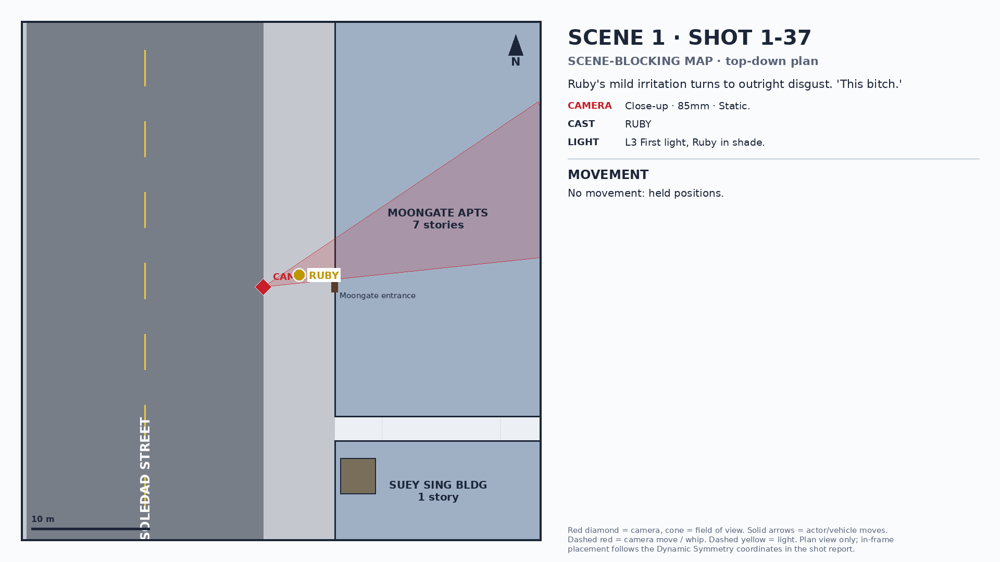

| Slot | Reference | File | Status |
|---|---|---|---|
| 1 | blocking_map | `03_department_outputs/scene_001/blocking_maps/1-37_blocking_map.png` | ready |
| 2 | character · RUBY | `02_bibles/refs/ruby_reference.png` | missing |
| 3 | location · MOONGATE_FRONT | `02_bibles/refs/moongate_front_plate.png` | missing |
| 4 | expression_start · RUBY_annoyed | `expr/RUBY_annoyed.png` | missing |
| 5 | expression_end · RUBY_disgust | `expr/RUBY_disgust.png` | missing |

```text
Image 1: Top-down scene-blocking map. Follow its positions and movement arrows; do not render the map itself.
Image 2 is RUBY (character).
Image 3 is MOONGATE_FRONT (location).
Image 4 is RUBY_annoyed (expression start).
Image 5 is RUBY_disgust (expression end).

Close on her face as mild irritation curdles into open disgust. Stage the action exactly as the blocking map in Image 1 shows: where each person stands, the numbered movement arrows, and the camera position and viewing direction. In frame, the focal point (Ruby's disgust) sits at Face at (0.30, 0.66). Close-up, 85mm lens. Static. Lighting: L3 First light, Ruby in shade. Cinematic tearjerker tone, emotionally intimate framing, soft natural light favoring dawn or dusk. Foil visible somewhere in frame — crumpled, glinting, or scattered nearby. Environment shows worn signs of habitation — blankets, bags, makeshift bedding — treated with visual dignity, not disorder. Camera lingers rather than cuts quickly, allowing emotional weight to build. Ruby says: "This bitch."

Duration 4s. Cinematic 2.39:1 composition, photoreal, no on-screen text, no map graphics in the output.
```

---

## Shot 1-38 · 8s

**Beat:** Season hops out and comes around the front of the car toward Ruby, smiling. Ruby doesn't fix her face.

> …Season hops out and starts around the front of the car towards her, smiling. SEASON: Morning Mom. What in Jesus' name are you doing out here in your robe so early for?

**Upstream reports:** CRR-001-CAS (flagged_for_human_review), CRR-001-WAR (provisional_pending_upstream), CRR-001-PRO (provisional_pending_upstream), CRR-001-LOC (flagged_for_human_review), CRR-001-BLK (locked), CRR-001-SET (locked), CRR-001-CIN (provisional_pending_upstream), CRR-001-LGT (flagged_for_human_review), CRR-001-IMG (provisional_pending_upstream), CRR-001-VAG (provisional_pending_upstream), CRR-001-EDT (locked)

### Shot Report
- **Blocking / Set:** focal point is *Season crossing toward Ruby* at Season arrives at UR (0.70, 0.66) — Ruby frame-left at (0.25, 0.55); Season crosses from the car at (0.80, 0.40) along the full spiral, arriving at (0.62, 0.55). Spiral: Full spiral, top-left orientation — lead character crossing frame. Season's pigeon-toed walk should read in this full-body shot (Season bible).
- **Set design:** Car parked across the street behind her; the tent field visible beyond.
- **Camera:** Wide two-shot, 35mm. Static, camera behind and beside Ruby at hip height.
- **Lighting:** L3 First light: Season walks out of full sun into the edge of Ruby's shade.
- **Cast / wardrobe:** RUBY (present_day_robe), SEASON (present_day)
- **Props:** SEASONS_CAR, RUBY_COFFEE_MUG
- **Expression anchors:** SEASON_giddy_goofy_smile → SEASON_giddy_goofy_smile
- **Editing:** Master for the Ruby/Season exchange.
- **How it works together:** the camera (35mm) arrives at the blocking's focal point — Season crossing toward Ruby — under L3 First light, so the beat "Season hops out and comes around the front of the car toward Ruby, smiling" lands where the eye already is.
- **Open flags:** F-07

### Prompt pair — **BLOCKED**
Blockers:
- RUBY: no chosen reference image (F-18)
- SEASON: no chosen reference image (F-18)
- MOONGATE_FRONT: no chosen location reference (F-18)

**LTX-2.3**

```text
[RUBY] Same character as reference image: 66-year-old Cherokee woman, smooth skin with only faint fine lines at the eyes, high cheekbones, sharp restless dark eyes, thick dark hair with silver strands in a loose braid, wearing a pink robe, barefoot, turquoise ring, turquoise pendant necklace. No facial tattoos, no gray-all-over hair, no gaunt features, no wrinkling. Maintain exact facial structure from reference. [SEASON] Same character as reference image: 44-year-old woman, half Cherokee and half Black, tall, overweight build, thick hair in a braid, black eyes, wears glasses, dimples visible when smiling, cross necklace, pigeon-toed stance, serious devout demeanor. Wearing a waitress work uniform. Maintain exact facial structure and build from reference. Scene: The sidewalk in front of the entrance of the seven-story Moongate Apartments on Soledad Street, the Suey Sing Building to its right. A tall, heavyset woman in glasses and a waitress uniform climbs out of her car and walks around its front toward the woman in the robe, beaming, with a slightly pigeon-toed gait. The woman in the robe waits, arms folded around her mug, not bothering to hide her disgust. Composition follows dynamic symmetry principles — subject(s) positioned along a diagonal sightline rather than center-frame, with deliberate negative space. Focal point — Season crossing toward Ruby: Ruby frame-left at (0.25, 0.55); Season crosses from the car at (0.80, 0.40) along the full spiral, arriving at (0.62, 0.55). Camera: Wide two-shot, 35mm lens. Static, camera behind and beside Ruby at hip height. Lighting: L3 First light: Season walks out of full sun into the edge of Ruby's shade. Props in frame: an ordinary, well-kept sedan; a ceramic coffee mug. Cinematic tearjerker tone, emotionally intimate framing, soft natural light favoring dawn or dusk. Foil visible somewhere in frame — crumpled, glinting, or scattered nearby. Environment shows worn signs of habitation — blankets, bags, makeshift bedding — treated with visual dignity, not disorder. Camera lingers rather than cuts quickly, allowing emotional weight to build. Season says: "Morning Mom. What in Jesus' name are you doing out here in your robe so early for?" Audio: Car door, footsteps. Duration 8 seconds. Compose inside a centered 2.39:1 safe area of a 16:9 frame.
```

**Wan 2.2** (first frame `expr/SEASON_giddy_goofy_smile.png`, last frame `expr/SEASON_giddy_goofy_smile.png`) — 8s > 5s: generate 2 segments, each segment's last frame seeds the next.

```text
[RUBY] Same character as reference image: 66-year-old Cherokee woman, smooth skin with only faint fine lines at the eyes, high cheekbones, sharp restless dark eyes, thick dark hair with silver strands in a loose braid, wearing a pink robe, barefoot, turquoise ring, turquoise pendant necklace. No facial tattoos, no gray-all-over hair, no gaunt features, no wrinkling. Maintain exact facial structure from reference. [SEASON] Same character as reference image: 44-year-old woman, half Cherokee and half Black, tall, overweight build, thick hair in a braid, black eyes, wears glasses, dimples visible when smiling, cross necklace, pigeon-toed stance, serious devout demeanor. Wearing a waitress work uniform. Maintain exact facial structure and build from reference. Scene: A tall, heavyset woman in glasses and a waitress uniform climbs out of her car and walks around its front toward the woman in the robe, beaming, with a slightly pigeon-toed gait. The woman in the robe waits, arms folded around her mug, not bothering to hide her disgust. Wide two-shot, 35mm. Static, camera behind and beside Ruby at hip height. Placement: Ruby frame-left at (0.25, 0.55); Season crosses from the car at (0.80, 0.40) along the full spiral, arriving at (0.62, 0.55). L3 First light: Season walks out of full sun into the edge of Ruby's shade.
```

Negative:

```text
no dead-center framing unless flagged as intentional, no clean or brand-new camping gear; tents show wear and dust, no high-contrast plastic or neon garbage bins, no harsh flat midday daylight, no garbled on-screen text, no facial tattoos, no sunken/gaunt cheekbones, no fully gray or white hair, no heavy wrinkling, forehead lines, or aged skin texture, no hunched or frail posture, no jewelry beyond turquoise ring and pendant, no default smiling, no short hair, no slender/thin build, no missing glasses, no missing cross necklace, no flat/dimple-less smile, no flashback wardrobe (yellow shorts/blouse), no eye color other than black, Moongate is the tallest structure on the block
```

**MiniMax Omni** (6/9 references)

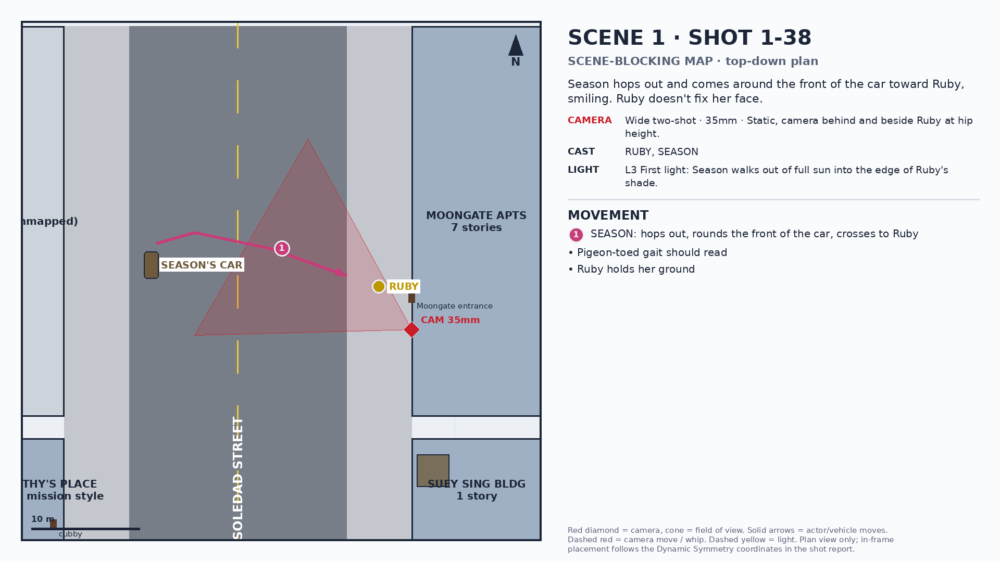

| Slot | Reference | File | Status |
|---|---|---|---|
| 1 | blocking_map | `03_department_outputs/scene_001/blocking_maps/1-38_blocking_map.png` | ready |
| 2 | character · RUBY | `02_bibles/refs/ruby_reference.png` | missing |
| 3 | character · SEASON | `02_bibles/refs/season_reference.png` | missing |
| 4 | location · MOONGATE_FRONT | `02_bibles/refs/moongate_front_plate.png` | missing |
| 5 | expression_start · SEASON_giddy_goofy_smile | `expr/SEASON_giddy_goofy_smile.png` | missing |
| 6 | prop · SEASONS_CAR | `02_bibles/refs/seasons_car.png` | missing |

```text
Image 1: Top-down scene-blocking map. Follow its positions and movement arrows; do not render the map itself.
Image 2 is RUBY (character).
Image 3 is SEASON (character).
Image 4 is MOONGATE_FRONT (location).
Image 5 is SEASON_giddy_goofy_smile (expression start).
Image 6 is SEASONS_CAR (prop).

A tall, heavyset woman in glasses and a waitress uniform climbs out of her car and walks around its front toward the woman in the robe, beaming, with a slightly pigeon-toed gait. The woman in the robe waits, arms folded around her mug, not bothering to hide her disgust. Stage the action exactly as the blocking map in Image 1 shows: where each person stands, the numbered movement arrows, and the camera position and viewing direction. In frame, the focal point (Season crossing toward Ruby) sits at Ruby frame-left at (0.25, 0.55); Season crosses from the car at (0.80, 0.40) along the full spiral, arriving at (0.62, 0.55). Wide two-shot, 35mm lens. Static, camera behind and beside Ruby at hip height. Lighting: L3 First light: Season walks out of full sun into the edge of Ruby's shade. Cinematic tearjerker tone, emotionally intimate framing, soft natural light favoring dawn or dusk. Foil visible somewhere in frame — crumpled, glinting, or scattered nearby. Environment shows worn signs of habitation — blankets, bags, makeshift bedding — treated with visual dignity, not disorder. Camera lingers rather than cuts quickly, allowing emotional weight to build. Season says: "Morning Mom. What in Jesus' name are you doing out here in your robe so early for?"

Duration 8s. Cinematic 2.39:1 composition, photoreal, no on-screen text, no map graphics in the output.
```

---

## Shot 1-39 · 6s

**Beat:** Ruby opens her mouth to respond; Season cuts her off, playful: 'You haven't started back smoking crack now have you mom.' Season chuckles.

> Ruby opens her mouth to respond but Season cuts her off. SEASON (a playful smile): You haven't started back smoking crack now have you mom. Season starts chuckling.

**Upstream reports:** CRR-001-CAS (flagged_for_human_review), CRR-001-WAR (provisional_pending_upstream), CRR-001-PRO (provisional_pending_upstream), CRR-001-LOC (flagged_for_human_review), CRR-001-BLK (locked), CRR-001-SET (locked), CRR-001-CIN (provisional_pending_upstream), CRR-001-LGT (flagged_for_human_review), CRR-001-IMG (provisional_pending_upstream), CRR-001-VAG (provisional_pending_upstream), CRR-001-EDT (locked)

### Shot Report
- **Blocking / Set:** focal point is *Season's teasing grin* at UR (0.70, 0.66) — Ruby's shoulder soft frame-left; Season face at (0.70, 0.66). Spiral: none. Season stands slightly higher (taller) — she thinks she has the upper hand here.
- **Camera:** Over-the-shoulder: Ruby's shoulder, Season MCU, 85mm. Static OTS.
- **Lighting:** L3 First light, Season half-lit warm.
- **Cast / wardrobe:** SEASON (present_day), RUBY (present_day_robe)
- **Expression anchors:** SEASON_playful_teasing → SEASON_playful_teasing
- **Editing:** Ruby's aborted response is heard at the head of the shot (breath, 'I—').
- **How it works together:** the camera (85mm) arrives at the blocking's focal point — Season's teasing grin — under L3 First light, Season half-lit warm., so the beat "Ruby opens her mouth to respond; Season cuts her off, playful: 'You haven't started back smoking crack now have you mom" lands where the eye already is.
- **Open flags:** F-07, F-16

### Prompt pair — **BLOCKED**
Blockers:
- SEASON: no chosen reference image (F-18)
- RUBY: no chosen reference image (F-18)
- MOONGATE_FRONT: no chosen location reference (F-18)

**LTX-2.3**

```text
[SEASON] Same character as reference image: 44-year-old woman, half Cherokee and half Black, tall, overweight build, thick hair in a braid, black eyes, wears glasses, dimples visible when smiling, cross necklace, pigeon-toed stance, serious devout demeanor. Wearing a waitress work uniform. Maintain exact facial structure and build from reference. [RUBY] Same character as reference image: 66-year-old Cherokee woman, smooth skin with only faint fine lines at the eyes, high cheekbones, sharp restless dark eyes, thick dark hair with silver strands in a loose braid, wearing a pink robe, barefoot, turquoise ring, turquoise pendant necklace. No facial tattoos, no gray-all-over hair, no gaunt features, no wrinkling. Maintain exact facial structure from reference. Scene: The sidewalk in front of the entrance of the seven-story Moongate Apartments on Soledad Street, the Suey Sing Building to its right. The woman in glasses cuts in with a playful, teasing smile, dimples showing, and starts chuckling at her own joke. Composition follows dynamic symmetry principles — subject(s) positioned along a diagonal sightline rather than center-frame, with deliberate negative space. Focal point — Season's teasing grin: Ruby's shoulder soft frame-left; Season face at (0.70, 0.66). Camera: Over-the-shoulder: Ruby's shoulder, Season MCU, 85mm lens. Static OTS. Lighting: L3 First light, Season half-lit warm. Cinematic tearjerker tone, emotionally intimate framing, soft natural light favoring dawn or dusk. Foil visible somewhere in frame — crumpled, glinting, or scattered nearby. Environment shows worn signs of habitation — blankets, bags, makeshift bedding — treated with visual dignity, not disorder. Camera lingers rather than cuts quickly, allowing emotional weight to build. Season says: "You haven't started back smoking crack now, have you, Mom?" Audio: Season's chuckle. Duration 6 seconds. Compose inside a centered 2.39:1 safe area of a 16:9 frame.
```

**Wan 2.2** (first frame `expr/SEASON_playful_teasing.png`, last frame `expr/SEASON_playful_teasing.png`) — 6s > 5s: generate 2 segments, each segment's last frame seeds the next.

```text
[SEASON] Same character as reference image: 44-year-old woman, half Cherokee and half Black, tall, overweight build, thick hair in a braid, black eyes, wears glasses, dimples visible when smiling, cross necklace, pigeon-toed stance, serious devout demeanor. Wearing a waitress work uniform. Maintain exact facial structure and build from reference. [RUBY] Same character as reference image: 66-year-old Cherokee woman, smooth skin with only faint fine lines at the eyes, high cheekbones, sharp restless dark eyes, thick dark hair with silver strands in a loose braid, wearing a pink robe, barefoot, turquoise ring, turquoise pendant necklace. No facial tattoos, no gray-all-over hair, no gaunt features, no wrinkling. Maintain exact facial structure from reference. Scene: The woman in glasses cuts in with a playful, teasing smile, dimples showing, and starts chuckling at her own joke. Over-the-shoulder: Ruby's shoulder, Season MCU, 85mm. Static OTS. Placement: Ruby's shoulder soft frame-left; Season face at (0.70, 0.66). L3 First light, Season half-lit warm.
```

Negative:

```text
no dead-center framing unless flagged as intentional, no clean or brand-new camping gear; tents show wear and dust, no high-contrast plastic or neon garbage bins, no harsh flat midday daylight, no garbled on-screen text, no short hair, no slender/thin build, no missing glasses, no missing cross necklace, no flat/dimple-less smile, no flashback wardrobe (yellow shorts/blouse), no eye color other than black, no facial tattoos, no sunken/gaunt cheekbones, no fully gray or white hair, no heavy wrinkling, forehead lines, or aged skin texture, no hunched or frail posture, no jewelry beyond turquoise ring and pendant, no default smiling, Moongate is the tallest structure on the block
```

**MiniMax Omni** (5/9 references)

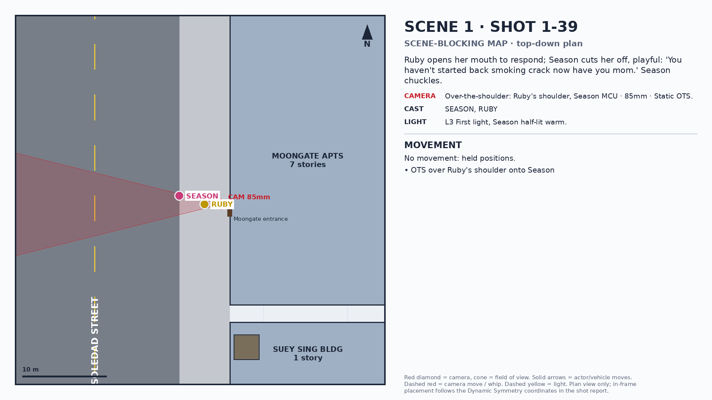

| Slot | Reference | File | Status |
|---|---|---|---|
| 1 | blocking_map | `03_department_outputs/scene_001/blocking_maps/1-39_blocking_map.png` | ready |
| 2 | character · SEASON | `02_bibles/refs/season_reference.png` | missing |
| 3 | character · RUBY | `02_bibles/refs/ruby_reference.png` | missing |
| 4 | location · MOONGATE_FRONT | `02_bibles/refs/moongate_front_plate.png` | missing |
| 5 | expression_start · SEASON_playful_teasing | `expr/SEASON_playful_teasing.png` | missing |

```text
Image 1: Top-down scene-blocking map. Follow its positions and movement arrows; do not render the map itself.
Image 2 is SEASON (character).
Image 3 is RUBY (character).
Image 4 is MOONGATE_FRONT (location).
Image 5 is SEASON_playful_teasing (expression start).

The woman in glasses cuts in with a playful, teasing smile, dimples showing, and starts chuckling at her own joke. Stage the action exactly as the blocking map in Image 1 shows: where each person stands, the numbered movement arrows, and the camera position and viewing direction. In frame, the focal point (Season's teasing grin) sits at Ruby's shoulder soft frame-left; Season face at (0.70, 0.66). Over-the-shoulder: Ruby's shoulder, Season MCU, 85mm lens. Static OTS. Lighting: L3 First light, Season half-lit warm. Cinematic tearjerker tone, emotionally intimate framing, soft natural light favoring dawn or dusk. Foil visible somewhere in frame — crumpled, glinting, or scattered nearby. Environment shows worn signs of habitation — blankets, bags, makeshift bedding — treated with visual dignity, not disorder. Camera lingers rather than cuts quickly, allowing emotional weight to build. Season says: "You haven't started back smoking crack now, have you, Mom?"

Duration 6s. Cinematic 2.39:1 composition, photoreal, no on-screen text, no map graphics in the output.
```

---

## Shot 1-40 · 4s

**Beat:** Ruby's eyes squint like a gunfighter's; she stares daggers.

> Ruby's eyes squinty like a gunfighters and she stares daggers at Season, as Season chuckles at her little joke.

**Upstream reports:** CRR-001-CAS (flagged_for_human_review), CRR-001-WAR (provisional_pending_upstream), CRR-001-PRO (provisional_pending_upstream), CRR-001-LOC (flagged_for_human_review), CRR-001-BLK (locked), CRR-001-SET (locked), CRR-001-CIN (provisional_pending_upstream), CRR-001-LGT (flagged_for_human_review), CRR-001-IMG (provisional_pending_upstream), CRR-001-VAG (provisional_pending_upstream), CRR-001-EDT (locked)

### Shot Report
- **Blocking / Set:** focal point is *Ruby's narrowed eyes* at eye line y=0.66, left eye at x=0.30 — Eyes across (0.30–0.70, 0.60). Spiral: none. Widescreen ECU — the 2.39 frame used like a western showdown.
- **Camera:** Extreme close-up on eyes, 100mm. Static.
- **Lighting:** L3 First light, cool shade, one warm catchlight.
- **Cast / wardrobe:** RUBY (present_day_robe)
- **Expression anchors:** RUBY_disgust → RUBY_gunfighter_squint
- **Editing:** —
- **How it works together:** the camera (100mm) arrives at the blocking's focal point — Ruby's narrowed eyes — under L3 First light, cool shade, one warm catchlight., so the beat "Ruby's eyes squint like a gunfighter's; she stares daggers" lands where the eye already is.

### Prompt pair — **BLOCKED**
Blockers:
- RUBY: no chosen reference image (F-18)
- MOONGATE_FRONT: no chosen location reference (F-18)

**LTX-2.3**

```text
[RUBY] Same character as reference image: 66-year-old Cherokee woman, smooth skin with only faint fine lines at the eyes, high cheekbones, sharp restless dark eyes, thick dark hair with silver strands in a loose braid, wearing a pink robe, barefoot, turquoise ring, turquoise pendant necklace. No facial tattoos, no gray-all-over hair, no gaunt features, no wrinkling. Maintain exact facial structure from reference. Scene: The sidewalk in front of the entrance of the seven-story Moongate Apartments on Soledad Street, the Suey Sing Building to its right. Extreme close-up: the older woman's sharp dark eyes narrow slowly to slits, like a gunfighter's, fixed and unblinking. Composition follows dynamic symmetry principles — subject(s) positioned along a diagonal sightline rather than center-frame, with deliberate negative space. Focal point — Ruby's narrowed eyes: Eyes across (0.30–0.70, 0.60). Camera: Extreme close-up on eyes, 100mm lens. Static. Lighting: L3 First light, cool shade, one warm catchlight. Cinematic tearjerker tone, emotionally intimate framing, soft natural light favoring dawn or dusk. Foil visible somewhere in frame — crumpled, glinting, or scattered nearby. Environment shows worn signs of habitation — blankets, bags, makeshift bedding — treated with visual dignity, not disorder. Camera lingers rather than cuts quickly, allowing emotional weight to build. Audio: Season's chuckle off-screen, trailing. Duration 4 seconds. Compose inside a centered 2.39:1 safe area of a 16:9 frame.
```

**Wan 2.2** (first frame `expr/RUBY_disgust.png`, last frame `expr/RUBY_gunfighter_squint.png`)

```text
[RUBY] Same character as reference image: 66-year-old Cherokee woman, smooth skin with only faint fine lines at the eyes, high cheekbones, sharp restless dark eyes, thick dark hair with silver strands in a loose braid, wearing a pink robe, barefoot, turquoise ring, turquoise pendant necklace. No facial tattoos, no gray-all-over hair, no gaunt features, no wrinkling. Maintain exact facial structure from reference. Scene: Extreme close-up: the older woman's sharp dark eyes narrow slowly to slits, like a gunfighter's, fixed and unblinking. Extreme close-up on eyes, 100mm. Static. Placement: Eyes across (0.30–0.70, 0.60). L3 First light, cool shade, one warm catchlight.
```

Negative:

```text
no dead-center framing unless flagged as intentional, no clean or brand-new camping gear; tents show wear and dust, no high-contrast plastic or neon garbage bins, no harsh flat midday daylight, no garbled on-screen text, no facial tattoos, no sunken/gaunt cheekbones, no fully gray or white hair, no heavy wrinkling, forehead lines, or aged skin texture, no hunched or frail posture, no jewelry beyond turquoise ring and pendant, no default smiling, Moongate is the tallest structure on the block
```

**MiniMax Omni** (5/9 references)

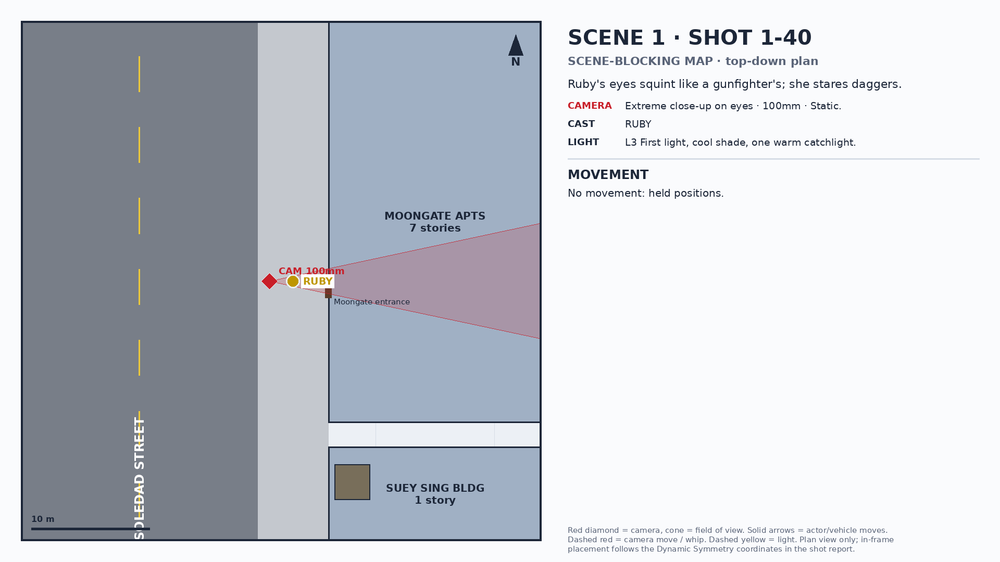

| Slot | Reference | File | Status |
|---|---|---|---|
| 1 | blocking_map | `03_department_outputs/scene_001/blocking_maps/1-40_blocking_map.png` | ready |
| 2 | character · RUBY | `02_bibles/refs/ruby_reference.png` | missing |
| 3 | location · MOONGATE_FRONT | `02_bibles/refs/moongate_front_plate.png` | missing |
| 4 | expression_start · RUBY_disgust | `expr/RUBY_disgust.png` | missing |
| 5 | expression_end · RUBY_gunfighter_squint | `expr/RUBY_gunfighter_squint.png` | missing |

```text
Image 1: Top-down scene-blocking map. Follow its positions and movement arrows; do not render the map itself.
Image 2 is RUBY (character).
Image 3 is MOONGATE_FRONT (location).
Image 4 is RUBY_disgust (expression start).
Image 5 is RUBY_gunfighter_squint (expression end).

Extreme close-up: the older woman's sharp dark eyes narrow slowly to slits, like a gunfighter's, fixed and unblinking. Stage the action exactly as the blocking map in Image 1 shows: where each person stands, the numbered movement arrows, and the camera position and viewing direction. In frame, the focal point (Ruby's narrowed eyes) sits at Eyes across (0.30–0.70, 0.60). Extreme close-up on eyes, 100mm lens. Static. Lighting: L3 First light, cool shade, one warm catchlight. Cinematic tearjerker tone, emotionally intimate framing, soft natural light favoring dawn or dusk. Foil visible somewhere in frame — crumpled, glinting, or scattered nearby. Environment shows worn signs of habitation — blankets, bags, makeshift bedding — treated with visual dignity, not disorder. Camera lingers rather than cuts quickly, allowing emotional weight to build.

Duration 4s. Cinematic 2.39:1 composition, photoreal, no on-screen text, no map graphics in the output.
```

---

## Shot 1-41 · 3s

**Beat:** Season notices and stops. 'Mom, I—'

> Season notices and stops. SEASON: Mom, I-

**Upstream reports:** CRR-001-CAS (flagged_for_human_review), CRR-001-WAR (provisional_pending_upstream), CRR-001-PRO (provisional_pending_upstream), CRR-001-LOC (flagged_for_human_review), CRR-001-BLK (locked), CRR-001-SET (locked), CRR-001-CIN (provisional_pending_upstream), CRR-001-LGT (flagged_for_human_review), CRR-001-IMG (provisional_pending_upstream), CRR-001-VAG (provisional_pending_upstream), CRR-001-EDT (locked)

### Shot Report
- **Blocking / Set:** focal point is *Season's smile dropping* at UR (0.70, 0.66) — Face at (0.70, 0.66). Spiral: none. 
- **Camera:** Medium close-up, 85mm. Static.
- **Lighting:** L3 First light.
- **Cast / wardrobe:** SEASON (present_day)
- **Expression anchors:** SEASON_playful_teasing → SEASON_caught_off_guard
- **Editing:** Ruby cuts her off — overlap Ruby's first word.
- **How it works together:** the camera (85mm) arrives at the blocking's focal point — Season's smile dropping — under L3 First light., so the beat "Season notices and stops" lands where the eye already is.
- **Open flags:** F-07

### Prompt pair — **BLOCKED**
Blockers:
- SEASON: no chosen reference image (F-18)
- MOONGATE_FRONT: no chosen location reference (F-18)

**LTX-2.3**

```text
[SEASON] Same character as reference image: 44-year-old woman, half Cherokee and half Black, tall, overweight build, thick hair in a braid, black eyes, wears glasses, dimples visible when smiling, cross necklace, pigeon-toed stance, serious devout demeanor. Wearing a waitress work uniform. Maintain exact facial structure and build from reference. Scene: The sidewalk in front of the entrance of the seven-story Moongate Apartments on Soledad Street, the Suey Sing Building to its right. Her chuckle dies and her smile falters as she catches the look on her mother's face. Composition follows dynamic symmetry principles — subject(s) positioned along a diagonal sightline rather than center-frame, with deliberate negative space. Focal point — Season's smile dropping: Face at (0.70, 0.66). Camera: Medium close-up, 85mm lens. Static. Lighting: L3 First light. Cinematic tearjerker tone, emotionally intimate framing, soft natural light favoring dawn or dusk. Foil visible somewhere in frame — crumpled, glinting, or scattered nearby. Environment shows worn signs of habitation — blankets, bags, makeshift bedding — treated with visual dignity, not disorder. Camera lingers rather than cuts quickly, allowing emotional weight to build. Season says: "Mom, I—" Duration 3 seconds. Compose inside a centered 2.39:1 safe area of a 16:9 frame.
```

**Wan 2.2** (first frame `expr/SEASON_playful_teasing.png`, last frame `expr/SEASON_caught_off_guard.png`)

```text
[SEASON] Same character as reference image: 44-year-old woman, half Cherokee and half Black, tall, overweight build, thick hair in a braid, black eyes, wears glasses, dimples visible when smiling, cross necklace, pigeon-toed stance, serious devout demeanor. Wearing a waitress work uniform. Maintain exact facial structure and build from reference. Scene: Her chuckle dies and her smile falters as she catches the look on her mother's face. Medium close-up, 85mm. Static. Placement: Face at (0.70, 0.66). L3 First light.
```

Negative:

```text
no dead-center framing unless flagged as intentional, no clean or brand-new camping gear; tents show wear and dust, no high-contrast plastic or neon garbage bins, no harsh flat midday daylight, no garbled on-screen text, no short hair, no slender/thin build, no missing glasses, no missing cross necklace, no flat/dimple-less smile, no flashback wardrobe (yellow shorts/blouse), no eye color other than black, Moongate is the tallest structure on the block
```

**MiniMax Omni** (5/9 references)

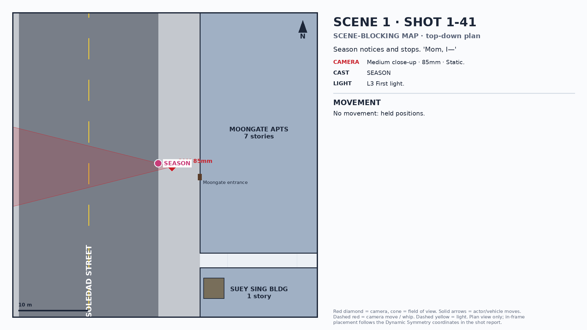

| Slot | Reference | File | Status |
|---|---|---|---|
| 1 | blocking_map | `03_department_outputs/scene_001/blocking_maps/1-41_blocking_map.png` | ready |
| 2 | character · SEASON | `02_bibles/refs/season_reference.png` | missing |
| 3 | location · MOONGATE_FRONT | `02_bibles/refs/moongate_front_plate.png` | missing |
| 4 | expression_start · SEASON_playful_teasing | `expr/SEASON_playful_teasing.png` | missing |
| 5 | expression_end · SEASON_caught_off_guard | `expr/SEASON_caught_off_guard.png` | missing |

```text
Image 1: Top-down scene-blocking map. Follow its positions and movement arrows; do not render the map itself.
Image 2 is SEASON (character).
Image 3 is MOONGATE_FRONT (location).
Image 4 is SEASON_playful_teasing (expression start).
Image 5 is SEASON_caught_off_guard (expression end).

Her chuckle dies and her smile falters as she catches the look on her mother's face. Stage the action exactly as the blocking map in Image 1 shows: where each person stands, the numbered movement arrows, and the camera position and viewing direction. In frame, the focal point (Season's smile dropping) sits at Face at (0.70, 0.66). Medium close-up, 85mm lens. Static. Lighting: L3 First light. Cinematic tearjerker tone, emotionally intimate framing, soft natural light favoring dawn or dusk. Foil visible somewhere in frame — crumpled, glinting, or scattered nearby. Environment shows worn signs of habitation — blankets, bags, makeshift bedding — treated with visual dignity, not disorder. Camera lingers rather than cuts quickly, allowing emotional weight to build. Season says: "Mom, I—"

Duration 3s. Cinematic 2.39:1 composition, photoreal, no on-screen text, no map graphics in the output.
```

---

## Shot 1-42 · 6s

**Beat:** Ruby cuts her off with a sharp-tongued reply.

> RUBY: What's funny is that if it wasn't for you being all Jesus-fearin' and what-not, I'd be asking you the same thing, 'cept I'd be asking if you'd been out suckin' dick all night.

**Upstream reports:** CRR-001-CAS (flagged_for_human_review), CRR-001-WAR (provisional_pending_upstream), CRR-001-PRO (provisional_pending_upstream), CRR-001-LOC (flagged_for_human_review), CRR-001-BLK (locked), CRR-001-SET (locked), CRR-001-CIN (provisional_pending_upstream), CRR-001-LGT (flagged_for_human_review), CRR-001-IMG (provisional_pending_upstream), CRR-001-VAG (provisional_pending_upstream), CRR-001-EDT (locked)

### Shot Report
- **Blocking / Set:** focal point is *Ruby delivering the line* at UL (0.30, 0.66) — Face at (0.30, 0.66). Spiral: none. She's won — low angle gives her the height now.
- **Camera:** Close-up, 85mm. Static, slightly low.
- **Lighting:** L3 First light.
- **Cast / wardrobe:** RUBY (present_day_robe)
- **Props:** RUBY_CIGARETTE
- **Expression anchors:** RUBY_gunfighter_squint → RUBY_cold_satisfaction
- **Editing:** —
- **How it works together:** the camera (85mm) arrives at the blocking's focal point — Ruby delivering the line — under L3 First light., so the beat "Ruby cuts her off with a sharp-tongued reply" lands where the eye already is.
- **Open flags:** F-16

### Prompt pair — **BLOCKED**
Blockers:
- RUBY: no chosen reference image (F-18)
- MOONGATE_FRONT: no chosen location reference (F-18)

**LTX-2.3**

```text
[RUBY] Same character as reference image: 66-year-old Cherokee woman, smooth skin with only faint fine lines at the eyes, high cheekbones, sharp restless dark eyes, thick dark hair with silver strands in a loose braid, wearing a pink robe, barefoot, turquoise ring, turquoise pendant necklace. No facial tattoos, no gray-all-over hair, no gaunt features, no wrinkling. Maintain exact facial structure from reference. Scene: The sidewalk in front of the entrance of the seven-story Moongate Apartments on Soledad Street, the Suey Sing Building to its right. Close on the older woman as she delivers a cutting reply, flat and deliberate, a cold hint of satisfaction at the corner of her mouth. Composition follows dynamic symmetry principles — subject(s) positioned along a diagonal sightline rather than center-frame, with deliberate negative space. Focal point — Ruby delivering the line: Face at (0.30, 0.66). Camera: Close-up, 85mm lens. Static, slightly low. Lighting: L3 First light. Props in frame: a lit cigarette. Cinematic tearjerker tone, emotionally intimate framing, soft natural light favoring dawn or dusk. Foil visible somewhere in frame — crumpled, glinting, or scattered nearby. Environment shows worn signs of habitation — blankets, bags, makeshift bedding — treated with visual dignity, not disorder. Camera lingers rather than cuts quickly, allowing emotional weight to build. Ruby says: "What's funny is that if it wasn't for you being all Jesus-fearin' and what-not, I'd be asking you the same thing, 'cept I'd be asking if you'd been out suckin' dick all night." Duration 6 seconds. Compose inside a centered 2.39:1 safe area of a 16:9 frame.
```

**Wan 2.2** (first frame `expr/RUBY_gunfighter_squint.png`, last frame `expr/RUBY_cold_satisfaction.png`) — 6s > 5s: generate 2 segments, each segment's last frame seeds the next.

```text
[RUBY] Same character as reference image: 66-year-old Cherokee woman, smooth skin with only faint fine lines at the eyes, high cheekbones, sharp restless dark eyes, thick dark hair with silver strands in a loose braid, wearing a pink robe, barefoot, turquoise ring, turquoise pendant necklace. No facial tattoos, no gray-all-over hair, no gaunt features, no wrinkling. Maintain exact facial structure from reference. Scene: Close on the older woman as she delivers a cutting reply, flat and deliberate, a cold hint of satisfaction at the corner of her mouth. Close-up, 85mm. Static, slightly low. Placement: Face at (0.30, 0.66). L3 First light.
```

Negative:

```text
no dead-center framing unless flagged as intentional, no clean or brand-new camping gear; tents show wear and dust, no high-contrast plastic or neon garbage bins, no harsh flat midday daylight, no garbled on-screen text, no facial tattoos, no sunken/gaunt cheekbones, no fully gray or white hair, no heavy wrinkling, forehead lines, or aged skin texture, no hunched or frail posture, no jewelry beyond turquoise ring and pendant, no default smiling, Moongate is the tallest structure on the block
```

**MiniMax Omni** (5/9 references)

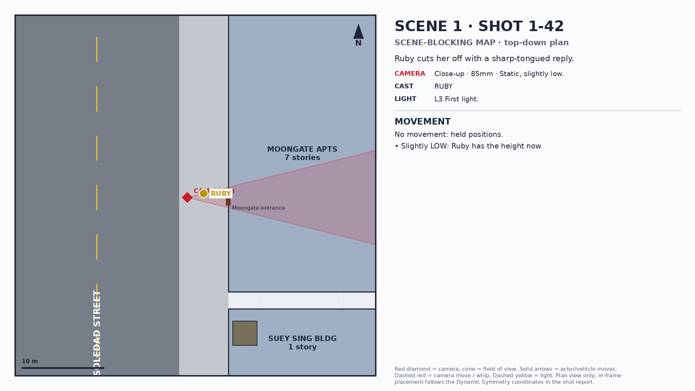

| Slot | Reference | File | Status |
|---|---|---|---|
| 1 | blocking_map | `03_department_outputs/scene_001/blocking_maps/1-42_blocking_map.png` | ready |
| 2 | character · RUBY | `02_bibles/refs/ruby_reference.png` | missing |
| 3 | location · MOONGATE_FRONT | `02_bibles/refs/moongate_front_plate.png` | missing |
| 4 | expression_start · RUBY_gunfighter_squint | `expr/RUBY_gunfighter_squint.png` | missing |
| 5 | expression_end · RUBY_cold_satisfaction | `expr/RUBY_cold_satisfaction.png` | missing |

```text
Image 1: Top-down scene-blocking map. Follow its positions and movement arrows; do not render the map itself.
Image 2 is RUBY (character).
Image 3 is MOONGATE_FRONT (location).
Image 4 is RUBY_gunfighter_squint (expression start).
Image 5 is RUBY_cold_satisfaction (expression end).

Close on the older woman as she delivers a cutting reply, flat and deliberate, a cold hint of satisfaction at the corner of her mouth. Stage the action exactly as the blocking map in Image 1 shows: where each person stands, the numbered movement arrows, and the camera position and viewing direction. In frame, the focal point (Ruby delivering the line) sits at Face at (0.30, 0.66). Close-up, 85mm lens. Static, slightly low. Lighting: L3 First light. Cinematic tearjerker tone, emotionally intimate framing, soft natural light favoring dawn or dusk. Foil visible somewhere in frame — crumpled, glinting, or scattered nearby. Environment shows worn signs of habitation — blankets, bags, makeshift bedding — treated with visual dignity, not disorder. Camera lingers rather than cuts quickly, allowing emotional weight to build. Ruby says: "What's funny is that if it wasn't for you being all Jesus-fearin' and what-not, I'd be asking you the same thing, 'cept I'd be asking if you'd been out suckin' dick all night."

Duration 6s. Cinematic 2.39:1 composition, photoreal, no on-screen text, no map graphics in the output.
```

---

## Shot 1-43 · 7s

**Beat:** Season gasps, stomps her foot — 'hmmppph' — and spins toward the Moongate entrance. Ruby mimics Season's chuckle at her back. FADE OUT.

> SEASON intakes a sharp, shocked-sounding breath, stomps her foot, exhales 'hmmppph', and spins around stepping toward the Moongate entrance. RUBY mimics SEASON'S chuckling… >FADE OUT.

**Upstream reports:** CRR-001-CAS (flagged_for_human_review), CRR-001-WAR (provisional_pending_upstream), CRR-001-PRO (provisional_pending_upstream), CRR-001-LOC (flagged_for_human_review), CRR-001-BLK (locked), CRR-001-SET (locked), CRR-001-CIN (provisional_pending_upstream), CRR-001-LGT (flagged_for_human_review), CRR-001-IMG (provisional_pending_upstream), CRR-001-VAG (provisional_pending_upstream), CRR-001-EDT (locked)

### Shot Report
- **Blocking / Set:** focal point is *Ruby, alone again, laughing* at LL (0.30, 0.33) → UL (0.30, 0.66) — Season stomps from (0.62, 0.55) out through the Moongate entrance at (0.85, 0.50); Ruby holds at (0.30, 0.55). Spiral: none. End where we began with Ruby: alone in front of the Moongate. Her laugh is armor over the dream.
- **Set design:** Moongate entrance door frame-right.
- **Camera:** Wide, 35mm. Static, then a slow pull-back as Season exits.
- **Lighting:** L3 First light: the sun finally reaches the sidewalk at Ruby's feet as the scene fades.
- **Cast / wardrobe:** SEASON (present_day), RUBY (present_day_robe)
- **Props:** RUBY_COFFEE_MUG
- **Expression anchors:** SEASON_huffy_offended → RUBY_mocking_laugh
- **Editing:** FADE OUT over the last 2s, after Ruby's laugh drops away — let the silence carry the dream.
- **How it works together:** the camera (35mm) arrives at the blocking's focal point — Ruby, alone again, laughing — under L3 First light, so the beat "Season gasps, stomps her foot — 'hmmppph' — and spins toward the Moongate entrance" lands where the eye already is.
- **Open flags:** F-07

### Prompt pair — **BLOCKED**
Blockers:
- SEASON: no chosen reference image (F-18)
- RUBY: no chosen reference image (F-18)
- MOONGATE_FRONT: no chosen location reference (F-18)

**LTX-2.3**

```text
[SEASON] Same character as reference image: 44-year-old woman, half Cherokee and half Black, tall, overweight build, thick hair in a braid, black eyes, wears glasses, dimples visible when smiling, cross necklace, pigeon-toed stance, serious devout demeanor. Wearing a waitress work uniform. Maintain exact facial structure and build from reference. [RUBY] Same character as reference image: 66-year-old Cherokee woman, smooth skin with only faint fine lines at the eyes, high cheekbones, sharp restless dark eyes, thick dark hair with silver strands in a loose braid, wearing a pink robe, barefoot, turquoise ring, turquoise pendant necklace. No facial tattoos, no gray-all-over hair, no gaunt features, no wrinkling. Maintain exact facial structure from reference. Scene: The sidewalk in front of the entrance of the seven-story Moongate Apartments on Soledad Street, the Suey Sing Building to its right. The woman in glasses gasps, stomps her foot, huffs, and spins away, marching into the apartment building's entrance. Behind her the woman in the robe mimics her chuckle, loud and mocking, then goes quiet, alone on the sidewalk, as the image fades out. Composition follows dynamic symmetry principles — subject(s) positioned along a diagonal sightline rather than center-frame, with deliberate negative space. Focal point — Ruby, alone again, laughing: Season stomps from (0.62, 0.55) out through the Moongate entrance at (0.85, 0.50); Ruby holds at (0.30, 0.55). Camera: Wide, 35mm lens. Static, then a slow pull-back as Season exits. Lighting: L3 First light: the sun finally reaches the sidewalk at Ruby's feet as the scene fades. Props in frame: a ceramic coffee mug. Cinematic tearjerker tone, emotionally intimate framing, soft natural light favoring dawn or dusk. Foil visible somewhere in frame — crumpled, glinting, or scattered nearby. Environment shows worn signs of habitation — blankets, bags, makeshift bedding — treated with visual dignity, not disorder. Camera lingers rather than cuts quickly, allowing emotional weight to build. Season says: "Hmmppph!" Ruby says: "(mimicking Season's chuckle)" Audio: Door slam off-screen. Ruby's mock-laugh, then street tone. Duration 7 seconds. Compose inside a centered 2.39:1 safe area of a 16:9 frame.
```

**Wan 2.2** (first frame `expr/SEASON_huffy_offended.png`, last frame `expr/RUBY_mocking_laugh.png`) — 7s > 5s: generate 2 segments, each segment's last frame seeds the next.

```text
[SEASON] Same character as reference image: 44-year-old woman, half Cherokee and half Black, tall, overweight build, thick hair in a braid, black eyes, wears glasses, dimples visible when smiling, cross necklace, pigeon-toed stance, serious devout demeanor. Wearing a waitress work uniform. Maintain exact facial structure and build from reference. [RUBY] Same character as reference image: 66-year-old Cherokee woman, smooth skin with only faint fine lines at the eyes, high cheekbones, sharp restless dark eyes, thick dark hair with silver strands in a loose braid, wearing a pink robe, barefoot, turquoise ring, turquoise pendant necklace. No facial tattoos, no gray-all-over hair, no gaunt features, no wrinkling. Maintain exact facial structure from reference. Scene: The woman in glasses gasps, stomps her foot, huffs, and spins away, marching into the apartment building's entrance. Behind her the woman in the robe mimics her chuckle, loud and mocking, then goes quiet, alone on the sidewalk, as the image fades out. Wide, 35mm. Static, then a slow pull-back as Season exits. Placement: Season stomps from (0.62, 0.55) out through the Moongate entrance at (0.85, 0.50); Ruby holds at (0.30, 0.55). L3 First light: the sun finally reaches the sidewalk at Ruby's feet as the scene fades.
```

Negative:

```text
no dead-center framing unless flagged as intentional, no clean or brand-new camping gear; tents show wear and dust, no high-contrast plastic or neon garbage bins, no harsh flat midday daylight, no garbled on-screen text, no short hair, no slender/thin build, no missing glasses, no missing cross necklace, no flat/dimple-less smile, no flashback wardrobe (yellow shorts/blouse), no eye color other than black, no facial tattoos, no sunken/gaunt cheekbones, no fully gray or white hair, no heavy wrinkling, forehead lines, or aged skin texture, no hunched or frail posture, no jewelry beyond turquoise ring and pendant, no default smiling, Moongate is the tallest structure on the block
```

**MiniMax Omni** (6/9 references)

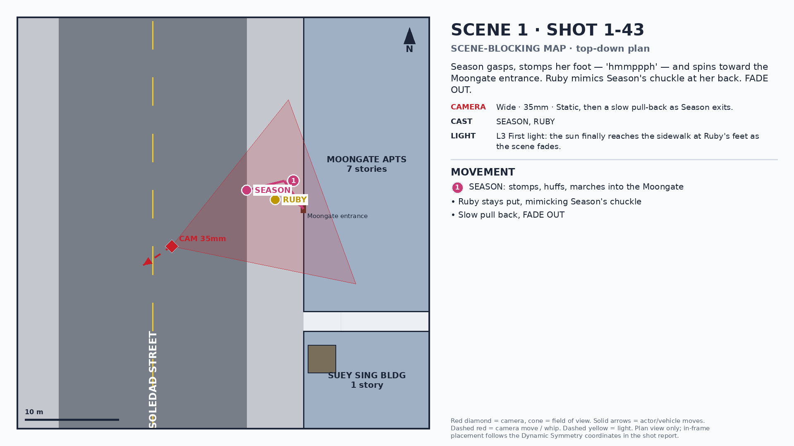

| Slot | Reference | File | Status |
|---|---|---|---|
| 1 | blocking_map | `03_department_outputs/scene_001/blocking_maps/1-43_blocking_map.png` | ready |
| 2 | character · SEASON | `02_bibles/refs/season_reference.png` | missing |
| 3 | character · RUBY | `02_bibles/refs/ruby_reference.png` | missing |
| 4 | location · MOONGATE_FRONT | `02_bibles/refs/moongate_front_plate.png` | missing |
| 5 | expression_start · SEASON_huffy_offended | `expr/SEASON_huffy_offended.png` | missing |
| 6 | expression_end · RUBY_mocking_laugh | `expr/RUBY_mocking_laugh.png` | missing |

```text
Image 1: Top-down scene-blocking map. Follow its positions and movement arrows; do not render the map itself.
Image 2 is SEASON (character).
Image 3 is RUBY (character).
Image 4 is MOONGATE_FRONT (location).
Image 5 is SEASON_huffy_offended (expression start).
Image 6 is RUBY_mocking_laugh (expression end).

The woman in glasses gasps, stomps her foot, huffs, and spins away, marching into the apartment building's entrance. Behind her the woman in the robe mimics her chuckle, loud and mocking, then goes quiet, alone on the sidewalk, as the image fades out. Stage the action exactly as the blocking map in Image 1 shows: where each person stands, the numbered movement arrows, and the camera position and viewing direction. In frame, the focal point (Ruby, alone again, laughing) sits at Season stomps from (0.62, 0.55) out through the Moongate entrance at (0.85, 0.50); Ruby holds at (0.30, 0.55). Wide, 35mm lens. Static, then a slow pull-back as Season exits. Lighting: L3 First light: the sun finally reaches the sidewalk at Ruby's feet as the scene fades. Cinematic tearjerker tone, emotionally intimate framing, soft natural light favoring dawn or dusk. Foil visible somewhere in frame — crumpled, glinting, or scattered nearby. Environment shows worn signs of habitation — blankets, bags, makeshift bedding — treated with visual dignity, not disorder. Camera lingers rather than cuts quickly, allowing emotional weight to build. Season says: "Hmmppph!" Ruby says: "(mimicking Season's chuckle)"

Duration 7s. Cinematic 2.39:1 composition, photoreal, no on-screen text, no map graphics in the output.
```
