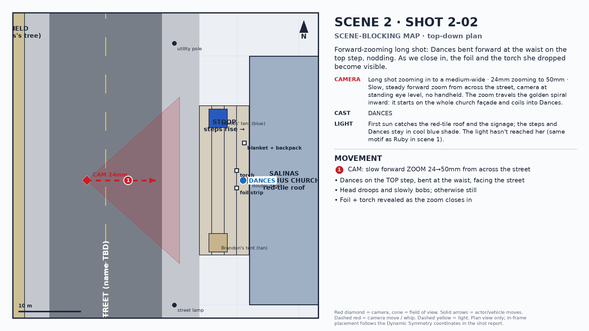
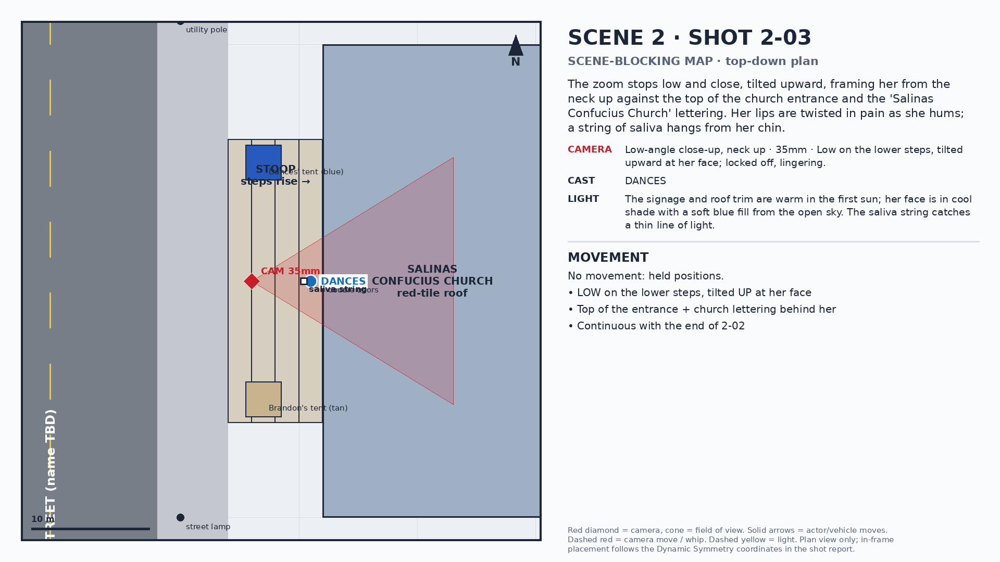
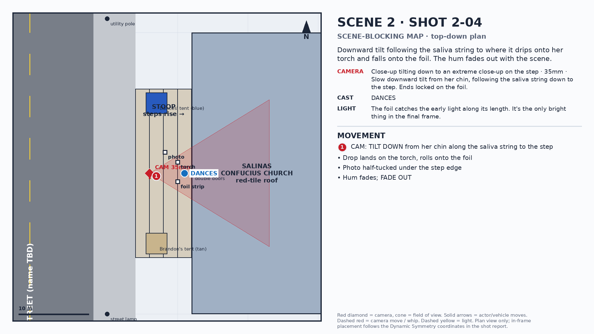

# Scene 002 — Shot Reports

> **TEST RUN**: CRR gate and image-lock blockers skipped. Outputs are for trying the generator, not for the cut.

**EXT. SALINAS CONFUCIUS CHURCH — DAWN** · present_day · source: 00_inputs/scene_002.fountain (Dances With Fetty.fountain, Drive, 2026-09-18)
Review order per shot: department reports → Shot Report → prompt pair. Prompts marked **BLOCKED** are drafts and should not be generated until the listed blockers clear.

---

## Shot 2-01 · 4s

**Beat:** FADE IN on sound first: the awkward start of the tune Dances is mumble-humming.

> THE DANCES'S ACKWARD START AUDIO OF THE ACKWARD-SOUNDING TUNE THAT DANCES IS MUMBLE-HUMMING WHILE NODDI[NG]

**Upstream reports:** none: TEST run, CRR gate skipped

**Audio-only (editorial).** Dances' mumble-hum over black, close and dry. Faint dawn street tone under it.

- DANCES (hum): "(broken, off-key mumble-hum; stops and restarts)"

**Editing:** The hum is the seed of 'The Feddie Blues' (scene 3 dream: 'Dances's mumble-hums are immediately recognizable'). Record it as the SAME melody, broken and slurred. Picture fades up under the hum at 4s.

---

## Shot 2-02 · 10s

**Beat:** Forward-zooming long shot: Dances bent forward at the waist on the top step, nodding. As we close in, the foil and the torch she dropped become visible.

> A forward zooming long shot of Dances, bent forward at the waist, on the top step of the Salinas Confucious Church, nodding… As the shot gets closer, the piece of foil and torch she'd dropped, become visible.

**Upstream reports:** none: TEST run, CRR gate skipped

### Shot Report
- **Blocking / Set:** focal point is *Dances' bowed head* at lower-left eye LL (0.30, 0.33) at the end of the zoom — Start: church façade fills frame, Dances small at (0.42, 0.40). End: Dances' face and lips at (0.30, 0.33); blue tent left foreground (0.15, 0.40); Brandon's tan tent (0.70, 0.40); church signage along the top line (0.50, 0.85). Spiral: Golden spiral curving from the upper-right into the lower-left eye (Scene Blocking Bible Shot 1). The zoom follows it inward.. She's on the TOP step, bent at the waist, facing the street.
- **Set design:** Red-tiled roofline runs as the dominant top horizontal; the columns of the entrance frame her; the worn blanket and backpack sit beside the entrance; the tents bracket the stoop, Dances' blue tent on the left and Brandon's tan tent on the right.
- **Camera:** Long shot zooming in to a medium-wide, 24mm zooming to 50mm. Slow, steady forward zoom from across the street, camera at standing eye level, no handheld. The zoom travels the golden spiral inward: it starts on the whole church façade and coils into Dances.
- **Lighting:** First sun catches the red-tile roof and the signage; the steps and Dances stay in cool blue shade. The light hasn't reached her (same motif as Ruby in scene 1).
- **Cast / wardrobe:** DANCES (present_day)
- **Props:** ELONGATED_FOIL, TORCH_LIGHTER, WORN_BLANKET, WEATHERED_BACKPACK
- **Expression anchors:** DANCES_nodding_eyes_closed → DANCES_nodding_eyes_closed
- **Editing:** Hold the full zoom. No cuts inside it. This is the film's introduction of its heroine.
- **How it works together:** the camera (24mm zooming to 50mm) arrives at the blocking's focal point — Dances' bowed head — under First sun catches the red-tile roof and the signage; the steps and Dances stay in cool blue shade. The light hasn't reached her (same motif as Ruby in scene 1)., so the beat "Forward-zooming long shot: Dances bent forward at the waist on the top step, nodding" lands where the eye already is.
- **Open flags:** F2-01, F2-02, F2-04

### Prompt pair — **TEST**
Blockers:
- DANCES: no chosen reference image (F-18)
- CHURCH_STOOP: no chosen location reference (F-18)
- F2-01: No chosen reference image exists for DANCES or the CHURCH_STOOP. The Scene Blocking Bible's 'First Five' roster lists both as '❌ Missing Source 2'.

**LTX-2.3**

```text
[DANCES] Same character as reference image: 22-year-old woman, mixed Cherokee and Black heritage, warm brown skin, high cheekbones, dark almond eyes, hard unimpressed expression, thick dark hair in two thick braids, tribal tattoos on both arms and neck only (no facial tattoos), worn brown leather jacket, gray tank top, dark jeans, boots. Maintain exact facial structure, tattoo placement, and wardrobe from reference. Neck tattoo limited to the left side of the neck only, small feather design, does not extend past the collarbone, no chest tattoo. Scene: The Salinas Confucius Church: ornate red-tiled roof, decorative red trim, tan stucco walls, columned entrance with dark wooden double doors, church signage above the entrance door, a utility pole and street lamp nearby. On the church stoop, a small blue tent with a blue tarp draped over it sits on the left side (Dances' tent), and a light tan tent with no tarp sits on the right side (Brandon's tent). Across a quiet dawn street, a young woman sits alone on the top step of an ornate church, bent all the way forward at the waist, her head drooping and slowly bobbing, drifting in and out, completely still otherwise. The view slowly closes in on her, and as it does, a long flat strip of foil and a small torch lighter come into view on the step beside her boots. Composition follows dynamic symmetry principles — subject(s) positioned along a diagonal sightline rather than center-frame, with deliberate negative space. Focal point — Dances' bowed head: Start: church façade fills frame, Dances small at (0.42, 0.40). End: Dances' face and lips at (0.30, 0.33); blue tent left foreground (0.15, 0.40); Brandon's tan tent (0.70, 0.40); church signage along the top line (0.50, 0.85). Camera: Long shot zooming in to a medium-wide, 24mm zooming to 50mm lens. Slow, steady forward zoom from across the street, camera at standing eye level, no handheld. The zoom travels the golden spiral inward: it starts on the whole church façade and coils into Dances. Lighting: First sun catches the red-tile roof and the signage; the steps and Dances stay in cool blue shade. The light hasn't reached her (same motif as Ruby in scene 1). Props in frame: a single unusually long strip of foil, roughly 4 inches wide and 16 inches long, laid out flat, catching the early light — long and mostly flat, unusually elongated compared to typical crumpled foil; a small handheld butane torch lighter lying on its side; a bundled worn blanket in muted neutral tones beside the church entrance; a single worn, aged backpack resting beside the blanket. Cinematic tearjerker tone, emotionally intimate framing, soft natural light favoring dawn or dusk. Foil visible somewhere in frame — crumpled, glinting, or scattered nearby. Environment shows worn signs of habitation — blankets, bags, makeshift bedding — treated with visual dignity, not disorder. Camera lingers rather than cuts quickly, allowing emotional weight to build. Audio: Dances' mumble-hum continues, faint at distance, growing as we close in. Duration 10 seconds. Compose inside a centered 2.39:1 safe area of a 16:9 frame.
```

**Wan 2.2** (first frame `expr/DANCES_nodding_eyes_closed.png`, last frame `expr/DANCES_nodding_eyes_closed.png`) — 10s > 5s: generate 2 segments, each segment's last frame seeds the next.

```text
[DANCES] Same character as reference image: 22-year-old woman, mixed Cherokee and Black heritage, warm brown skin, high cheekbones, dark almond eyes, hard unimpressed expression, thick dark hair in two thick braids, tribal tattoos on both arms and neck only (no facial tattoos), worn brown leather jacket, gray tank top, dark jeans, boots. Maintain exact facial structure, tattoo placement, and wardrobe from reference. Neck tattoo limited to the left side of the neck only, small feather design, does not extend past the collarbone, no chest tattoo. Scene: Across a quiet dawn street, a young woman sits alone on the top step of an ornate church, bent all the way forward at the waist, her head drooping and slowly bobbing, drifting in and out, completely still otherwise. The view slowly closes in on her, and as it does, a long flat strip of foil and a small torch lighter come into view on the step beside her boots. Long shot zooming in to a medium-wide, 24mm zooming to 50mm. Slow, steady forward zoom from across the street, camera at standing eye level, no handheld. The zoom travels the golden spiral inward: it starts on the whole church façade and coils into Dances. Placement: Start: church façade fills frame, Dances small at (0.42, 0.40). End: Dances' face and lips at (0.30, 0.33); blue tent left foreground (0.15, 0.40); Brandon's tan tent (0.70, 0.40); church signage along the top line (0.50, 0.85). First sun catches the red-tile roof and the signage; the steps and Dances stay in cool blue shade. The light hasn't reached her (same motif as Ruby in scene 1).
```

Negative:

```text
no dead-center framing unless flagged as intentional, no clean or brand-new camping gear; tents show wear and dust, no high-contrast plastic or neon garbage bins, no harsh flat midday daylight, no garbled on-screen text, no facial tattoos, no chest tattoo, no neck tattoo on the right side, no gauntness or sunken features, no soft/delicate or glamorous styling, no bright/colorful clothing, no default smiling, no thin/multi-braid hairstyle, two thick braids only, no swapping tent positions: Dances' blue tent always left, Brandon's tan tent always right, no tarp on Brandon's tent, no tent color substitutions, no clean or brand-new camping gear
```

**MiniMax Omni** (6/9 references)



| Slot | Reference | File | Status |
|---|---|---|---|
| 1 | blocking_map | `03_department_outputs/scene_002/blocking_maps/2-02_blocking_map.png` | ready |
| 2 | character · DANCES | `02_bibles/refs/dances_reference.png` | missing |
| 3 | location · CHURCH_STOOP | `02_bibles/refs/church_stoop_plate.png` | missing |
| 4 | expression_start · DANCES_nodding_eyes_closed | `expr/DANCES_nodding_eyes_closed.png` | missing |
| 5 | prop · ELONGATED_FOIL | `02_bibles/refs/elongated_foil.png` | missing |
| 6 | prop · TORCH_LIGHTER | `02_bibles/refs/torch_lighter.png` | missing |

```text
Image 1: Top-down scene-blocking map. Follow its positions and movement arrows; do not render the map itself.
Image 2 is DANCES (character).
Image 3 is CHURCH_STOOP (location).
Image 4 is DANCES_nodding_eyes_closed (expression start).
Image 5 is ELONGATED_FOIL (prop).
Image 6 is TORCH_LIGHTER (prop).

Across a quiet dawn street, a young woman sits alone on the top step of an ornate church, bent all the way forward at the waist, her head drooping and slowly bobbing, drifting in and out, completely still otherwise. The view slowly closes in on her, and as it does, a long flat strip of foil and a small torch lighter come into view on the step beside her boots. Stage the action exactly as the blocking map in Image 1 shows: where each person stands, the numbered movement arrows, and the camera position and viewing direction. In frame, the focal point (Dances' bowed head) sits at Start: church façade fills frame, Dances small at (0.42, 0.40). End: Dances' face and lips at (0.30, 0.33); blue tent left foreground (0.15, 0.40); Brandon's tan tent (0.70, 0.40); church signage along the top line (0.50, 0.85). Long shot zooming in to a medium-wide, 24mm zooming to 50mm lens. Slow, steady forward zoom from across the street, camera at standing eye level, no handheld. The zoom travels the golden spiral inward: it starts on the whole church façade and coils into Dances. Lighting: First sun catches the red-tile roof and the signage; the steps and Dances stay in cool blue shade. The light hasn't reached her (same motif as Ruby in scene 1). Cinematic tearjerker tone, emotionally intimate framing, soft natural light favoring dawn or dusk. Foil visible somewhere in frame — crumpled, glinting, or scattered nearby. Environment shows worn signs of habitation — blankets, bags, makeshift bedding — treated with visual dignity, not disorder. Camera lingers rather than cuts quickly, allowing emotional weight to build.

Duration 10s. Cinematic 2.39:1 composition, photoreal, no on-screen text, no map graphics in the output.
```

---

## Shot 2-03 · 6s

**Beat:** The zoom stops low and close, tilted upward, framing her from the neck up against the top of the church entrance and the 'Salinas Confucius Church' lettering. Her lips are twisted in pain as she hums; a string of saliva hangs from her chin.

> The shot stop low and close, tilted at an upward angle that frames her from the neck up with the top to the front entrance and the 'Salinas Confucius Church' lettering above it, as a backdrop. DANCES'S lips are twisted in pain, like it's hurting her to mumble-hum, and there's a string of slobber hanging from her chin.

**Upstream reports:** none: TEST run, CRR gate skipped

### Shot Report
- **Blocking / Set:** focal point is *Dances' lips and the string of saliva* at LL eye (0.30, 0.33), the spiral's coil center — Face and lips at (0.30, 0.33); saliva string runs down to (0.30, 0.15); signage along the top dominant line at (0.50, 0.85); entrance top frames the upper-right. Spiral: Spiral coil center on her lips (Scene Blocking Bible). Low and upward: the camera doesn't look down on her (Cinematography Bible). The church name sits over her like a caption.
- **Set design:** Only the top of the entrance, the columns' capitals and the lettering are in frame behind her.
- **Camera:** Low-angle close-up, neck up, 35mm. Low on the lower steps, tilted upward at her face; locked off, lingering.
- **Lighting:** The signage and roof trim are warm in the first sun; her face is in cool shade with a soft blue fill from the open sky. The saliva string catches a thin line of light.
- **Cast / wardrobe:** DANCES (present_day)
- **Props:** SLOBBER_STRING
- **Expression anchors:** DANCES_nodding_eyes_closed → DANCES_pained_hum
- **Editing:** Continuous with the end of 2-02 (treat as one move; the cut should be invisible).
- **How it works together:** the camera (35mm) arrives at the blocking's focal point — Dances' lips and the string of saliva — under The signage and roof trim are warm in the first sun; her face is in cool shade with a soft blue fill from the open sky. The saliva string catches a thin line of light., so the beat "The zoom stops low and close, tilted upward, framing her from the neck up against the top of the church entrance and the 'Salinas Confucius Church' lettering" lands where the eye already is.
- **Open flags:** F2-02, F2-03

### Prompt pair — **TEST**
Blockers:
- DANCES: no chosen reference image (F-18)
- CHURCH_STOOP: no chosen location reference (F-18)

**LTX-2.3**

```text
[DANCES] Same character as reference image: 22-year-old woman, mixed Cherokee and Black heritage, warm brown skin, high cheekbones, dark almond eyes, hard unimpressed expression, thick dark hair in two thick braids, tribal tattoos on both arms and neck only (no facial tattoos), worn brown leather jacket, gray tank top, dark jeans, boots. Maintain exact facial structure, tattoo placement, and wardrobe from reference. Neck tattoo limited to the left side of the neck only, small feather design, does not extend past the collarbone, no chest tattoo. Scene: The Salinas Confucius Church: ornate red-tiled roof, decorative red trim, tan stucco walls, columned entrance with dark wooden double doors, church signage above the entrance door, a utility pole and street lamp nearby. On the church stoop, a small blue tent with a blue tarp draped over it sits on the left side (Dances' tent), and a light tan tent with no tarp sits on the right side (Brandon's tent). Low angle looking up at the young woman's face as she hangs forward, eyes half-closed and heavy, her lips twisted as if it hurts her to hum. A thin glistening string of saliva hangs from her chin. Behind and above her, the top of the church entrance and its lettering. Composition follows dynamic symmetry principles — subject(s) positioned along a diagonal sightline rather than center-frame, with deliberate negative space. Focal point — Dances' lips and the string of saliva: Face and lips at (0.30, 0.33); saliva string runs down to (0.30, 0.15); signage along the top dominant line at (0.50, 0.85); entrance top frames the upper-right. Camera: Low-angle close-up, neck up, 35mm lens. Low on the lower steps, tilted upward at her face; locked off, lingering. Lighting: The signage and roof trim are warm in the first sun; her face is in cool shade with a soft blue fill from the open sky. The saliva string catches a thin line of light. Props in frame: a continuous, glistening string of saliva from the corner of her mouth, stretching down to a small reflective puddle on the cold step. Cinematic tearjerker tone, emotionally intimate framing, soft natural light favoring dawn or dusk. Foil visible somewhere in frame — crumpled, glinting, or scattered nearby. Environment shows worn signs of habitation — blankets, bags, makeshift bedding — treated with visual dignity, not disorder. Camera lingers rather than cuts quickly, allowing emotional weight to build. Dances says: "(mumble-humming, pained)" Audio: The hum close and raw. Duration 6 seconds. Compose inside a centered 2.39:1 safe area of a 16:9 frame.
```

**Wan 2.2** (first frame `expr/DANCES_nodding_eyes_closed.png`, last frame `expr/DANCES_pained_hum.png`) — 6s > 5s: generate 2 segments, each segment's last frame seeds the next.

```text
[DANCES] Same character as reference image: 22-year-old woman, mixed Cherokee and Black heritage, warm brown skin, high cheekbones, dark almond eyes, hard unimpressed expression, thick dark hair in two thick braids, tribal tattoos on both arms and neck only (no facial tattoos), worn brown leather jacket, gray tank top, dark jeans, boots. Maintain exact facial structure, tattoo placement, and wardrobe from reference. Neck tattoo limited to the left side of the neck only, small feather design, does not extend past the collarbone, no chest tattoo. Scene: Low angle looking up at the young woman's face as she hangs forward, eyes half-closed and heavy, her lips twisted as if it hurts her to hum. A thin glistening string of saliva hangs from her chin. Behind and above her, the top of the church entrance and its lettering. Low-angle close-up, neck up, 35mm. Low on the lower steps, tilted upward at her face; locked off, lingering. Placement: Face and lips at (0.30, 0.33); saliva string runs down to (0.30, 0.15); signage along the top dominant line at (0.50, 0.85); entrance top frames the upper-right. The signage and roof trim are warm in the first sun; her face is in cool shade with a soft blue fill from the open sky. The saliva string catches a thin line of light.
```

Negative:

```text
no dead-center framing unless flagged as intentional, no clean or brand-new camping gear; tents show wear and dust, no high-contrast plastic or neon garbage bins, no harsh flat midday daylight, no garbled on-screen text, no facial tattoos, no chest tattoo, no neck tattoo on the right side, no gauntness or sunken features, no soft/delicate or glamorous styling, no bright/colorful clothing, no default smiling, no thin/multi-braid hairstyle, two thick braids only, no swapping tent positions: Dances' blue tent always left, Brandon's tan tent always right, no tarp on Brandon's tent, no tent color substitutions, no clean or brand-new camping gear
```

**MiniMax Omni** (5/9 references)



| Slot | Reference | File | Status |
|---|---|---|---|
| 1 | blocking_map | `03_department_outputs/scene_002/blocking_maps/2-03_blocking_map.png` | ready |
| 2 | character · DANCES | `02_bibles/refs/dances_reference.png` | missing |
| 3 | location · CHURCH_STOOP | `02_bibles/refs/church_stoop_plate.png` | missing |
| 4 | expression_start · DANCES_nodding_eyes_closed | `expr/DANCES_nodding_eyes_closed.png` | missing |
| 5 | expression_end · DANCES_pained_hum | `expr/DANCES_pained_hum.png` | missing |

```text
Image 1: Top-down scene-blocking map. Follow its positions and movement arrows; do not render the map itself.
Image 2 is DANCES (character).
Image 3 is CHURCH_STOOP (location).
Image 4 is DANCES_nodding_eyes_closed (expression start).
Image 5 is DANCES_pained_hum (expression end).

Low angle looking up at the young woman's face as she hangs forward, eyes half-closed and heavy, her lips twisted as if it hurts her to hum. A thin glistening string of saliva hangs from her chin. Behind and above her, the top of the church entrance and its lettering. Stage the action exactly as the blocking map in Image 1 shows: where each person stands, the numbered movement arrows, and the camera position and viewing direction. In frame, the focal point (Dances' lips and the string of saliva) sits at Face and lips at (0.30, 0.33); saliva string runs down to (0.30, 0.15); signage along the top dominant line at (0.50, 0.85); entrance top frames the upper-right. Low-angle close-up, neck up, 35mm lens. Low on the lower steps, tilted upward at her face; locked off, lingering. Lighting: The signage and roof trim are warm in the first sun; her face is in cool shade with a soft blue fill from the open sky. The saliva string catches a thin line of light. Cinematic tearjerker tone, emotionally intimate framing, soft natural light favoring dawn or dusk. Foil visible somewhere in frame — crumpled, glinting, or scattered nearby. Environment shows worn signs of habitation — blankets, bags, makeshift bedding — treated with visual dignity, not disorder. Camera lingers rather than cuts quickly, allowing emotional weight to build. Dances says: "(mumble-humming, pained)"

Duration 6s. Cinematic 2.39:1 composition, photoreal, no on-screen text, no map graphics in the output.
```

---

## Shot 2-04 · 6s

**Beat:** Downward tilt following the saliva string to where it drips onto her torch and falls onto the foil. The hum fades out with the scene.

> The shot starts into a downward tilt, following the slobber-string to where it dripping on her torch and falling off and onto the foil she'd been smoking from. Her mumble-humming fades-out with the scene.

**Upstream reports:** none: TEST run, CRR gate skipped

### Shot Report
- **Blocking / Set:** focal point is *The drop landing on the foil* at LL (0.30, 0.20), the Props Bible foil coordinate — Tilt starts on her chin at (0.30, 0.33); ends with the foil strip at (0.30, 0.20), the torch lighter at (0.45, 0.24), and the faded photograph half-tucked under the step edge at (0.72, 0.14). Spiral: none. Elongated foil only, no small crumpled wads near her feet (Props Bible negative list).
- **Set design:** The concrete step edge runs as a low horizontal; the photograph is the humanizing object in the corner of the frame.
- **Camera:** Close-up tilting down to an extreme close-up on the step, 35mm. Slow downward tilt from her chin, following the saliva string down to the step. Ends locked on the foil.
- **Lighting:** The foil catches the early light along its length. It's the only bright thing in the final frame.
- **Cast / wardrobe:** DANCES (present_day)
- **Props:** SLOBBER_STRING, TORCH_LIGHTER, ELONGATED_FOIL, FADED_PHOTO
- **Expression anchors:** DANCES_pained_hum → DANCES_pained_hum
- **Editing:** FADE OUT on the foil after the hum is gone; hold 1s of silence on black.
- **How it works together:** the camera (35mm) arrives at the blocking's focal point — The drop landing on the foil — under The foil catches the early light along its length. It's the only bright thing in the final frame., so the beat "Downward tilt following the saliva string to where it drips onto her torch and falls onto the foil" lands where the eye already is.
- **Open flags:** F2-04

### Prompt pair — **TEST**
Blockers:
- DANCES: no chosen reference image (F-18)
- CHURCH_STOOP: no chosen location reference (F-18)

**LTX-2.3**

```text
[DANCES] Same character as reference image: 22-year-old woman, mixed Cherokee and Black heritage, warm brown skin, high cheekbones, dark almond eyes, hard unimpressed expression, thick dark hair in two thick braids, tribal tattoos on both arms and neck only (no facial tattoos), worn brown leather jacket, gray tank top, dark jeans, boots. Maintain exact facial structure, tattoo placement, and wardrobe from reference. Neck tattoo limited to the left side of the neck only, small feather design, does not extend past the collarbone, no chest tattoo. Scene: The Salinas Confucius Church: ornate red-tiled roof, decorative red trim, tan stucco walls, columned entrance with dark wooden double doors, church signage above the entrance door, a utility pole and street lamp nearby. On the church stoop, a small blue tent with a blue tarp draped over it sits on the left side (Dances' tent), and a light tan tent with no tarp sits on the right side (Brandon's tent). The view tilts slowly down, following the glistening string of saliva from her chin to the step, where a drop lands on a small torch lighter lying on its side and rolls off onto a long, flat strip of foil catching the early light. At the edge of the step, a small curled photograph is half-tucked under the concrete. Composition follows dynamic symmetry principles — subject(s) positioned along a diagonal sightline rather than center-frame, with deliberate negative space. Focal point — The drop landing on the foil: Tilt starts on her chin at (0.30, 0.33); ends with the foil strip at (0.30, 0.20), the torch lighter at (0.45, 0.24), and the faded photograph half-tucked under the step edge at (0.72, 0.14). Camera: Close-up tilting down to an extreme close-up on the step, 35mm lens. Slow downward tilt from her chin, following the saliva string down to the step. Ends locked on the foil. Lighting: The foil catches the early light along its length. It's the only bright thing in the final frame. Props in frame: a continuous, glistening string of saliva from the corner of her mouth, stretching down to a small reflective puddle on the cold step; a small handheld butane torch lighter lying on its side; a single unusually long strip of foil, roughly 4 inches wide and 16 inches long, laid out flat, catching the early light — long and mostly flat, unusually elongated compared to typical crumpled foil; a small curled-corner photograph half-tucked under the edge of a step. Cinematic tearjerker tone, emotionally intimate framing, soft natural light favoring dawn or dusk. Foil visible somewhere in frame — crumpled, glinting, or scattered nearby. Environment shows worn signs of habitation — blankets, bags, makeshift bedding — treated with visual dignity, not disorder. Camera lingers rather than cuts quickly, allowing emotional weight to build. Audio: The hum thins and fades to nothing with the picture. Duration 6 seconds. Compose inside a centered 2.39:1 safe area of a 16:9 frame.
```

**Wan 2.2** (first frame `expr/DANCES_pained_hum.png`, last frame `expr/DANCES_pained_hum.png`) — 6s > 5s: generate 2 segments, each segment's last frame seeds the next.

```text
[DANCES] Same character as reference image: 22-year-old woman, mixed Cherokee and Black heritage, warm brown skin, high cheekbones, dark almond eyes, hard unimpressed expression, thick dark hair in two thick braids, tribal tattoos on both arms and neck only (no facial tattoos), worn brown leather jacket, gray tank top, dark jeans, boots. Maintain exact facial structure, tattoo placement, and wardrobe from reference. Neck tattoo limited to the left side of the neck only, small feather design, does not extend past the collarbone, no chest tattoo. Scene: The view tilts slowly down, following the glistening string of saliva from her chin to the step, where a drop lands on a small torch lighter lying on its side and rolls off onto a long, flat strip of foil catching the early light. At the edge of the step, a small curled photograph is half-tucked under the concrete. Close-up tilting down to an extreme close-up on the step, 35mm. Slow downward tilt from her chin, following the saliva string down to the step. Ends locked on the foil. Placement: Tilt starts on her chin at (0.30, 0.33); ends with the foil strip at (0.30, 0.20), the torch lighter at (0.45, 0.24), and the faded photograph half-tucked under the step edge at (0.72, 0.14). The foil catches the early light along its length. It's the only bright thing in the final frame.
```

Negative:

```text
no dead-center framing unless flagged as intentional, no clean or brand-new camping gear; tents show wear and dust, no high-contrast plastic or neon garbage bins, no harsh flat midday daylight, no garbled on-screen text, no facial tattoos, no chest tattoo, no neck tattoo on the right side, no gauntness or sunken features, no soft/delicate or glamorous styling, no bright/colorful clothing, no default smiling, no thin/multi-braid hairstyle, two thick braids only, no swapping tent positions: Dances' blue tent always left, Brandon's tan tent always right, no tarp on Brandon's tent, no tent color substitutions, no clean or brand-new camping gear
```

**MiniMax Omni** (6/9 references)



| Slot | Reference | File | Status |
|---|---|---|---|
| 1 | blocking_map | `03_department_outputs/scene_002/blocking_maps/2-04_blocking_map.png` | ready |
| 2 | character · DANCES | `02_bibles/refs/dances_reference.png` | missing |
| 3 | location · CHURCH_STOOP | `02_bibles/refs/church_stoop_plate.png` | missing |
| 4 | expression_start · DANCES_pained_hum | `expr/DANCES_pained_hum.png` | missing |
| 5 | prop · TORCH_LIGHTER | `02_bibles/refs/torch_lighter.png` | missing |
| 6 | prop · ELONGATED_FOIL | `02_bibles/refs/elongated_foil.png` | missing |

```text
Image 1: Top-down scene-blocking map. Follow its positions and movement arrows; do not render the map itself.
Image 2 is DANCES (character).
Image 3 is CHURCH_STOOP (location).
Image 4 is DANCES_pained_hum (expression start).
Image 5 is TORCH_LIGHTER (prop).
Image 6 is ELONGATED_FOIL (prop).

The view tilts slowly down, following the glistening string of saliva from her chin to the step, where a drop lands on a small torch lighter lying on its side and rolls off onto a long, flat strip of foil catching the early light. At the edge of the step, a small curled photograph is half-tucked under the concrete. Stage the action exactly as the blocking map in Image 1 shows: where each person stands, the numbered movement arrows, and the camera position and viewing direction. In frame, the focal point (The drop landing on the foil) sits at Tilt starts on her chin at (0.30, 0.33); ends with the foil strip at (0.30, 0.20), the torch lighter at (0.45, 0.24), and the faded photograph half-tucked under the step edge at (0.72, 0.14). Close-up tilting down to an extreme close-up on the step, 35mm lens. Slow downward tilt from her chin, following the saliva string down to the step. Ends locked on the foil. Lighting: The foil catches the early light along its length. It's the only bright thing in the final frame. Cinematic tearjerker tone, emotionally intimate framing, soft natural light favoring dawn or dusk. Foil visible somewhere in frame — crumpled, glinting, or scattered nearby. Environment shows worn signs of habitation — blankets, bags, makeshift bedding — treated with visual dignity, not disorder. Camera lingers rather than cuts quickly, allowing emotional weight to build.

Duration 6s. Cinematic 2.39:1 composition, photoreal, no on-screen text, no map graphics in the output.
```
